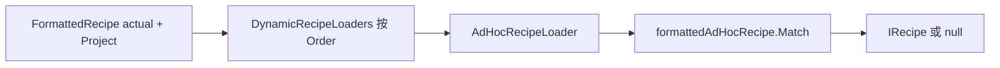

# RecipaediaEX API 使用文档

本文档基于当前 `Dependencies/RecipaediaEX` 源码整理，描述稳定可用的接口、扩展点和推荐实践。

> 本文件是旧版完整 API 汇总，继续保留作为兼容入口。新的按主题入口见 [api/README.md](api/README.md)。

版本间差异与升级步骤见 **[更新日志](CHANGELOG.md)**（面向依赖 RX 的其它模组作者）。

## 目录

| 章节 | 内容 |
|------|------|
| [§1 核心概念](#1-核心概念) | 配方、图鉴、**事件总线 / 拦截总线** |
| [§2 逻辑层 API](#2-逻辑层-api) | `IRecipe`、加载器、匹配、`RecipaediaEXManager` |
| [§2.5](#25-事件与扩展总线) | **`RecipaediaEventBus` / `RecipaediaInterceptBus`**（扩展主入口） |
| [§3–5](#3-工作站crafterapi) | Crafter、图鉴 UI、Descriptor |
| [§6 推荐接入步骤](#6-推荐接入步骤) | 从零接入清单 |
| [§7 示例骨架](#7-示例骨架) | 配方、加载器、**拦截订阅** |
| [§8 常见问题](#8-常见问题) | FAQ |
| [§9 图鉴搜索](#9-图鉴搜索) | 搜索引擎（另见策划） |
| [§10 合成助手](#10-合成助手crafting-overlay) | `IRecipaediaOverlayHost`、快捷键路由、[§10.8 Placable](#108-iplacablerecipe-与-placablereciadapter) |
| [§11 兼容说明](#11-兼容说明) | 遗留入口 |

## 1. 核心概念

- `IRecipe`：运行时配方对象，负责匹配逻辑与扩展数据。
- `RecipeExtraKeys`：`IRecipe` Extra 约定键名常量集合。
- `IRecipesLoader`：配方来源提供器，负责初始化与返回静态配方集。
- `IDynamicRecipeLoader`：运行时动态配方提供器（如原版 AdHoc），不进入静态总表。
- `RecipaediaEXManager`：配方容器与匹配入口。
- `ICrafter` + `RecipesCrafterManager`：配方对应工作站（用于 UI 展示）。
- `IRecipaedia*`：图鉴条目、分类、详情、配方页接口。
- `RecipeDescriptor`：配方在 `RecipaediaEXRecipesScreen` 的渲染器。
- **`RecipaediaEventBus`**：事后**通知**（`Publish` / `Subscribe(Action<T>)`），不可否决操作。
- **`RecipaediaInterceptBus`**：事前**拦截**（`TryProceed` / `Subscribe(Func<T,bool>)`），`return false` 否决。
- **`IRecipaediaOverlayHost`**：合成 Modal 实现此接口以接入**合成助手**（悬浮图鉴 + `+` 摆放）。

---

## 2. 逻辑层 API

### 2.1 `IRecipe`

路径：`RecipesExtra/IRecipe.cs`

必须实现：

- `int DisplayOrder { get; }`：图鉴配方排序（越小越靠前）。
- `int MatchPriority { get; }`：匹配优先级（当前实现按升序）。
- `bool Match(IRecipe actual)`：与“实际配方”比较。
- `T GetExtraValue<T>(string key, T defaultValue)`
- `void SetExtraValue<T>(string key, T value)`

推荐约定：

- 在配方里维护 `ValuesDictionary`。
- 键名使用 **`RecipeExtraKeys`**（`RecipesExtra/RecipeExtraKeys.cs`），勿手写字符串。
- 图鉴相关：`MatchedResultBlockValues` / `MatchedIngredientBlockValues`（见下表）。非方块产物语义由依赖模组自定 Extra 键。
- `FormattedRecipe` 在 `PreTransformIngredients()` 末尾会自动写入 `MatchedIngredientBlockValues`。

#### `RecipeExtraKeys` 约定键一览

| 常量 | 值类型 | 用途 |
|------|--------|------|
| `MatchedResultBlockValues` | `int[]` | 图鉴方块产物 `BlockItem.Match` |
| `MatchedIngredientBlockValues` | `int[]` | 图鉴方块原料 `BlockItem.IsIngredient` |
| `Project` | `Project` | `FindMatchingRecipe<T>` 触发动态配方链 |
| `ActualIngredients` | `int?[]` | 槽位方块快照；`IECraftingRecipe` / `IESmeltingRecipe` 等匹配 |
| `Inventory` | `IInventory` | 扩展工作台/熔炉发起匹配时的库存引用 |

示例：

```csharp
recipe.SetExtraValue(RecipeExtraKeys.MatchedResultBlockValues, new[] { resultBlockValue });
recipe.SetExtraValue(RecipeExtraKeys.MatchedIngredientBlockValues,
    FormattedRecipe.ExpandIngredientToBlockValues("iron_ingot"));
actual.SetExtraValue(RecipeExtraKeys.Project, project);
```

### 2.2 `IRecipesLoader`

路径：`LoaderExtra/IRecipesLoader.cs`

- `void Initialize()`：首次加载时调用，建议做扫描和缓存准备。
- `IEnumerable<IRecipe> GetRecipes()`：返回配方集合（首次加载和进入存档时会调用）。
- `int Order { get; }`：加载器优先级。

默认加载器示例：

- `SurvivalcraftRecipesLoader`（原版配方）
- `BlockProceduralRecipesLoader`（程序生成配方）
- `CrXmlRecipesLoader`（`.cr` 文件）

### 2.3 `RecipaediaEXManager`

路径：`RecipaediaEXManager.cs`

常用方法：

- `FindMatchingRecipe(IRecipe actual)`：仅在静态配方表 `Recipes` 中查找。
- `FindDynamicRecipe(IRecipe actual, Project project)`：仅询问 `IDynamicRecipeLoader` 链。
- `FindMatchingRecipe<T>(IRecipe actual)`：若 `actual` 的 `ExtraValues` 含 `RecipeExtraKeys.Project`，先 `FindDynamicRecipe`，再查静态表。
- `TryFindMatchingRecipe<T>(IRecipe actual, out T recipe)`
- `FindMatchingRecipes(IRecipe actual)`：仅静态表。
- `ResetRecipes()`（方块 ID 变化后重建）

扩展工作台/熔炉在构造 `actual` 时会 `SetExtraValue(RecipeExtraKeys.Project, Project)`，因此经 `FindCraftingRecipe` / `FindMatchingRecipe<T>` 可自动解析 AdHoc。自定义机器需要 AdHoc 时请同样在 `actual` 上写入 `Project`。

### 2.4 动态配方（`IDynamicRecipeLoader` / `DynamicLoaders`）

路径：

- 接口：`LoaderExtra/IDynamicRecipeLoader.cs`
- 内置实现：`LoaderExtra/DynamicLoaders/AdHocRecipeLoader.cs`
- 注册表：`RecipesLoadManager.DynamicRecipeLoaders`
- 入口：`RecipaediaEXManager.FindDynamicRecipe` / `FindMatchingRecipe<T>`

#### 与静态 `IRecipesLoader` 的区别

| | 静态 `IRecipesLoader` | 动态 `IDynamicRecipeLoader` |
|---|---|---|
| 配方来源 | `GetRecipes()` 写入 `RecipaediaEXManager.Recipes` | `GetDynamicRecipe(actual, project)` 按次生成 |
| 进入图鉴总表 | 是 | 否（仅匹配时临时返回） |
| 典型场景 | XML / 程序生成 / 固定表 | 原版 AdHoc、依赖世界状态的配方 |
| 图鉴 `Match` / `IsIngredient` | 需在配方对象上设置 Extra（`RecipeExtraKeys`） | 动态返回的 `IRecipe` 同样应设置产物/原料 Extra（`FormattedRecipe` 经 `PreTransformIngredients` 会写原料 Extra） |

#### 接口

```csharp
public interface IDynamicRecipeLoader {
    void Initialize();
    IRecipe GetDynamicRecipe(IRecipe actual, Project project);
    int Order { get; }
}
```

- **`GetDynamicRecipe`**：`actual` 为当前格子布局的快照（通常为 `FormattedRecipe`）；无匹配返回 `null`。
- **`Order`**：升序；`FindDynamicRecipe` 按顺序询问，**先返回非 `null` 的 Loader 生效**，后续 Loader 不再执行。
- **`Initialize`**：接口已定义；`RecipaediaEXManager.Initialize()` 目前**不会**统一调用各 Loader 的 `Initialize`，可在 `GetDynamicRecipe` 内惰性初始化。

#### 自动发现

`RecipesLoadManager.Initialize()` 扫描 `TypeCache.LoadedAssemblies` 中所有**非抽象**的 `IDynamicRecipeLoader` 实现，无参构造实例化后加入 `DynamicRecipeLoaders`，再按 `Order` 排序。与 `IRecipesLoader` 使用同一套反射机制；**无需**在 xdb 或 modinfo 中额外注册类名。

调试：将 `RecipesLoadManager.DebugLogModToRecipeFileLoaders` 设为 `true` 时，日志会输出 `DynamicRecipeLoader {FullName}` 列表。

#### 匹配入口

```csharp
// 仅动态链（不查静态表）
IRecipe dynamic = RecipaediaEXManager.FindDynamicRecipe(actual, project);

// 先动态、再静态（推荐用于工作台/熔炉）
actual.SetExtraValue(RecipeExtraKeys.Project, project);
T recipe = RecipaediaEXManager.FindMatchingRecipe<T>(actual);

// 仅静态表（不走 DynamicLoader）
IRecipe staticOnly = RecipaediaEXManager.FindMatchingRecipe(actual);
```

扩展工作台 / 熔炉（`ComponentEXCraftingTable` / `ComponentEXFurnace`）构造 `actual` 时会写入 `RecipeExtraKeys.Project`、`ActualIngredients`、`Inventory`，因此生产逻辑与图鉴侧经 `FindMatchingRecipe<T>` 可解析 AdHoc。自定义机器需要 AdHoc 或自定义动态配方时，请在 `actual` 上同样写入 `Project`。

#### 内置 `AdHocRecipeLoader`

| 项 | 说明 |
|----|------|
| 类型 | `RecipaediaEX.Implementation.AdHocRecipeLoader` |
| `Order` | `0`（默认最先） |
| 输入 | `actual` 须为 `FormattedRecipe`，否则返回 `null` |
| 查找 | `project.FindSubsystem<SubsystemTerrain>()`，遍历 `BlocksManager.Blocks` → `block.GetAdHocCraftingRecipe(terrain, ingredients, heatLevel, playerLevel)` |
| 输出 | `CraftingRecipe.ToFormattedRecipe<OriginalSmeltingRecipe>()`（`RequiredHeatLevel > 0`）或 `OriginalCraftingRecipe` |
| 校验 | `formattedAdHocRecipe.Match(actual)` 为真才返回；否则继续下一个方块 |
| 图鉴 Extra | 返回的 `FormattedRecipe` 会执行 `PreTransformIngredients()`（含 `MatchedIngredientBlockValues`）；若需在图鉴按产物检索，可对结果再 `SetExtraValue(RecipeExtraKeys.MatchedResultBlockValues, …)` |

流程概览：



#### 自定义 DynamicLoader

```csharp
public class MyDynamicLoader : IDynamicRecipeLoader {
    public int Order => 10; // 大于 0 时在 AdHoc 之后；小于 0 可抢先于 AdHoc

    public void Initialize() { }

    public IRecipe GetDynamicRecipe(IRecipe actual, Project project) {
        if (actual is not FormattedRecipe snapshot) return null;
        // 读取 project / 方块 / 玩家状态，构造或克隆 IRecipe
        // 记得设置 RecipeExtraKeys.MatchedResultBlockValues / MatchedIngredientBlockValues（若需图鉴跳转）
        return null;
    }
}
```

实现类放在**已加载的程序集**中即可（与自定义 `IRecipesLoader` 相同）；发布后确认日志中出现你的 `DynamicRecipeLoader` 全名。

### 2.5 事件与扩展总线

RecipaediaEX 提供两条平行的扩展通道，命名约定区分语义：

| | `RecipaediaEventBus` | `RecipaediaInterceptBus` |
|---|---|---|
| **时机** | 操作**已发生**或**即将完成** | 操作**执行前** |
| **订阅签名** | `Subscribe(Action<T>)` | `Subscribe(Func<T, bool>)` |
| **返回值** | 无 | `true` 放行，`false` **否决** |
| **无订阅者** | 不发布则无回调 | `TryProceed` 默认 **放行** |
| **载荷命名** | `*Event` | `*Context` |
| **典型用途** | 统计、解锁、联动 UI | 权限门禁、替换搜索词、阻止取出 |

两条总线均支持**自定义类型** `T`（无需在 RX 注册），通过 `GetPublisher<T>()` / `GetSubscriber<T>()` 使用。

#### 订阅生命周期

- `Subscribe` 均返回 `IDisposable`，**Dispose 即退订**（建议在模组卸载或世界退出时释放）。
- 拦截链按 `priority` **升序**执行（越小越先）；同优先级按注册顺序。
- 单个订阅者抛异常不会阻断其它订阅者（异常写入 `Log.Error`）；拦截链中异常视为该订阅者**放行**（`true`）。

#### 通知与拦截成对关系

部分生产流程同时提供「事前拦截 + 事后通知」，便于附属模组在拦截阶段做门禁、在事件阶段做解锁：

| 拦截（`RecipaediaInterceptBus`） | 通知（`RecipaediaEventBus`） |
|---|---|
| `CrafterOutputRemoving` | `CrafterOutputRemoved` |
| `CrafterOutputProducing` | `CrafterOutputProduced` |
| `FurnaceFuelConsuming` | `FurnaceFuelUsed` |
| `OpenFullRecipaediaNavigating` | `OpenFullRecipaediaRequested`（无便捷属性，见下） |

其余拦截点（合成助手、`+` 摆放）目前仅有拦截或仅有 UI 侧逻辑，无对称 Event。

---

#### `RecipaediaEventBus`

路径：`Events/`（`RecipaediaEventBus.cs`、`EventChannel.cs`、`IPublisher.cs`、`ISubscriber.cs`）

```csharp
using RecipaediaEX.Events;

IDisposable sub = RecipaediaEventBus.RecipeMatched.Subscribe(e => {
    if (e.FromDynamicLoader) { /* AdHoc 等 */ }
});
sub.Dispose();
```

**内置事件一览**

| 便捷属性 | 事件类型 | 触发时机 | 主要载荷 |
|----------|----------|----------|----------|
| `RecipesReset` | `RecipesResetEvent` | `RecipaediaEXManager.ResetRecipes()` 结束 | `RecipeCount` |
| `RecipeMatched` | `RecipeMatchedEvent` | `FindMatchingRecipe` 静态命中，或 `FindMatchingRecipe<T>` 动态链命中 | `Actual`、`Matched`、`FromDynamicLoader`、`Project?` |
| `CraftingRecipeChanged` | `CraftingRecipeChangedEvent` | 扩展工作台**当前预览配方**引用变化 | `Inventory`、`PreviousRecipe`、`NewRecipe` |
| `SmeltingRecipeChanged` | `SmeltingRecipeChangedEvent` | 扩展熔炉**激活冶炼配方**变化 | 同上 |
| `CrafterOutputProduced` | `CrafterOutputProducedEvent` | 扩展熔炉冶炼完成并**写入产物格** | `OutputBlockValue`、`ProducedCount`、`Recipe`、`CrafterKind` |
| `CrafterOutputRemoved` | `CrafterOutputRemovedEvent` | Crafter 从**产物格成功取出** | `OutputBlockValue`、`RemovedCount`、`CrafterKind` |
| `FurnaceFuelUsed` | `FurnaceFuelUsedEvent` | 扩展熔炉成功消耗一格燃料 | `FuelBlockValue`、`HeatLevel`、`FireDuration` |

**全屏图鉴请求**（无 `RecipaediaEventBus` 便捷属性）：

```csharp
RecipaediaEventBus.GetSubscriber<OpenFullRecipaediaRequestedEvent>()
    .Subscribe(_ => { /* 打开你的全屏图鉴 Screen */ });
```

由 `RecipaediaOverlayInput` 在非合成 Host 场景、且 `OpenFullRecipaediaNavigating` 拦截放行后发布。

**`CrafterKind`**（`string`）：`CrafterKind.CraftingTable` / `CrafterKind.Furnace` 为 RX 内置常量；内容模组专有 Crafter 传入自有名称（如 `"MyPress"`）。

**产出 vs 取出**

- `CrafterOutputProduced`：熔炉在 `ConsumeIngredientsAndCreateResult` 写入结果槽时触发；玩家尚未点击取出。
- `CrafterOutputRemoved`：玩家（或自动化）从结果槽 `RemoveSlotItems` 成功时触发。工作台「合成」在取出时才消耗原料并计为取出事件。

自定义机器若继承 `ComponentEXCraftingTable` / `ComponentEXFurnace` 并调用 `base` 相关方法，可自动获得上表事件；若仅调用 `RecipaediaEXManager.FindMatchingRecipe`，会收到 `RecipeMatched` 等全局事件。

**自定义事件类型**

```csharp
public readonly struct MyPackRecipeRegisteredEvent {
    public MyPackRecipeRegisteredEvent(IRecipe recipe) => Recipe = recipe;
    public IRecipe Recipe { get; }
}

RecipaediaEventBus.GetSubscriber<MyPackRecipeRegisteredEvent>().Subscribe(e => { });
RecipaediaEventBus.GetPublisher<MyPackRecipeRegisteredEvent>().Publish(new(e));
```

**与 `RecipeMatched` 的重复订阅**

扩展熔炉/工作台切换配方时会先发布 `RecipeMatched`，随后可能再发 `CraftingRecipeChanged` / `SmeltingRecipeChanged`。只关心「最终绑定到机器的配方」→ 订阅 Changed；要在任意匹配入口统一处理 → 订阅 `RecipeMatched`。

---

#### `RecipaediaInterceptBus`

路径：`Events/`（`RecipaediaInterceptBus.cs`、`InterceptChannel.cs`、`IInterceptPublisher.cs`、`IInterceptSubscriber.cs`）

```csharp
using RecipaediaEX.Events;

// 订阅（也可用便捷属性 CrafterOutputRemoving 等）
IDisposable gate = RecipaediaInterceptBus.GetSubscriber<CrafterOutputRemovingContext>()
    .Subscribe(ctx => !ShouldBlockTake(ctx), priority: 10);

// 发布方在唯一出口调用
bool allowed = RecipaediaInterceptBus.TryProceed(context);
```

静态快捷方式：`RecipaediaInterceptBus.TryProceed<T>(context)` 等价于对应通道的 `TryProceed`。

**内置拦截点一览**

| 便捷属性 | 上下文类型 | 触发时机 | 成对通知 |
|----------|------------|----------|----------|
| `CrafterOutputRemoving` | `CrafterOutputRemovingContext` | 产物格 `RemoveSlotItems` **之前** | `CrafterOutputRemoved` |
| `CrafterOutputProducing` | `CrafterOutputProducingContext` | 熔炉写入产物格**之前** | `CrafterOutputProduced` |
| `FurnaceFuelConsuming` | `FurnaceFuelConsumingContext` | 熔炉 `UseFuel` **扣燃料之前** | `FurnaceFuelUsed` |
| `RecipePlacementPlanBuilding` | `RecipePlacementPlanBuildingContext` | 助手 `+` 已算出方案、执行前（含 `execute: false` 预检） | — |
| `RecipePlacementExecuting` | `RecipePlacementExecutingContext` | 助手 `+` `execute: true`、即将扣背包填格 | — |
| `CraftingOverlayOpening` | `CraftingOverlayOpeningContext` | 助手 `Toggle` 打开或重新显示 | — |
| `CraftingOverlayClosing` | `CraftingOverlayClosingContext` | 助手 `Hide` 或显式 `Dismiss()` | — |
| `OpenFullRecipaediaNavigating` | `OpenFullRecipaediaNavigatingContext` | 非合成 Host 按 Recipaedia 键、发布全屏请求**之前** | `OpenFullRecipaediaRequested` |
| `OverlaySearchApplying` | `OverlaySearchApplyingContext` | 助手搜索框应用查询**之前** | — |
| `OverlayRecipePreviewShowing` | `OverlayRecipePreviewShowingContext` | 助手展示配方预览弹层**之前** | — |

**上下文字段参考**

| 上下文 | 主要字段 | 说明 |
|--------|----------|------|
| `CrafterOutputRemovingContext` | `Project`、`Inventory`、`InteractingPlayer?`、`Recipe?`、`OutputBlockValue`、`RequestedCount`、`CrafterKind` | 取出前可读配方与数量 |
| `CrafterOutputProducingContext` | 同上 + `ProducedCount` | `Recipe` 非 null |
| `FurnaceFuelConsumingContext` | `Project`、`Inventory`、`FuelBlockValue`、`HeatLevel`、`FireDuration` | 扣燃料前 |
| `RecipePlacementPlanBuildingContext` | `PlacementContext`、`Recipe`、`Sources`、`Options`、`CrafterKind`、`WillExecute`、`PlannedTransferCount`、`MissingIngredientCount` | `WillExecute` 对应当次 `TryPlace` 的 `execute` 参数 |
| `RecipePlacementExecutingContext` | `PlacementContext`、`Recipe`、`Sources`、`Options`、`CrafterKind`、`PlannedTransferCount` | 仅 `execute: true` 路径 |
| `CraftingOverlayOpeningContext` | `Host`、`Context`、`IsReopening` | `IsReopening=true` 为已有实例重新显示 |
| `CraftingOverlayClosingContext` | `Host?`、`Reason`（`Hide` / `Dismiss`） | 见下方 `DismissSilently` 边界 |
| `OpenFullRecipaediaNavigatingContext` | `ComponentGui` | 全屏图鉴路由 |
| `OverlaySearchApplyingContext` | `CraftingContext`、`SearchQuery`（**可写**）、`CommitHistory` | **class**，可在链中改写 `SearchQuery` |
| `OverlayRecipePreviewShowingContext` | `Host`、`CraftingContext`、`RecipeItem` | 预览弹层打开前 |

**否决后的运行时行为（内置挂接点）**

| 拦截点 | 否决效果 |
|--------|----------|
| `CrafterOutputRemoving` | 本次取出失败，产物保留 |
| `CrafterOutputProducing` | 不写入产物格；熔炉进度停在完成态，**每帧重试**（仅在有订阅且否决时） |
| `FurnaceFuelConsuming` | 不消耗燃料 |
| `RecipePlacementPlanBuilding` / `Executing` | `+` 预检/执行中止，UI 显示规划结果或错误 |
| `CraftingOverlayOpening` | 不打开/不重新显示助手 |
| `CraftingOverlayClosing` | `Hide` / `Dismiss` 不生效，助手保持原状态 |
| `OpenFullRecipaediaNavigating` | 不发布 `OpenFullRecipaediaRequested` |
| `OverlaySearchApplying` | 不刷新列表 |
| `OverlayRecipePreviewShowing` | 不打开预览弹层 |

**`CraftingOverlayClosing` 与 `DismissSilently`**

用户可见关闭走 `RecipaediaCraftingOverlayController.Hide()`（`Reason=Hide`）或 `Dismiss()`（`Reason=Dismiss`），二者会触发 `CraftingOverlayClosing` 拦截。

以下**系统生命周期**走 `DismissSilently()`，**不**触发 `CraftingOverlayClosing`（避免 Host 切换时重复建 Dialog 或被误否决）：

- `Toggle` 切换到另一 Host 前销毁旧实例
- `DismissForModalWidget`（Host Modal 关闭）
- `RefreshHostContext` 时 `GetCraftingContext()` 返回 null

附属模组若需区分玩家主动关闭与系统 teardown，可检查 `CraftingOverlayClosingContext.Reason`，并知晓 `DismissSilently` 路径不会收到 Closing 回调。

**自定义拦截类型**

与 EventBus 相同：约定 `T` + `GetSubscriber<T>()`，在自有代码**唯一出口**调用 `TryProceed`（或 `GetPublisher<T>().TryProceed`）。

**典型接入：科技树「先解锁再取出」**

```csharp
// 拦截：未解锁则禁止取出
RecipaediaInterceptBus.CrafterOutputRemoving.Subscribe(ctx => {
    if (!TechTree.IsUnlocked(ctx.OutputBlockValue)) return false;
    return true;
});

// 通知：首次成功取出后解锁（与拦截互补）
RecipaediaEventBus.CrafterOutputRemoved.Subscribe(e => {
    TechTree.UnlockOnFirstTake(e.OutputBlockValue);
});
```

---

## 3. 工作站（Crafter）API

### 3.1 `ICrafter`

路径：`CrafterExtra/ICrafter.cs`

```csharp
bool IsCrafter(int blockValue, IRecipe recipe);
```

说明：

- 用于告诉图鉴“某配方可在哪些方块上执行”。
- 不直接实现生产逻辑（生产逻辑仍在你的组件中）。

### 3.2 `RecipesCrafterManager`

路径：`RecipesCrafterManager.cs`

- `Crafters`：`Dictionary<IRecipe, List<int>>`
- `Initialize()`：扫描实现了 `ICrafter` 的方块并建立映射。

---

## 4. 图鉴 UI API

### 4.1 条目接口

- `IRecipaediaItem`：图鉴列表条目基接口
- `IRecipaediaDescriptionItem`：详情页数据
- `IRecipaediaRecipeItem`：配方页匹配条件

关键点：

- `IRecipaediaItem.RecipeScreenName` / `DetailScreenName` 决定跳转界面。
- `IRecipaediaRecipeItem.Match()` 决定某条目能看到哪些配方。

### 4.2 分类接口

- `IRecipaediaCategoryProvider`：返回分类集合（要求无参构造）
- `IRecipaediaCategory`：分类定义
- `IAdvancedCategory`：额外控制 `ListItemSize` 和 `ListDirection`

---

## 5. 配方展示 API（Descriptor）

### 5.1 `RecipeDescriptor`

路径：`ScreenExtra/RecipeDescriptor.cs`

必须实现：

- `Show(IRecipe recipe, string nameSuffix)`
- `Hide()`
- `GetCrafterButton(IRecipe recipe)`

### 5.2 `RecipeDescriptorAttribute`

路径：`ScreenExtra/RecipeDescriptorAttribute.cs`

```csharp
[RecipeDescriptor(new[] { typeof(YourRecipe) }, order: 0)]
```

选择规则（同一 `recipeType` 多个 Descriptor 时）：

1. `order` 更高者生效
2. `order` 相同按类名字典序，后者覆盖前者

注意：

- Descriptor 构造函数必须是 `ctor(RecipaediaEXRecipesScreen)`。
- `RecipaediaEXRecipesScreen` 会缓存 Descriptor 实例复用。

---

## 6. 推荐接入步骤

1. 定义你的 `IRecipe` 类型。
2. 定义 `IRecipesLoader`，返回该配方集合。
3. 在配方中通过 `RecipeExtraKeys` 写好产物/原料（及流体）Extra。
4. 为要展示的条目实现 `IRecipaediaRecipeItem`。
5. 为配方类型实现 `RecipeDescriptor` 并加特性。
6. （可选）给工作站方块实现 `ICrafter`。
7. （可选）若需运行时 AdHoc 等逻辑，实现 `IDynamicRecipeLoader`；`actual` 匹配时写入 `Project`。
8. （可选）在 `RecipaediaEventBus` 订阅内置事件，或发布/订阅自定义事件类型（见 [§2.5](#25-事件与扩展总线)）。
9. （可选）在 `RecipaediaInterceptBus` 订阅内置拦截点，实现门禁、搜索注入等（见 [§2.5](#25-事件与扩展总线)）；注意 `Dispose` 退订。
10. （可选）合成 Modal 实现 `IRecipaediaOverlayHost` 以接入合成助手（见 [§10](#10-合成助手crafting-overlay)）。

---

## 7. 示例骨架

### 7.1 自定义配方

```csharp
public class MyRecipe : IRecipe {
    public int DisplayOrder { get; init; }
    public int MatchPriority { get; init; }
    public int ResultValue { get; init; }
    public string Ingredient { get; init; } = string.Empty;
    readonly ValuesDictionary _extra = new();

    public bool Match(IRecipe actual) {
        if (actual is not MyRecipe a) return false;
        return CraftingRecipesManager.CompareIngredients(Ingredient, a.Ingredient);
    }

    public T GetExtraValue<T>(string key, T defaultValue) => _extra.GetValue(key, defaultValue);
    public void SetExtraValue<T>(string key, T value) => _extra.SetValue(key, value);
}
```

### 7.2 自定义加载器

```csharp
public class MyRecipesLoader : IRecipesLoader {
    readonly List<IRecipe> _recipes = [];
    public int Order => 100;
    public void Initialize() {
        // 扫描文件 / 构建索引
    }
    public IEnumerable<IRecipe> GetRecipes() => _recipes;
}
```

### 7.3 拦截订阅

```csharp
using RecipaediaEX.Events;

public sealed class MyModInterceptSubscriptions : IDisposable {
    readonly List<IDisposable> m_subs = [];

    public void Register() {
        m_subs.Add(RecipaediaInterceptBus.CrafterOutputRemoving.Subscribe(ctx =>
            MyGate.CanTake(ctx.OutputBlockValue, ctx.CrafterKind)));

        m_subs.Add(RecipaediaInterceptBus.OverlaySearchApplying.Subscribe(ctx => {
            if (string.IsNullOrWhiteSpace(ctx.SearchQuery))
                ctx.SearchQuery = MyDefaults.ForHost(ctx.CraftingContext);
            return true;
        }, priority: -100));
    }

    public void Dispose() {
        foreach (IDisposable sub in m_subs) sub.Dispose();
        m_subs.Clear();
    }
}
```

在 `ModLoader` 卸载或世界退出时调用 `Dispose()`，避免悬挂订阅。

---

## 8. 常见问题

- **Q: 为什么图鉴里看不到我的配方？**  
  A: 先检查该配方是否设置了 `RecipeExtraKeys.MatchedResultBlockValues`，以及条目的 `IRecipaediaRecipeItem.Match()` 是否命中。非方块条目由模组自定 Match 与 Extra 约定。

- **Q: 为什么配方页显示了错误的 UI？**  
  A: 检查该配方类型是否有多个 `RecipeDescriptor`，确认 `order` 规则和构造函数签名。

- **Q: 我是否必须使用 `.cr`？**  
  A: 不必须。你可以实现自己的 `IRecipesLoader` 读取任意格式。

- **Q: AdHoc / 原版动态配方为什么匹配不到？**  
  A: 确认 `FindMatchingRecipe<T>` 的 `actual` 已 `SetExtraValue(RecipeExtraKeys.Project, project)`，且 `actual` 为 `FormattedRecipe`（如 `OriginalCraftingRecipe` / `OriginalSmeltingRecipe`）。非泛型 `FindMatchingRecipe` 不会走动态 Loader。

- **Q: 熔炉冶炼完成和玩家取出产物，应该订阅哪个事件？**  
  A: 写入产物格用 `CrafterOutputProduced`；玩家从产物格拿走用 `CrafterOutputRemoved`。工作台合成仅在取出时触发 `CrafterOutputRemoved`。

- **Q: 想在取出前阻止玩家拿产物，该用 Event 还是 Intercept？**  
  A: 用 `RecipaediaInterceptBus.CrafterOutputRemoving`；`CrafterOutputRemoved` 仅在取出**成功后**触发，无法否决。

- **Q: 没有订阅任何拦截点时，游戏行为会变吗？**  
  A: 不会。`TryProceed` 在无订阅者时返回 `true`，与引入拦截框架前一致。

- **Q: 拦截链里 `return true` 和 `return false` 分别表示什么？**  
  A: `true` 本订阅方放行；`false` **否决**整个操作。所有订阅方均须返回 `true` 才最终放行。

- **Q: `CraftingOverlayClosing` 为什么有时收不到？**  
  A: Host 切换、Modal 关闭等走 `DismissSilently()`，故意不触发 Closing 拦截；仅 `Hide()` / `Dismiss()` 会触发。

- **Q: 如何接管非合成场景下的 Recipaedia 键？**  
  A: 订阅 `OpenFullRecipaediaRequestedEvent` 打开全屏图鉴；若要在发布前否决，订阅 `OpenFullRecipaediaNavigating`。

---

## 9. 图鉴搜索

条目过滤、Advanced Filter Dialog、查询 Token、`or` / 拼音 / `@recipes` / 搜索历史与分阶段交付见 **[图鉴搜索功能策划](图鉴搜索功能策划.md)**（Phase 1 / Phase 2 核心已落地并验收）。

实现入口：`RecipaediaEX/Search/`、`UI/RecipaediaSearchFilterDialog.cs`、`ScreenExtra/RecipaediaEXScreen.cs`。

---

## 10. 合成助手（Crafting Overlay）

路径：`Overlay/`。策划与验收清单见 **[工作台悬浮助手策划](工作台悬浮助手策划.md)**。

### 10.1 角色划分

| 类型 | 职责 |
|------|------|
| `IRecipaediaOverlayHost` | 合成 Modal Widget 声明：提供上下文、挂载父节点、可选摆放目标 |
| `RecipaediaCraftingOverlayController` | 单例式助手生命周期（`Toggle` / `Hide` / `Dismiss`） |
| `RecipaediaCraftingOverlayDialog` | 右侧条带 UI + 配方预览 |
| `RecipaediaOverlayInput` | Recipaedia 键路由（合成 Host toggle vs 全屏图鉴 EventBus） |

### 10.2 `IRecipaediaOverlayHost`

```csharp
public interface IRecipaediaOverlayHost {
    RecipaediaCraftingContext? GetCraftingContext();
    ContainerWidget OverlayParent { get; }
    IRecipePlacementTarget? GetPlacementTarget() => null;
}
```

- `GetCraftingContext()` 返回 `null` 时：**不显示**助手角标，Recipaedia 键走全屏图鉴路由。
- `OverlayParent`：通常为合成 Modal 根 Widget，用于把 `RecipaediaCraftingOverlayDialog` 挂到 `GameWidget` 下。
- `GetPlacementTarget()`：返回非 null 时，助手配方卡上的 `+` 可自动摆放；工作台参考 `CraftingTablePlacementTarget`，熔炉参考 `FurnacePlacementTarget`。

### 10.3 `RecipaediaCraftingContext`

```csharp
public sealed class RecipaediaCraftingContext {
    public int CrafterBlockValue { get; init; }   // 默认 Crafter Tab、+ 门控
    public float PlayerLevel { get; init; } = 1f;
    public float RequiredHeatLevel { get; init; }
    public Project? Project { get; init; }
    public IInventory? Inventory { get; init; }
}
```

内容模组在 `GetCraftingContext()` 中按当前机器填充；Host 与 Placement 接入步骤见 [§10](#10-合成助手crafting-overlay) 与 [工作台悬浮助手策划.md](工作台悬浮助手策划.md) §6。

### 10.4 `IRecipePlacementTarget`

```csharp
public interface IRecipePlacementTarget {
    bool CanAccept(IRecipe recipe);
    PlacementResult TryPlaceRecipe(IRecipe recipe, PlacementSources sources,
        PlacementOptions options, bool execute);
}
```

- `execute: false`：预检，触发 `RecipePlacementPlanBuilding`。
- `execute: true`：扣背包填格，触发 `RecipePlacementExecuting`。
- 内容模组专有 / 化工类机器由依赖方实现 `IRecipePlacementTarget`；`PlacableRecipeAdapter` 用于注册可摆放配方类型。

### 10.5 Recipaedia 键路由

`RecipaediaOverlayInput.HandleRecipaediaKey(ComponentGui gui)`（由 RX Loader Hook 调用）：

```
按 Recipaedia 键
 ├─ 顶层 Modal 为 IRecipaediaOverlayHost 且 GetCraftingContext() != null
 │    → RecipaediaCraftingOverlayController.Toggle(host)
 └─ 否则
      → OpenFullRecipaediaNavigating 拦截
      → 放行则 Publish OpenFullRecipaediaRequestedEvent
```

已有其它 Dialog 且助手未打开时，键被忽略（与原版「有弹窗不打开图鉴」一致）。

### 10.6 控制器 API 摘要

| 方法 | 说明 |
|------|------|
| `Toggle(host)` | 打开 / 隐藏 / 切换 Host |
| `Hide()` | 隐藏助手，Host Modal 仍在；触发 `CraftingOverlayClosing(Hide)` |
| `Dismiss()` | 销毁实例；触发 `CraftingOverlayClosing(Dismiss)` |
| `DismissSilently()` | 系统 teardown，**不**触发 Closing |
| `DismissForModalWidget(modal)` | Host Modal 关闭时由 RX 调用 |
| `TryGetOverlayHost(gui, out host)` | 解析当前合成 Host |
| `IsOpen` | 助手是否可见 |

### 10.7 最小 Host 示例（熔炉）

```csharp
public class RecipaediaFurnaceWidget : FurnaceWidget, IRecipaediaOverlayHost {
    public RecipaediaFurnaceWidget(IInventory inventory, ComponentFurnace furnace)
        : base(inventory, furnace) {
        RecipaediaOverlayHostUi.EnsureToggleButton(this, this);
    }

    public ContainerWidget OverlayParent => this;

    public RecipaediaCraftingContext? GetCraftingContext() {
        if (!m_componentFurnace.IsAddedToProject) return null;
        ComponentPlayer? player = m_componentFurnace.FindInteractingPlayer();
        return new RecipaediaCraftingContext {
            CrafterBlockValue = m_componentFurnace.Entity
                .FindComponent<ComponentBlockEntity>(false)?.BlockValue ?? 0,
            PlayerLevel = player?.PlayerData.Level ?? 1f,
            Project = m_componentFurnace.Project,
            Inventory = player?.ComponentMiner.Inventory,
        };
    }

    public IRecipePlacementTarget? GetPlacementTarget() =>
        m_componentFurnace.IsAddedToProject
            ? new FurnacePlacementTarget(m_componentFurnace)
            : null;
}
```

RX 通过 Loader 将原版 `FurnaceWidget` 替换为上述实现；内容模组自定义 Host 时参照同一模式。

### 10.8 `IPlacableRecipe` 与 `PlacableRecipeAdapter`

**职责拆分：**

| 层 | 类型 | 职责 |
|----|------|------|
| 门控 | `IPlacableRecipe` / `PlacableRecipeAdapter.IsPlacable` | 配方卡是否显示可点的 **`+`** |
| 执行 | `IRecipePlacementTarget.TryPlaceRecipe` | 从背包填入 Host 槽位 / 合成格 |

REX 内置：`OriginalCraftingRecipe`、`OriginalSmeltingRecipe` 可直接摆放（走 `FormattedGridPlacementPlanner`）。内容模组专有配方须 **`PlacableRecipeAdapter.Register`** 注册工厂，或在配方类上 **直接实现 `IPlacableRecipe`**（`IsPlacable` 会识别）。

**推荐（内容模组）：** 配方数据类（`IRecipe`）与 Placable 包装类分离——`Recipes` 模块不引用 `RecipaediaEX.Overlay`；在 `ModLoader` 启动时 `PlacableRecipeAdapter.Register` 注册工厂。

**双槽示例（模式）：** 自定义 `IPlacableRecipe` 声明多格 `PlacementRequirement`；对应 `IRecipePlacementTarget` 对各槽分别调用 `ContainerSlotPlacementPlanner`（或自研 Planner）。Host 接入进度由各依赖模组在其仓库自行维护。

---

## 11. 兼容说明

- `RecipeReaderAttribute`、`RecipeFileLoaderAttribute` 在当前主流程中并非硬依赖入口。
- 建议通过 `IRecipesLoader` 作为主扩展入口，在 Loader 内部自行组织 Reader 分发策略。
