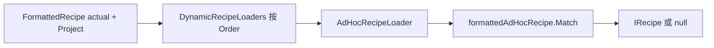

# RecipaediaEX API 使用文档

本文档基于当前 `Dependencies/RecipaediaEX` 源码整理，描述稳定可用的接口、扩展点和推荐实践。

## 1. 核心概念

- `IRecipe`：运行时配方对象，负责匹配逻辑与扩展数据。
- `IRecipesLoader`：配方来源提供器，负责初始化与返回静态配方集。
- `IDynamicRecipeLoader`：运行时动态配方提供器（如原版 AdHoc），不进入静态总表。
- `RecipaediaEXManager`：配方容器与匹配入口。
- `ICrafter` + `RecipesCrafterManager`：配方对应工作站（用于 UI 展示）。
- `IRecipaedia*`：图鉴条目、分类、详情、配方页接口。
- `RecipeDescriptor`：配方在 `RecipaediaEXRecipesScreen` 的渲染器。

---

## 2. 逻辑层 API

### 2.1 `IRecipe`

路径：`RecipesExtra/IRecipe.cs`

必须实现：

- `int DisplayOrder { get; }`：图鉴配方排序（越小越靠前）。
- `int MatchPriority { get; }`：匹配优先级（当前实现按升序）。
- `bool Match(IRecipe actual)`：与“实际配方”比较。
- `T GetExtraValue<T>(string key, T defaultValue)`
- `void SetExtraValue<T>(string key, T value)`

推荐约定：

- 在配方里维护 `ValuesDictionary`。
- 设置 `MatchedResultBlockValues`（`int[]`），用于图鉴产物条目 `Match`。
- 设置 `MatchedIngredientBlockValues`（`int[]`），用于图鉴原料条目 `IsIngredient`；`FormattedRecipe` 在 `PreTransformIngredients()` 末尾会自动写入。

### 2.2 `IRecipesLoader`

路径：`LoaderExtra/IRecipesLoader.cs`

- `void Initialize()`：首次加载时调用，建议做扫描和缓存准备。
- `IEnumerable<IRecipe> GetRecipes()`：返回配方集合（首次加载和进入存档时会调用）。
- `int Order { get; }`：加载器优先级。

默认加载器示例：

- `SurvivalcraftRecipesLoader`（原版配方）
- `BlockProceduralRecipesLoader`（程序生成配方）
- `CrXmlRecipesLoader`（`.cr` 文件）

### 2.3 `RecipaediaEXManager`

路径：`RecipaediaEXManager.cs`

常用方法：

- `FindMatchingRecipe(IRecipe actual)`：仅在静态配方表 `Recipes` 中查找。
- `FindDynamicRecipe(IRecipe actual, Project project)`：仅询问 `IDynamicRecipeLoader` 链。
- `FindMatchingRecipe<T>(IRecipe actual)`：若 `actual` 的 `ExtraValues` 含键 `"Project"`，先 `FindDynamicRecipe`，再查静态表。
- `TryFindMatchingRecipe<T>(IRecipe actual, out T recipe)`
- `FindMatchingRecipes(IRecipe actual)`：仅静态表。
- `ResetRecipes()`（方块 ID 变化后重建）

扩展工作台/熔炉在构造 `actual` 时会 `SetExtraValue("Project", Project)`，因此经 `FindCraftingRecipe` / `FindMatchingRecipe<T>` 可自动解析 AdHoc。自定义机器需要 AdHoc 时请同样在 `actual` 上写入 `Project`。

### 2.4 动态配方（`IDynamicRecipeLoader` / `DynamicLoaders`）

路径：

- 接口：`LoaderExtra/IDynamicRecipeLoader.cs`
- 内置实现：`LoaderExtra/DynamicLoaders/AdHocRecipeLoader.cs`
- 注册表：`RecipesLoadManager.DynamicRecipeLoaders`
- 入口：`RecipaediaEXManager.FindDynamicRecipe` / `FindMatchingRecipe<T>`

#### 与静态 `IRecipesLoader` 的区别

| | 静态 `IRecipesLoader` | 动态 `IDynamicRecipeLoader` |
|---|---|---|
| 配方来源 | `GetRecipes()` 写入 `RecipaediaEXManager.Recipes` | `GetDynamicRecipe(actual, project)` 按次生成 |
| 进入图鉴总表 | 是 | 否（仅匹配时临时返回） |
| 典型场景 | XML / 程序生成 / 固定表 | 原版 AdHoc、依赖世界状态的配方 |
| 图鉴 `Match` / `IsIngredient` | 需在配方对象上设置 Extra | 动态返回的 `IRecipe` 同样应设置 `MatchedResultBlockValues` / `MatchedIngredientBlockValues`（`FormattedRecipe` 经 `PreTransformIngredients` 会写原料 Extra） |

#### 接口

```csharp
public interface IDynamicRecipeLoader {
    void Initialize();
    IRecipe GetDynamicRecipe(IRecipe actual, Project project);
    int Order { get; }
}
```

- **`GetDynamicRecipe`**：`actual` 为当前格子布局的快照（通常为 `FormattedRecipe`）；无匹配返回 `null`。
- **`Order`**：升序；`FindDynamicRecipe` 按顺序询问，**先返回非 `null` 的 Loader 生效**，后续 Loader 不再执行。
- **`Initialize`**：接口已定义；`RecipaediaEXManager.Initialize()` 目前**不会**统一调用各 Loader 的 `Initialize`，可在 `GetDynamicRecipe` 内惰性初始化。

#### 自动发现

`RecipesLoadManager.Initialize()` 扫描 `TypeCache.LoadedAssemblies` 中所有**非抽象**的 `IDynamicRecipeLoader` 实现，无参构造实例化后加入 `DynamicRecipeLoaders`，再按 `Order` 排序。与 `IRecipesLoader` 使用同一套反射机制；**无需**在 xdb 或 modinfo 中额外注册类名。

调试：将 `RecipesLoadManager.DebugLogModToRecipeFileLoaders` 设为 `true` 时，日志会输出 `DynamicRecipeLoader {FullName}` 列表。

#### 匹配入口

```csharp
// 仅动态链（不查静态表）
IRecipe dynamic = RecipaediaEXManager.FindDynamicRecipe(actual, project);

// 先动态、再静态（推荐用于工作台/熔炉）
actual.SetExtraValue("Project", project);
T recipe = RecipaediaEXManager.FindMatchingRecipe<T>(actual);

// 仅静态表（不走 DynamicLoader）
IRecipe staticOnly = RecipaediaEXManager.FindMatchingRecipe(actual);
```

扩展工作台 / 熔炉（`ComponentEXCraftingTable` / `ComponentEXFurnace`）构造 `actual` 时会 `SetExtraValue("Project", Project)`，因此生产逻辑与图鉴侧经 `FindMatchingRecipe<T>` 可解析 AdHoc。自定义机器需要 AdHoc 或自定义动态配方时，请在 `actual` 上同样写入 `Project`。

#### 内置 `AdHocRecipeLoader`

| 项 | 说明 |
|----|------|
| 类型 | `RecipaediaEX.Implementation.AdHocRecipeLoader` |
| `Order` | `0`（默认最先） |
| 输入 | `actual` 须为 `FormattedRecipe`，否则返回 `null` |
| 查找 | `project.FindSubsystem<SubsystemTerrain>()`，遍历 `BlocksManager.Blocks` → `block.GetAdHocCraftingRecipe(terrain, ingredients, heatLevel, playerLevel)` |
| 输出 | `CraftingRecipe.ToFormattedRecipe<OriginalSmeltingRecipe>()`（`RequiredHeatLevel > 0`）或 `OriginalCraftingRecipe` |
| 校验 | `formattedAdHocRecipe.Match(actual)` 为真才返回；否则继续下一个方块 |
| 图鉴 Extra | 返回的 `FormattedRecipe` 会执行 `PreTransformIngredients()`（含 `MatchedIngredientBlockValues`）；若需在图鉴按产物检索，可对结果再 `SetExtraValue(MatchedResultBlockValuesKey, …)` |

流程概览：



#### 自定义 DynamicLoader

```csharp
public class MyDynamicLoader : IDynamicRecipeLoader {
    public int Order => 10; // 大于 0 时在 AdHoc 之后；小于 0 可抢先于 AdHoc

    public void Initialize() { }

    public IRecipe GetDynamicRecipe(IRecipe actual, Project project) {
        if (actual is not FormattedRecipe snapshot) return null;
        // 读取 project / 方块 / 玩家状态，构造或克隆 IRecipe
        // 记得设置 MatchedResultBlockValues / MatchedIngredientBlockValues（若需图鉴跳转）
        return null;
    }
}
```

实现类放在**已加载的程序集**中即可（与自定义 `IRecipesLoader` 相同）；发布后确认日志中出现你的 `DynamicRecipeLoader` 全名。

### 2.5 `RecipaediaEventBus`

路径：`Events/RecipaediaEventBus.cs`

- `Channel<T>()`：按事件类型懒创建全局 `EventChannel<T>`。
- `CrafterOutputRemoved`：内置通道，等价于 `Channel<CrafterOutputRemovedEvent>()`；扩展工作台/熔炉从产物格成功取出时发布。

```csharp
IDisposable sub = RecipaediaEventBus.CrafterOutputRemoved.Subscribe(e => { });
// 卸载时 sub.Dispose();
```

---

## 3. 工作站（Crafter）API

### 3.1 `ICrafter`

路径：`CrafterExtra/ICrafter.cs`

```csharp
bool IsCrafter(int blockValue, IRecipe recipe);
```

说明：

- 用于告诉图鉴“某配方可在哪些方块上执行”。
- 不直接实现生产逻辑（生产逻辑仍在你的组件中）。

### 3.2 `RecipesCrafterManager`

路径：`RecipesCrafterManager.cs`

- `Crafters`：`Dictionary<IRecipe, List<int>>`
- `Initialize()`：扫描实现了 `ICrafter` 的方块并建立映射。

---

## 4. 图鉴 UI API

### 4.1 条目接口

- `IRecipaediaItem`：图鉴列表条目基接口
- `IRecipaediaDescriptionItem`：详情页数据
- `IRecipaediaRecipeItem`：配方页匹配条件

关键点：

- `IRecipaediaItem.RecipeScreenName` / `DetailScreenName` 决定跳转界面。
- `IRecipaediaRecipeItem.Match()` 决定某条目能看到哪些配方。

### 4.2 分类接口

- `IRecipaediaCategoryProvider`：返回分类集合（要求无参构造）
- `IRecipaediaCategory`：分类定义
- `IAdvancedCategory`：额外控制 `ListItemSize` 和 `ListDirection`

---

## 5. 配方展示 API（Descriptor）

### 5.1 `RecipeDescriptor`

路径：`ScreenExtra/RecipeDescriptor.cs`

必须实现：

- `Show(IRecipe recipe, string nameSuffix)`
- `Hide()`
- `GetCrafterButton(IRecipe recipe)`

### 5.2 `RecipeDescriptorAttribute`

路径：`ScreenExtra/RecipeDescriptorAttribute.cs`

```csharp
[RecipeDescriptor(new[] { typeof(YourRecipe) }, order: 0)]
```

选择规则（同一 `recipeType` 多个 Descriptor 时）：

1. `order` 更高者生效
2. `order` 相同按类名字典序，后者覆盖前者

注意：

- Descriptor 构造函数必须是 `ctor(RecipaediaEXRecipesScreen)`。
- `RecipaediaEXRecipesScreen` 会缓存 Descriptor 实例复用。

---

## 6. 推荐接入步骤

1. 定义你的 `IRecipe` 类型。
2. 定义 `IRecipesLoader`，返回该配方集合。
3. 在配方中写好 `MatchedResultBlockValues`（及按需 `MatchedIngredientBlockValues`）。
4. 为要展示的条目实现 `IRecipaediaRecipeItem`。
5. 为配方类型实现 `RecipeDescriptor` 并加特性。
6. （可选）给工作站方块实现 `ICrafter`。
7. （可选）若需运行时 AdHoc 等逻辑，实现 `IDynamicRecipeLoader`；`actual` 匹配时写入 `Project`。

---

## 7. 示例骨架

### 7.1 自定义配方

```csharp
public class MyRecipe : IRecipe {
    public int DisplayOrder { get; init; }
    public int MatchPriority { get; init; }
    public int ResultValue { get; init; }
    public string Ingredient { get; init; } = string.Empty;
    readonly ValuesDictionary _extra = new();

    public bool Match(IRecipe actual) {
        if (actual is not MyRecipe a) return false;
        return CraftingRecipesManager.CompareIngredients(Ingredient, a.Ingredient);
    }

    public T GetExtraValue<T>(string key, T defaultValue) => _extra.GetValue(key, defaultValue);
    public void SetExtraValue<T>(string key, T value) => _extra.SetValue(key, value);
}
```

### 7.2 自定义加载器

```csharp
public class MyRecipesLoader : IRecipesLoader {
    readonly List<IRecipe> _recipes = [];
    public int Order => 100;
    public void Initialize() {
        // 扫描文件 / 构建索引
    }
    public IEnumerable<IRecipe> GetRecipes() => _recipes;
}
```

---

## 8. 常见问题

- **Q: 为什么图鉴里看不到我的配方？**  
  A: 先检查该配方是否设置了 `MatchedResultBlockValues`，以及条目的 `IRecipaediaRecipeItem.Match()` 是否命中。

- **Q: 为什么配方页显示了错误的 UI？**  
  A: 检查该配方类型是否有多个 `RecipeDescriptor`，确认 `order` 规则和构造函数签名。

- **Q: 我是否必须使用 `.cr`？**  
  A: 不必须。你可以实现自己的 `IRecipesLoader` 读取任意格式。

- **Q: AdHoc / 原版动态配方为什么匹配不到？**  
  A: 确认 `FindMatchingRecipe<T>` 的 `actual` 已 `SetExtraValue("Project", project)`，且 `actual` 为 `FormattedRecipe`（如 `OriginalCraftingRecipe` / `OriginalSmeltingRecipe`）。非泛型 `FindMatchingRecipe` 不会走动态 Loader。

---

## 9. 兼容说明

- `RecipeReaderAttribute`、`RecipeFileLoaderAttribute` 在当前主流程中并非硬依赖入口。
- 建议通过 `IRecipesLoader` 作为主扩展入口，在 Loader 内部自行组织 Reader 分发策略。
