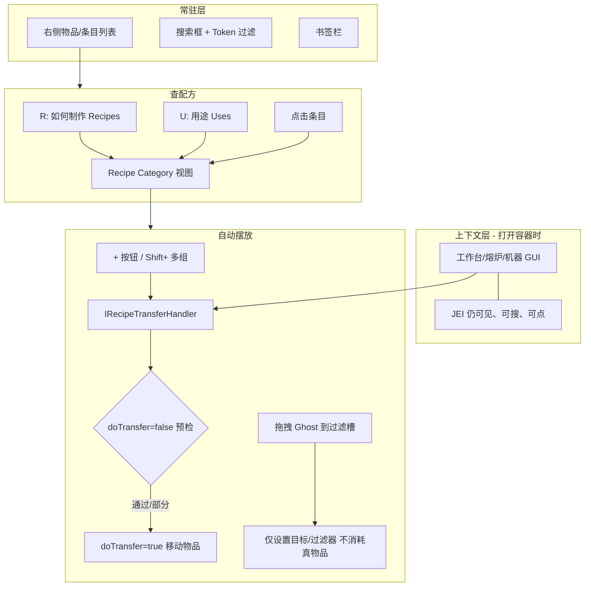

# 合成助手 — JEI 对标解构与基元语句

> **版本**：v1.2  
> **状态**：设计参考（与 [工作台悬浮助手策划.md](工作台悬浮助手策划.md) 配套）  
> **范围**：RecipaediaEX 合成助手（Crafting Overlay）的产品与技术对齐依据  
> **对标产品**：Minecraft [Just Enough Items (JEI)](https://github.com/mezz/JustEnoughItems)

---

## 1. 文档目的

本文件回答三个问题：

1. **JEI 是怎么做的**（玩法、逻辑、流程）？
2. **REX 合成助手应对齐 JEI 的哪些机制**？
3. **哪些「基元语句」是不可或缺的**（删掉任一条，查看/摆放体验就会明显劣于 JEI）？

主策划案（入口、UI、分期、接口）见 [工作台悬浮助手策划.md](工作台悬浮助手策划.md)。

---

## 2. 与 REX 已实现能力的区分

| 能力 | 实现 | 是否「合成助手」 |
|------|------|----------------|
| 合成失败文字提示 | `CrafterHints` + `DisplaySmallMessage`（IE2 设置「合成提示」） | ❌ 仅提示「为什么不能合成」，不提供查配方与摆放 |
| 全屏图鉴 + 搜索 | `RecipaediaEXScreen` + `RecipaediaSearchEngine` | ❌ 需 `SwitchScreen`，打断合成 Modal |
| **合成助手** | 策划 `RecipaediaCraftingOverlayDialog` + `IRecipaediaOverlayHost` + `IRecipePlacementTarget` | ✅ 同屏查配方 + **+** 自动摆放 |

---

## 3. JEI 总览：三层能力

JEI 不是全屏图鉴，而是 **叠在任意已打开 GUI 之上的配方浏览器 + 转移器**。



| 层 | JEI 机制 | 玩家感知 |
|----|----------|----------|
| **索引/展示** | Ingredient 注册 + Recipe Category + 插件注册配方 | 右侧永远能搜、能翻页、R/U 查 |
| **上下文查看** | 打开容器时 JEI **不 SwitchScreen**，配方面板叠在同一画面 | 边看配方边摆格子 |
| **自动摆放** | `IRecipeTransferHandler` / `IRecipeTransferInfo` 把配方槽 → 容器槽 | 点 **+** 从背包搬进机器 |

---

## 4. JEI 核心玩法流程

### 4.1 浏览与搜索（无容器打开）

1. 右侧列表展示 **所有已注册 Ingredient**（物品、流体、模组自定义类型）
2. 搜索框支持 `@mod:`、`$tag:` 等 Token
3. **A** 书签常用物品
4. **O** 隐藏/显示 JEI 面板

### 4.2 查配方 / 查用途（R / U）

| 操作 | 语义 | 结果 |
|------|------|------|
| **R** (Recipes) | 「这个东西 **怎么造**？」 | 按 **Recipe Category** 分页展示（工作台 3×3、熔炉、模组机器…） |
| **U** (Uses) | 「这个东西 **能干什么**？」 | 所有 **以它为原料** 的配方列表 |

可 **链式跳转**：铁锭 → U → 看到需要铁锭的机器配方 → 再 R 看机器怎么造。

### 4.3 打开容器时的「同屏」体验

打开工作台/化学反应釜 GUI 时：

- JEI **仍在**（模组可注册 **Exclusion Zone** 避让关键槽位）
- 搜索、R/U、书签 **行为不变**
- 配方视图里出现 **[+]**（若当前容器注册了 Transfer Handler）

### 4.4 自动摆放（+ 按钮）

现代 API（`IUniversalRecipeTransferHandler`）一次转移大致是：

```
transferRecipe(container, recipe, recipeSlots, player, maxTransfer, doTransfer)
```

| 参数 | 含义 |
|------|------|
| `doTransfer=false` | **只预检**：能不能放、缺什么、会不会冲突 |
| `doTransfer=true` | **真正移动**物品 |
| `maxTransfer=false` | 放 **一组** |
| `maxTransfer=true` | Shift+：尽量放 **多组**（受背包数量限制） |

典型算法（Basic Handler 隐含逻辑）：

1. 读取 **配方所需槽位**（category 定义的 layout）
2. 读取 **容器可写槽 + 玩家背包** 作为来源
3. 对每个需求槽：匹配 **等价物品**（同 tag / 同 ore dictionary）
4. **优先填空位**，默认 **不覆盖** 已有摆放
5. 背包不够 → **部分填充** + 返回缺失提示
6. 客户端 UI 侧发起 → **服务端权威**执行（防 dup）

**REX Overlay 扩展（D21）**：点 `+` **执行**前可将合成格物品退回背包再摆当前配方（`ClearGridBeforePlace`），避免同产物多变体 layout 与「只填空位」（P5）叠加产生混合 pattern。

**点 `+` 后的 UI 语义**（REX 决议 D20）：

| 行为 | JEI | REX Overlay |
|------|-----|-------------|
| 转移后关不关助手 / 配方页 | 工作台 GUI + JEI 条 **不关**；Recipe 页现代版常保持打开 | **不关闭** Overlay 与二级配方弹窗 |
| 已摆满再点 `+` | `+` 灰显 / 无转移 / tooltip | `AlreadySatisfied` → Tooltip「合成格已符合该配方」 |
| 反复叠加同一 pattern | ❌ 有形合成不支持 | ❌ 同左；Shift 多组 → Phase 3 |

官方 Wiki 对 Transfer 的分级：[Recipe Transfer Handlers](https://github.com/mezz/JustEnoughItems/wiki/Recipe-Transfer-Handlers)

| 级别 | 适用 |
|------|------|
| **Basic** | 声明「配方槽 + 背包槽」，JEI 自动生成 handler |
| **Complete Control** | 自定义 handler（ghost 槽、背后连着 AE 存储、化工釜等） |
| **Universal** | 一种 handler 处理所有 category（AE 样板编码等） |

### 4.5 Ghost 拖拽（与 + 不同）

`IGhostIngredientHandler`：从 JEI **拖**一个「假物品」到 GUI 某区域：

- **不消耗**背包
- 用于 **过滤槽、样板编码、设置目标物品** 等

**预览/设定** 与 **真实库存转移** 是两条通道，不能混为一谈。

### 4.6 模组接入方式

每个机器 mod 在 JEI Plugin 里：

1. `registerRecipes` — 注册 **Recipe Category** + 配方实例
2. `registerRecipeTransferHandlers` — 注册 **该 Container 的 Transfer Handler**
3. 声明 **recipe slots ↔ container slots** 的对应关系

化学反应釜、灌装机、AE 样板格 **各自** 注册；JEI 核心 **不写死** 任何 mod 逻辑。

---

## 5. REX 与 JEI 概念对照

| JEI 概念 | REX 已有 | 合成助手缺口 |
|----------|----------|--------------|
| Ingredient 列表 | `RecipaediaSearchIndex` + 图鉴条目 | 悬浮壳层未做 |
| R / U | 图鉴 `Match` / `IsIngredient` + `RecipeSlotWidget` 点击跳转 | 缺 **快捷键 R/U + 悬浮内链** |
| Recipe Category | `RecipeDescriptor` | 需在 Overlay 内嵌只读 Descriptor |
| 同屏 | 策划 `RecipaediaCraftingOverlayDialog` | 未实现 |
| + Transfer | 策划 `IRecipePlacementTarget` | 通用 `PlacementRequirement` + 内容模组 Target 解释 Quantity |
| 流体原料 | `ReactionEquationRecipe` + 反应釜 Component | 内容模组 `ReactorPlacementTarget`（REX 无 Fluid 字段） |
| Ghost | 无 | Phase 3 可选 |

### 5.1 工业反应釜示例

反应釜 `FindEquation()` 的输入是 **3 个物品槽 + 3 个流体罐** 的组合，不是 36 格形状合成——对应 JEI 的 **Complete Control Handler**，不能复用 `CraftingTablePlacementTarget`。

| 机器 | 配方类型 | Placement 适配 |
|------|----------|----------------|
| 工作台/机床 | `OriginalCraftingRecipe` + Transform | REX `CraftingTablePlacementTarget`（`GridCell`） |
| 反应釜 | `ReactionEquationRecipe` | 内容模组 `ReactorPlacementTarget`（`ContainerSlot` + 自解释 `Quantity`） |
| 灌装机 | 灌装类配方 | 内容模组 Target |
| One2One 压板机 | `One2OneRecipe` | 内容模组 Target（单 `ContainerSlot`） |

反应釜 **+** 的第一版可：**物品槽自动填 + 罐体缺口仅提示**（不自动拉管道），仍符合 JEI/RS 常见行为。

### 5.2 与 recipaedia-rex-anti-patterns 的对齐（v1.1）

v0.2 策划曾出现 `FluidVolume`、`PlacementKind.FluidTank`、`PlacementSources.ITank`，**违背** mdc §1（把流体语义写进 REX 核心）。

**定稿原则**：

| 层级 | REX 核心 | 内容模组 |
|------|----------|----------|
| 需求 struct | `PlacementAddressKind` + `MatchKey` + **`Quantity`（opaque）** | 适配器将方程/流体转为 `ContainerSlot` 列表 |
| 数量含义 | 不定义 | Target 解释（个数 vs 体积） |
| 罐体 API | 不出现 `ITank` | `ReactorPlacementTarget` 构造时绑定 Component |

**不用字段级 union 的原因**：`ItemCount`/`FluidVolume` 并列或在 C# 做 explicit union，都会在 API 表面 **命名** 流体分支；单一 `Quantity` + Target 解释与 JEI「Handler 解释 Ingredient」同构。

---

## 6. 基元语句（Primitive Statements）

以下每条为 **不可再删的公理**。删掉任一条，「查看/摆放配方」体验就会明显劣于 JEI。

### 6.1 查看（View）

**V1. 同屏公理**  
> 玩家打开工作容器时，查配方 **不得** 离开该容器界面；辅助 UI 只能是 **叠加层**，不能 `SwitchScreen` 打断合成会话。

**V2. 双向导航公理**  
> 对任意图鉴条目，系统必须能回答：**如何制作（R）** 与 **作为何物原料（U）**；两种导航共享同一索引。

**V3. 分类展示公理**  
> 一种工作站/工序对应一种 **Recipe Category（Descriptor）**；同一产物若有多条路径（工作台 vs 机床 vs 反应釜），必须 **分 category 展示**，不能混成一张图。

**V4. 上下文过滤公理**（v0.4 拆分）  
> **搜索**：悬浮助手条目候选 = **全局 All Blocks**（与 JEI 齐平）。  
> **预览**：选中条目后，配方 Descriptor 列表 = **该条目 Match** ∩ **当前工作站（`@crafter`）** ∩ **网格宽度（`GridWidth`）**；**不设 `ProcessType` 字段**；**舍弃 `@grid` Token**。

**V5. 搜索一致公理**  
> 悬浮助手与全屏图鉴 **共用** 搜索引擎与索引；助手搜索 **永远 All Blocks**；工作站约束 **仅作用于预览 Grid**，不拼进搜索 query。

**V6. 只读预览公理**  
> 配方预览区 **只读**；点击原料格可跳转相关配方，但 **不隐式改动** 容器内物品。

### 6.2 摆放（Place / Transfer）

**P1. 槽位映射公理**  
> 自动摆放的本质是：**Recipe Requirement → Container Writable Slot** 的显式映射；没有映射就没有 `+` 按钮。

**P2. 多资源类型公理**  
> 「可摆放原料」不限于物品堆叠；**流体、能量等** 也可参与转移，但 REX 核心仅以 **opaque `Quantity` + 容器槽寻址** 承载；**具体语义由 Target 解释**（基元 E1），不在框架 struct 上命名 `Fluid*` 字段。

**P3. 等价物选择公理**  
> 一个配方需求可对应多种方块实例（及内容模组内的其它等价物）；转移前必须为每个需求 **选定具体 variant**（优先：已在目标槽的 > 背包数量最多的 > 字典序）。

**P4. 预检优先公理**  
> 执行转移前必须 **dry-run**：报告缺失、冲突、等级/温度不足；**允许部分成功**，禁止 silent fail。

**P5. 非破坏默认公理**  
> 默认 **只填空位**，不覆盖玩家已摆好的内容；覆盖需显式选项或机器语义（如「清空输入区」按钮）。

**P6. 库存来源公理**  
> 转移只能消耗 **玩家当前可访问** 的库存（打开 GUI 绑定的背包 + 该面板可见的机器侧缓存），不能凭空生成（生存模式）。

**P7. 转移后刷新公理**  
> 任意成功放置后，必须触发容器侧 **配方重匹配**（`UpdateCraftingResult` / `FindEquation` / `FindRecipe`），使产物预览与进度条立即更新。

**P8. 权威执行公理**  
> 若存在联机/服务端权威：UI 发起、**服务端执行** 物品移动，客户端只做预测与提示（与手工拖放同一套库存 API；罐体在内容模组 Target 内）。

**P9. 形状变换公理**  
> 有形合成（3×3/4×4）的放置必须支持 **平移/镜像** 等与匹配侧一致的 Transform，否则「+ 放进去但不出产物」。

**P10. Ghost 分离公理**  
> **Ghost/拖拽设定**（过滤器、样板、目标物品）与 **真实 + 转移** 是两条通道；Ghost **不消耗**背包，Transfer **必须**消耗。

### 6.3 扩展与架构

**E1. 插件注册公理**  
> 每种机器 GUI 通过 **自注册** 的 PlacementTarget 接入；框架核心 **不写** 工业/流体/化工专有逻辑。

**E2. 可放置配方接口公理**  
> 不能自动 `+` 的配方类型，不是「不支持助手」，而是 **未实现 `IPlacableRecipe`**；UI 仍应能预览，只是禁用 `+` 并说明原因。

**E3. 快捷键上下文公理**  
> `X`/R/U 的行为随焦点变化：打开 **可放置容器** → toggle 悬浮助手；否则 → 经 **`RecipaediaEventBus`** 请求全屏图鉴（REX Hook 统一监听，内容模组订阅）；在槽位上 → 优先对该物品 R/U。

**E4. 缺失可行动公理**  
> 预检失败时，提示必须 **可行动**（「缺铜锭×2」），而非仅「无法合成」；条件允许时链到 **获取途径**（图鉴/科技树/用途 U）。

---

## 7. 基元 → REX 接口映射（摘要）

| 基元 | REX / 内容模组落点 |
|------|-------------------|
| V1–V6 | `RecipaediaCraftingOverlayDialog`、`IRecipaediaOverlayHost`、预览 **Grid + Scroll** |
| V6 / 导航 | `IRecipaediaRecipeNavigator` + `RecipeDescriptorRegistry`（解耦 Screen） |
| P1–P4 | `IRecipePlacementTarget` + `PlacementResult`（dry-run / execute） |
| P2 | REX：`PlacementAddressKind` + `Quantity`；流体/罐体：内容模组 Target |
| P9 | `CraftingTablePlacementTarget` + `TransformRecipe` |
| P7 | Target 实现末尾调用 `UpdateCraftingResult` / `FindEquation` |
| E1–E2 | `IPlacableRecipe` + 内容模组 `*PlacementTarget` |
| E3 | REX `RecipaediaEXLoader` Hook + `RecipaediaEventBus` |
| P10 | Phase 3 `IGhostPlacementTarget`（可选） |

---

## 8. 一句话总结

**JEI = 同屏配方浏览器 + 按容器注册的 Transfer Handler；`+` 不是「聪明 AI」，而是「配方需求 → 槽位映射 → 预检 → 部分填充 → 刷新匹配」。**

REX 合成助手只要把接口从「36 格 + `IInventory`」升格为 **「`PlacementRequirement`（通用寻址 + opaque Quantity）+ dry-run/execute + 每机器一个 Target」**，工业反应釜与 JEI Complete Control Handler 即为同一类问题；**流体不进入 REX struct 字段名**。

---

## 9. 相关文档

- [工作台悬浮助手策划.md](工作台悬浮助手策划.md) — 主策划（UI、分期、接口定义）
- [图鉴搜索功能策划.md](图鉴搜索功能策划.md) — 搜索内核前置
- [JEI Recipe Transfer Handlers Wiki](https://github.com/mezz/JustEnoughItems/wiki/Recipe-Transfer-Handlers)

---

## 10. 变更记录

| 版本 | 日期 | 说明 |
|------|------|------|
| v1.0 | 2026-06-16 | 初稿：JEI 解构、REX 对照、基元语句、工业机器扩展依据 |
| v1.1 | 2026-06-16 | 对齐 anti-patterns：废止 FluidVolume/FluidTank/ITank；P2/P8/§5.2/§7 修订 |
| v1.2 | 2026-06-16 | 对齐策划 v0.4：V4/V5 搜索与预览拆分、E3 EventBus、Navigator 映射 |
