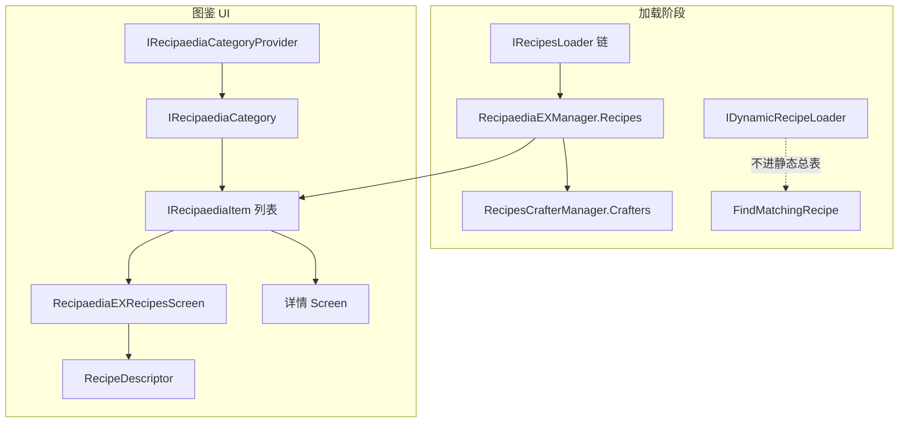
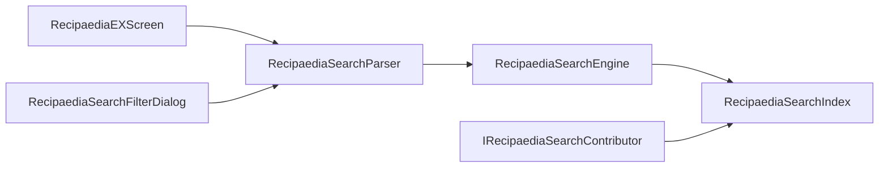

# RecipaediaEX 图鉴搜索功能策划

> **版本**：v0.8  
> **状态**：**Phase 1 / Phase 2 核心已收尾**（冒烟 A–F 已通过）；可选项（高亮 / Contributor 文档 / RecipeSlot 联动）待续  
> **范围**：RecipaediaEX（REX）核心程序集；面向所有依赖 REX 的内容模组。  
> **目标界面**：`RecipaediaEXScreen`（替换原版 `Recipaedia` 入口后的主图鉴页）。

---

## 1. 背景与问题

### 1.1 现状（REX 架构摘要）

REX 已将「配方定义 → 加载 → 图鉴展示 → 工作站匹配」解耦，主流程如下：



**主图鉴页当前能力**（`RecipaediaEXScreen`）：

| 能力 | 实现 |
|------|------|
| 分类浏览 | `IRecipaediaCategoryProvider` → 左右切换 `m_categoriesName` |
| 条目列表 | `ListPanelWidget`，按分类 `GetItems()` 填充 |
| 条目类型 | 不限方块：`IRecipaediaItem`（方块 / 自定义条目等） |
| 配方关联 | `IRecipaediaRecipeItem.Match` / `IsIngredient` + `RecipeExtraKeys` |
| 工作站展示 | `RecipesCrafterManager` + `RecipeDescriptor.GetCrafterButton` |

**当前缺失**：无文本检索、无结构化 Filter；条目规模上千时只能靠分类 + 滚动。

### 1.2 用户痛点（泛化）

依赖 REX 的内容模组通常会显著扩充方块 / 自定义图鉴条目、配方类型与工作站点。玩家在「找某个产物」「某原料能做什么」「某机器相关物品」时，现有 UI 成本过高。

### 1.3 设计目标

1. **JEI 式直觉**：输入名称即可缩小当前可见条目列表；选中后仍走现有详情 / 配方页。
2. **Unity SearchFilter 式表达力**：单行查询 + 前缀 Token + 排除 / 精确匹配。
3. **框架级、可扩展**：搜索索引与过滤在 REX 核心；内容模组通过 `IRecipaediaSearchContributor` 补充元数据。
4. **性能可接受**：千级条目 + 万级配方的索引重建与防抖查询在可接受时间内完成。

---

## 2. 已确认决策

| # | 议题 | 决策 |
|---|------|------|
| 1 | **搜索范围** | **仅当前分类**。用户处于「All Blocks」等全量分类时等价于全局；切换到子分类时，搜索只在当前分类条目内过滤。切换分类时保留或清空搜索词见 §5.2（默认：**清空搜索**）。 |
| 2 | **搜索域** | **仅条目过滤**（Item Scope）。不做配方域独立列表（`@scope:recipe` 不纳入 Phase 1/2 主交付）。 |
| 3 | **高级筛选 UI** | 使用 **Dialog**（`DialogsManager` / 独立 Dialog 类），非 Screen 内嵌抽屉。 |
| 4 | **模组来源 Token** | **同时支持** `@mod:`（显示名 / 友好名模糊）与 `@pack:`（包名 / `modinfo` PackageName 精确或前缀）。 |
| 5 | **中文拼音** | **Phase 2**：索引增加拼音全拼 / 首字母字段，支持拼音检索。 |
| 6 | **代码归属** | 索引、解析器、搜索引擎、Contributor 接口均放在 **REX 核心程序集**（`RecipaediaEX`），非独立 UI 模组。 |
| 7 | **搜索栏 UI** | **复用宿主 `CommunityContentScreen` 顶部搜索栏**（同款 `TextBoxArea`、占位符、`ClearSearchLink`、`Search` / `SearchType` 按钮布局与样式）；不自研独立 SearchBar 控件皮肤。 |

---

## 3. 参考产品对照

### 3.1 JEI（Just Enough Items）

| JEI 能力 | REX 映射 | 阶段 |
|----------|----------|------|
| 物品列表文字过滤 | 主搜索框 → 过滤当前分类内 `IRecipaediaItem` | P0 |
| 点击物品 → 用途 / 来源 | 已有 `RecipesButton` + `Match` / `IsIngredient` | 已有 |
| 点击配方槽位跳转原料 | 已有 `RecipeSlotWidget` | 已有 |
| `@mod` 模组过滤 | `@mod:` + `@pack:` | P1 |
| 配方分类 | `@rtype:` 配方类型（用于筛条目，非配方域列表） | P1 |
| 书签 / 历史 | 搜索历史（UI 偏好存储） | P2 |
| 快捷用途 / 来源 | Advanced Filter Dialog 内 `@can-use` / `@has:recipe` | P1 |

### 3.2 Unity SearchFilter / QueryEngine

| Unity 机制 | REX 映射 |
|------------|----------|
| Provider 前缀 | 本方案无多 Provider；条目域唯一 |
| `t:` 类型 | `@t:block` / `@t:custom` |
| `l:` 标签 | `@tag:`（Contributor 扩展） |
| `ref:` 依赖 | `@uses:` / `@in:` / `@makes:` / `@out:`（基于配方图，仍输出条目） |
| 空格 = AND | 默认 AND |
| `-` 排除 | `-keyword` / `-@t:custom` |
| `=` 精确 / `:` 模糊 | `name=铁锭` vs `name:铁` |
| `()` / `or` | Phase 2 |

---

## 4. 功能范围

### 4.1 搜索范围语义（当前分类）

```text
候选集 = m_categories[m_selectedCategory].GetItems()
过滤结果 = SearchEngine.Execute(query, candidates)
```

| 当前分类 | 有效范围 |
|----------|----------|
| `All Blocks`（或各 Provider 定义的全量类） | 该分类下全部条目 ≈ 全局 |
| `Terrain`、自定义分类 | 仅该分类 `GetItems()` |
| 切换分类 | **默认清空搜索框与 Filter 状态**，重新 `PopulateBlocksList` |

`@cat:` Token **Phase 1 不启用**（与「仅当前分类」冲突）；若 Advanced Dialog 中保留分类多选，则视为「临时 override」，需显式确认后切换分类或提示用户（**建议 Phase 1 Dialog 隐藏分类字段**，避免歧义）。

### 4.2 基础搜索（Phase 1 / P0）

- 搜索栏 **复用宿主社区 Screen 顶部 UI**（见 §5.1），不单独设计图鉴专用输入框样式。
- **触发方式**（与 `CommunityContentScreen` 一致）：
  - 点击 **`Search` 按钮** 执行查询（主路径）；
  - **`ClearSearchLink`** 清空输入并恢复未过滤列表；
  - 占位符 `placeholder` 在无文本时居中显示；有文本或获焦时隐藏；
  - 可选：输入框 `TextChanged` 防抖（~200ms）作为辅助，但不替代 Search 按钮语义。
- **匹配字段**（在当前分类候选集内）：
  - 显示名；
  - 描述摘要（首行 / 截断）；
  - CraftingId / 内部 Id（`@id:` 精确；普通文本模糊）。
- **空结果**：提示改写关键词，或通过 **`SearchType` 按钮** 打开 Advanced Filter Dialog。
- **Esc / Back**：有搜索文本时先清空搜索，再退出 Screen。

### 4.3 高级 Filter（Phase 1 / P1）

#### 4.3.1 入口（复用社区 Screen 按钮位）

图鉴页 **不单独做 Filter Chip 行**；高级筛选入口占用社区搜索栏右侧按钮位：

| 宿主控件 | 图鉴语义 |
|----------|----------|
| `Search`（`ButtonStyle_115x60`） | **搜索**：按当前输入框内容执行条目过滤 |
| `SearchType`（115×60） | **筛选**：打开 Advanced Filter Dialog；按钮文案为当前筛选摘要（无筛选时显示默认「筛选」类文案） |

Dialog 内提供 `@has:recipe`、`@can-use` 等布尔项及结构化字段，确认后写回 `key` 文本框并触发一次搜索。

#### 4.3.2 Advanced Filter Dialog

- 通过 `DialogsManager.ShowDialog(...)` 弹出，与 `key` 输入框 **双向同步**。
- 确认 → 写回查询字符串并关闭；取消 → 不应用。
- Phase 1 字段：

| 字段 | UI 控件 | Token |
|------|---------|-------|
| 条目类型 | 多选：方块 / 自定义 | `@t:` |
| 来源包 | 下拉 / 列表 | `@pack:` |
| 来源模组 | 下拉 / 列表（显示名） | `@mod:` |
| 工作站 | 方块 picker | `@crafter:` |
| 配方类型 | 已注册 `IRecipe` 类型 | `@rtype:` |
| 原料包含 | 物品 picker | `@in:` / `@uses:` |
| 产物为 | 物品 picker | `@out:` / `@makes:` |
| 配方数量 | 数值 / 范围 | `@recipes>=1`（Phase 2 完整比较符） |
| 排除词 | 文本 | `-keyword` |

**不包含**「图鉴分类」多选（见 §4.1）。

Picker 复用图鉴条目图标（`ItemWidgetFactory` 缩略图或 `BlockIconWidget`）。

### 4.3.3 查询语言（Query Language）

单行语法，空格默认 **AND**：

```text
# 模糊名称
铁 锭

# 精确名称
name=铁锭

# 类型（在当前分类候选集内再筛）
@t:block 铜

# 配方关系（输出仍为条目，非配方列表）
@out:铜锭
@in:铜矿石
@uses:铜矿石          # @in 别名

# 工作站
@crafter:熔炉
@crafter=工作台

# 配方类型
@rtype:Smelting

# 来源（二者并存）
@pack:com.example.content
@mod:示例内容包

# 排除
铜 -@t:custom -废

# Phase 2
(@in:煤 or @in:木炭) @crafter:熔炉
name:tie          # 拼音匹配「铁」等
```

**Phase 1 运算符**：AND、`-` 排除、`=` 精确、`:` 模糊。  
**Phase 2**：`or`、`()`、数值比较、`@recipes>=N`、拼音字段。

---

## 5. UI 设计

### 5.1 主界面布局（RecipaediaEXScreen）

搜索区插在 **分类栏与列表之间**，视觉与交互 **对齐宿主 `CommunityContentScreen`**（`Screens/CommunityContentScreen.xml` + `CommunityContentScreen.cs`），复用宿主全局样式，不在 REX 内另做一套输入框皮肤。

**布局示意**：

```text
┌──────────────────────────────────────────────────────────┐
│  TopBar: 图鉴（Widgets/TopBarContents）                    │
├──────────────────────────────────────────────────────────┤
│  ◀  分类名 (N)  ▶                                          │
├──────────────────────────────────────────────────────────┤
│  ┌──────────────────────────────┐ [搜索] [筛选]            │
│  │ TextBoxArea + placeholder    │ 115×60  115×60          │
│  │ key                    清除→ │                         │
│  └──────────────────────────────┘                         │
├──────────────────────────────────────────────────────────┤
│  ListPanelWidget（过滤后条目）                             │
├──────────────────────────────────────────────────────────┤
│  [详情]                         [配方 (k)]                 │
└──────────────────────────────────────────────────────────┘
```

#### 5.1.1 复用的宿主 XML 结构

在 `RecipaediaEXScreen.xml` 中 **按社区 Screen 同构拷贝** 搜索行（控件名保持一致，便于对照宿主 `Update` 逻辑）：

```xml
<!-- 对齐 CommunityContentScreen.xml L26-L36 -->
<StackPanelWidget Direction="Horizontal" Margin="10, 0" HorizontalAlignment="Center">
  <CanvasWidget VerticalAlignment="Center" Size="340, 50" Margin="0, 5">
    <BevelledRectangleWidget Style="{Styles/TextBoxArea}" />
    <LabelWidget Name="placeholder" HorizontalAlignment="Center" VerticalAlignment="Center"
                 Text="[RecipaediaSearch:0]" Color="96, 96, 96" />
    <TextBoxWidget Name="key" Size="Infinity, 60" VerticalAlignment="Center" Margin="10, 0" />
    <LinkWidget Name="ClearSearchLink" Text="[OriginalCommunityContentScreen:7]"
                Color="64, 192, 64" HorizontalAlignment="Far" VerticalAlignment="Center"
                DropShadow="true" Margin="10, 0" />
  </CanvasWidget>
  <CanvasWidget Size="5, 0" />
  <BevelledButtonWidget Name="Search" Text="[CommunityContentScreen:10]"
                         Style="{Styles/ButtonStyle_115x60}" VerticalAlignment="Center" />
  <BevelledButtonWidget Name="SearchType" Text="[RecipaediaSearch:1]"
                        Size="115, 60" VerticalAlignment="Center" />
</StackPanelWidget>
```

**样式与资源约定**：

| 资源 | 来源 | 说明 |
|------|------|------|
| `{Styles/TextBoxArea}` | 宿主 Content | 输入区底框 |
| `{Styles/ButtonStyle_115x60}` | 宿主 Content | 「搜索」按钮 |
| `ClearSearchLink` 文案键 | `[OriginalCommunityContentScreen:7]` | 与社区页「清除」一致 |
| `Search` 文案键 | `[CommunityContentScreen:10]` | 与社区页「搜索」一致 |
| `placeholder` / `SearchType` | REX 新增语言键 `RecipaediaSearch` | 图鉴专用占位与筛选摘要 |

**不引入** REX 自有 `SearchBar` Widget 皮肤；若后续多处复用，可抽 `RecipaediaEX/Widgets/CommunityStyleSearchRow.xml` 作为 **结构片段**，仍引用上述宿主 Style。

#### 5.1.2 代码侧字段（对齐 CommunityContentScreen）

`RecipaediaEXScreen` 增加与宿主同名的控件引用：

```csharp
TextBoxWidget m_inputKey;      // Name="key"
LabelWidget m_placeHolder;     // Name="placeholder"
LinkWidget m_clearSearchLink;  // Name="ClearSearchLink"
ButtonWidget m_searchButton;   // Name="Search"
ButtonWidget m_searchTypeButton; // Name="SearchType"
string m_searchQuery = string.Empty; // 上次成功执行的查询（含 Dialog 合成的 Token）
```

**可见性逻辑**（照抄社区 Screen `Update` 片段）：

- `m_placeHolder.IsVisible` ← 输入框为空；
- `m_clearSearchLink.IsVisible` ← 输入框非空或获焦；
- `m_searchTypeButton.Text` ← 无高级筛选时默认文案；有筛选时显示简短摘要（如「3 项筛选」）。

分类标签 `(N)` 为 **过滤后** 条目数。列表刷新：`PopulateBlocksList` → 若有 `m_searchQuery` 则 `ApplySearchFilter`。

### 5.2 交互规则

| 事件 | 行为 |
|------|------|
| 切换分类（◀ ▶） | 清空 `key` 与 `m_searchQuery`；`PopulateBlocksList` |
| 点击 `Search` | 读取 `key.Text`（trim、去换行）→ 写入 `m_searchQuery` → 过滤列表 |
| 点击 `ClearSearchLink` | `key.Text = ""`；`m_searchQuery = ""`；恢复未过滤列表 |
| 点击 `SearchType` | 打开 Advanced Filter Dialog |
| Dialog「应用」 | 合成 query 写回 `key` → 等同点击 `Search` |
| Dialog「取消」 | 不修改当前列表 |
| `key` 回车（若宿主 TextBox 支持） | 等同点击 `Search` |
| 可选 `TextChanged` 防抖 | 仅作辅助预览，**不以**替代 `Search` 按钮 |
| Esc（有搜索词） | 先 `ClearSearchLink` 语义，不退出 |
| Esc（无搜索词） | 沿用现有退出逻辑 |

### 5.3 Advanced Filter Dialog

- 继承项目内 Dialog 惯例（参考宿主 `Dialog/` 与 REX 现有 Widget 风格）。
- 布局：表单 + 「重置」「取消」「应用」。
- 「应用」仅关闭 Dialog 并触发搜索，不切换 Screen。
- XML 资源建议路径：`RecipaediaEX/Dialogs/RecipaediaSearchFilterDialog.xml`（与 Screen 资源并列）。

### 5.4 搜索历史（Phase 2）

- 存于 **UI 偏好**（外部 Storage，非世界存档），最近 20 条。
- SearchBar 获焦时可下拉历史（可选；`key` 获焦触发）。

---

## 6. 技术架构

### 6.1 分层



全部位于 **`RecipaediaEX` 程序集**，建议目录：

```text
RecipaediaEX/
  Search/
    RecipaediaSearchIndex.cs
    RecipaediaSearchEngine.cs
    RecipaediaSearchParser.cs
    SearchQuery.cs
    ItemSearchDocument.cs
    IRecipaediaSearchContributor.cs
    ISearchFilterDefinition.cs
  UI/
    RecipaediaSearchFilterDialog.cs
  ScreenExtra/
    RecipaediaEXScreen.cs          # 集成社区同款搜索行 + Update 逻辑
  Assets/RecipaediaEX/
    Dialogs/RecipaediaSearchFilterDialog.xml
    Screens/RecipaediaEXScreen.xml   # 增加 §5.1.1 搜索行
    Widgets/CommunityStyleSearchRow.xml  # 可选：抽取片段，仍引用宿主 Style
```

### 6.2 RecipaediaSearchIndex

**重建时机**：

| 事件 | 动作 |
|------|------|
| `RecipaediaEventBus.RecipesReset` | 重建配方关联字段（产物 / 原料 / 工作站 / 类型） |
| 图鉴 `GetCategories()` 完成 | 按分类构建条目文档 |
| `BlocksInitalized` | 刷新 `@crafter` 相关映射 |

**条目文档 `ItemSearchDocument`**（每个 `IRecipaediaItem` 一条）：

| 字段 | 来源 |
|------|------|
| `Item` | `IRecipaediaItem` 引用或稳定键 `(CategoryId, Value)` |
| `DisplayName` / `NormalizedName` | 去大小写、trim |
| `Pinyin` / `PinyinInitials` | Phase 2：由中文显示名生成 |
| `DescriptionSnippet` | 描述截断 |
| `ItemKind` | block / custom |
| `CategoryId` | 所属分类（条目可只属于一个 Provider 分类实例） |
| `PackId` | 注册方包名（`modinfo` PackageName） |
| `ModDisplayName` | 用于 `@mod:` |
| `CraftingIds[]` | 方块 craftingId 等 |
| `RecipeCountAsResult` | 对 `RecipaediaEXManager.Recipes` 的 `Match` 计数 |
| `RecipeCountAsIngredient` | `IsIngredient` 计数 |
| `CrafterBlockValues[]` | 关联配方 → `RecipesCrafterManager` 并集 |
| `RecipeTypeNames[]` | 关联配方 CLR 类型名 |
| `ResultBlockValues[]` / `IngredientBlockValues[]` | 便于 `@in` / `@out` 解析 |
| `Tags[]` | Contributor |

**查询流程**（仅条目）：

```text
1. candidates = currentCategory.GetItems()
2. docs = Index.GetDocuments(candidates)
3. ast = Parser.Parse(query)
4. result = Engine.Filter(docs, ast)
5. Sort by relevance → DisplayOrder → name
6. m_blocksList 仅展示 result
```

**顺带修复**：`BlockItem.m_recipesCount` 在构造时计算且 `BlocksCategoryProvider` 静态缓存，`RecipesReset` 后可能过期。索引重建时 **动态计算** 计数；Screen 上配方按钮文案应读索引或实时 Count，而非构造期缓存。

### 6.3 IRecipaediaSearchContributor

内容模组无参构造，反射注册（与 `IRecipaediaCategoryProvider` 相同）：

```csharp
public interface IRecipaediaSearchContributor
{
    void EnrichItem(IRecipaediaItem item, ItemSearchDocument doc);
    void EnrichRecipe(IRecipe recipe, RecipeSearchDocument doc); // 供 @in/@out 索引，不用于配方域 UI
    IEnumerable<ISearchFilterDefinition> GetFilterDefinitions();
}
```

### 6.4 @mod 与 @pack 区分

| Token | 匹配对象 | 匹配方式 |
|-------|----------|----------|
| `@pack:` | `modinfo.json` 的 PackageName / 程序集所属包 | 精确或前缀（`@pack:com.foo`） |
| `@mod:` | 模组显示名、Contributor 提供的别名 | 模糊包含 |

条目 `PackId` / `ModDisplayName` 在索引构建时由 `ModsManager` / 方块注册源推断；无法推断时 Contributor 补充。

### 6.5 相关度排序

| 条件 | 分 |
|------|-----|
| 名称前缀匹配 | +100 |
| 名称包含 | +50 |
| CraftingId 匹配 | +40 |
| 描述包含 | +10 |
| `@tag` / Contributor 标签 | +20 |
| Phase 2 拼音全拼 / 首字母 | +30 / +15 |

---

## 7. 用户故事与验收

| ID | 故事 | 验收 |
|----|------|------|
| US-01 | 在「All Blocks」输入「铜」 | 仅 All 分类内名称含铜的条目；`(N)` 为过滤后数量 |
| US-02 | 切换到自定义分类后搜索 | 仅该分类条目 |
| US-03 | 子分类下搜其它分类才有的词 | 无结果或仅当前分类匹配项 |
| US-04 | `@uses:铜矿石` 在当前分类内 | 列出可作原料的条目（或反向：列出与铜矿石相关的条目集，见实现时 `@in` 语义：筛 **条目** 是否出现在原料侧配方中） |
| US-05 | `@pack:com.xxx` 与 `@mod:显示名` | 二者可独立生效 |
| US-06 | Advanced Dialog 选工作站后应用 | 关闭 Dialog，`key` 显示合成 query，列表刷新 |
| US-09 | 搜索行外观与社区 Screen 一致 | 同屏对比 `CommunityContentScreen`：TextBoxArea、清除链接、115×60 按钮 |
| US-07 | `RecipesReset` 后 | 配方计数与 `@has:recipe` 正确 |
| US-08 | Phase 2 输入 `tie` 找「铁」 | 拼音命中 |

**`@in` / `@out` 语义说明（条目过滤）**：

- `@out:铁锭`：在当前分类候选集中，保留 **作为该产物之配方产物条目** 的图鉴项（即 `IRecipaediaRecipeItem.Match` 对以铁锭为产物的配方为真）。
- `@in:铜矿石`：保留 **作为原料参与配方** 的条目（`IsIngredient`）。
- Picker 选的物品解析为 blockValue，再查索引倒排表。

---

## 8. 分阶段交付

### Phase 1 — MVP（P0 + P1）

- [x] `RecipaediaSearchIndex` + `RecipesReset` / Categories 挂钩
- [x] `RecipaediaSearchParser` + `RecipaediaSearchEngine`
- [x] `RecipaediaEXScreen` 集成社区同款搜索行（`key` / `Search` / `SearchType` / `ClearSearchLink`）
- [x] `RecipaediaSearch` 语言键（placeholder、筛选摘要）
- [x] `RecipaediaSearchFilterDialog` + XML
- [x] Token：`@t:` `@pack:` `@mod:` `@crafter:` `@in:` `@out:` `@uses:` `@makes:` `@rtype:` `@has:recipe` `@can-use` `-` `name=` / `name:`
- [x] 仅当前分类候选集过滤
- [x] 切换分类清空搜索
- [x] 修复条目配方计数 stale
- [x] 语言包挂 `ContentWidgets`（Dialog / 搜索栏 i18n）
- [x] 搜索行与分类切换同一行；搜索/筛选按钮样式一致
- [x] 筛选 Dialog：`TextBoxArea` 衬底、标签列对齐、滚动区、底部固定按钮栏
- [x] 修复排除词双重取反（`-关键词` / Dialog 排除词）

### Phase 1 冒烟测试（每条属性单独测）

| 字段 | 测试输入 | 预期 |
|------|----------|------|
| 名称 | `橡` | 名称/描述含「橡」 |
| 有配方 | 勾选 | 非「没有配方」条目 |
| 可作原料 | 勾选 | 可作原料的条目 |
| 条目类型 | 方块 / 自定义 | 对应 `BlockItem` / 自定义条目 |
| 来源包 | 包名片段 | `PackId` 前缀匹配 |
| 来源模组 | 模组显示名 | 模糊包含 |
| 工作站 | `熔炉` 等 | 关联工作站配方 |
| 配方类型 | `Smelting` 等 | 关联配方类型 |
| 原料包含 | `铜` | 代表物为铜且可作原料 |
| 产物为 | `铁锭` | 代表物为铁锭且可作产物 |
| 排除词 | `蓝色` | **不含**「蓝色」 |

### Phase 2 — 增强

- [x] 拼音全拼 / 首字母索引与查询（`NPinyin.Core`；ASCII 查询命中 `PinyinFull` / `PinyinInitials`）
- [x] `or` / `()` 分组（`SearchNode` AST）
- [x] `@recipes>=N` 等数值比较（`>=` `<=` `=` `>` `<` `!=`）
- [x] 搜索历史（`RecipaediaEXSearchHistory.txt`；历史 **图标按钮**）
- [x] 搜索栏图标化：搜索 / 历史 / 筛选（Bevelled 70×60 + 模组 PNG；`BlendState=NonPremultiplied` 防白边）
- [ ] 名称高亮、键盘上下选条目（可选）
- [ ] `IRecipaediaSearchContributor` 完整文档与示例
- [ ] 与 `RecipeSlotWidget` 联动：「在图鉴中搜索此原料」（可选）

### Phase 2 冒烟测试

**环境**：依赖 REX 的内容模组 + RecipaediaEX 已部署；进入图鉴主屏 `RecipaediaEXScreen`；默认在 **All Blocks**（或条目最多的全量分类）。每条用例 **单独执行**（先 `×` 清空或切换分类复位，再输入并点搜索图标）。

#### A. 拼音检索

| # | 场景 | 测试输入 | 预期 |
|---|------|----------|------|
| P2-A1 | 全拼前缀 | `tie` | 出现「铁」相关条目（如铁锭、铁矿石）；无中文输入 |
| P2-A2 | 全拼包含 | `tongkuang` | 名称拼音含 `tongkuang` 的条目（如铜矿类） |
| P2-A3 | 首字母 | `td` | 首字母链命中多字条目（如「铁锭」→ `td`）；结果 ⊆ 当前分类 |
| P2-A4 | 拼音 + 中文 AND | `tie 锭` | 同时满足两词（铁相关且名含「锭」） |
| P2-A5 | 非拼音 ASCII | `copper` | 仅匹配英文名 / CraftingId / 描述含 `copper`；**不**因拼音字段误命中中文名 |
| P2-A6 | 纯中文 | `铁` | 与 Phase 1 一致，中文直搜仍正常 |

#### B. `or` 与 `()` 分组

| # | 场景 | 测试输入 | 预期 |
|---|------|----------|------|
| P2-B1 | 简单 or | `橡木 or 白桦` | 名称匹配任一关键词的条目并集 |
| P2-B2 | or + 隐式 AND | `木 or 石 板` | `(木 or 石)` 与 `板` AND：名含「板」且（含「木」或含「石」） |
| P2-B3 | 括号分组 | `(橡木 or 白桦) 板` | 同 P2-B2 语义；括号改变 or 作用域 |
| P2-B4 | or + Token | `(@in:煤 or @in:木炭) @crafter:熔炉` | 熔炉相关且原料侧含煤或木炭的条目 |
| P2-B5 | 排除 + or | `(铜 or 铁) -废` | 含铜或铁，且名称/描述 **不含**「废」 |
| P2-B6 | 空 or 支 | `铜 or`（末尾孤立 or） | 不崩溃；按解析结果过滤或等价于单词 `铜` |

#### C. `@recipes` 数值比较

比较对象为条目 **作为产物** 的配方数（`RecipeCountAsResult`）。

| # | 场景 | 测试输入 | 预期 |
|---|------|----------|------|
| P2-C1 | 大于等于 | `@recipes>=2` | 至少 2 条产物配方的条目；「没有配方」类不出现 |
| P2-C2 | 等于 | `@recipes=1` | 恰好 1 条产物配方 |
| P2-C3 | 小于 | `@recipes<3` | 产物配方数 0–2 的条目 |
| P2-C4 | 不等于 | `@recipes!=0` | 与 `@has:recipe` 等价：仅有配方的条目 |
| P2-C5 | 与名称 AND | `@recipes>=1 铁` | 有配方且名称/拼音等命中「铁」 |
| P2-C6 | Dialog 写回 | 筛选 Dialog 设「配方数量 ≥ 1」→ 应用 | `key` 出现 `@recipes>=1`（或等价 Token）；列表与手输一致 |

#### D. 搜索历史

存储路径：`ModsManager.ExternalPath/RecipaediaEXSearchHistory.txt`（**非**世界存档）。

| # | 场景 | 操作 | 预期 |
|---|------|------|------|
| P2-D1 | 初始无历史 | 首次进图鉴、从未搜索 | 历史图标按钮 **隐藏** |
| P2-D2 | 写入历史 | 搜索 `铜` → 点搜索 | 历史图标 **显示**；再搜 `铁` | 历史列表含 `铁`、`铜`（`铁` 在上） |
| P2-D3 | 去重置顶 | 再搜一次 `铜` | 历史中仅一条 `铜`，且排在最前 |
| P2-D4 | 点选回放 | 点历史图标 → 选 `铁` | 输入框填入 `铁`；列表立即按 `铁` 过滤 |
| P2-D5 | 持久化 | 退出图鉴 → 重进游戏 → 再进图鉴 | 历史仍存在；图标可见；列表内容正确 |
| P2-D6 | 清空不删历史 | `×` 清空搜索框 | 列表恢复未过滤；**历史文件与图标仍保留** |
| P2-D7 | 切换分类 | 有历史时 ◀/▶ 换分类 | 搜索框清空（Phase 1 规则）；历史 **不** 丢失 |
| P2-D8 | 上限 | 连续搜索 21 条不同 query | 文件内最多 **20** 条；最旧一条被挤出 |

#### E. Phase 2 UI（图标搜索栏）

| # | 场景 | 操作 | 预期 |
|---|------|------|------|
| P2-E1 | 图标白边 | 查看历史 / 搜索 / 筛选三枚图标按钮 | 抗锯齿边缘无白色光晕（`BlendState=NonPremultiplied`） |
| P2-E2 | 筛选高亮 | 筛选 Dialog 勾选任意项 → 应用 | 筛选图标呈 **按下/选中** 态（`IsChecked`）；无文字叠在图标上 |
| P2-E3 | 历史与输入 | 有历史记录时输入文字 | 历史按钮在输入框 **左侧**，不与文字重叠 |

#### F. Phase 1 回归（与 Phase 2 语法叠加）

| # | 场景 | 测试输入 | 预期 |
|---|------|----------|------|
| P2-F1 | 排除词 | `-蓝色` 或 Dialog 排除「蓝色」 | 结果 **不含**「蓝色」；无双重取反 |
| P2-F2 | 仅当前分类 | 子分类下搜全库独有词 | 无结果或仅当前分类命中 |
| P2-F3 | 切换分类清空 | 有搜索词时 ◀ 换分类 | 搜索框与过滤状态清空 |
| P2-F4 | Esc 两级 | 有搜索词按 Esc | 先清空搜索；再 Esc 退出图鉴 |

**通过标准**：上表 **A–F 全部勾选**；可选 Phase 2 项（高亮 / Contributor 文档 / RecipeSlot 联动）不在本表范围。

**验收记录**：2026-06-08 手工冒烟 **A–F 通过**（依赖 REX 的内容模组 + REX 当前 main）。

### 明确不做（本策划范围内）

- 配方域独立列表 Screen
- `@scope:recipe`
- 在当前分类模式下提供 `@cat:` 跨分类 override（避免与 §4.1 冲突）

---

## 9. 非功能需求

| 项 | 指标 |
|----|------|
| 索引构建 | 万级配方、千级条目：主线程 < 2s；必要时首帧后分帧构建 |
| 单次查询 | 候选集 < 5000：< 100ms |
| 内存 | 索引约 条目数 × 250B + 配方倒排共享 |
| 存档 | 无新世界持久化；搜索历史属外部 UI 偏好 |
| 本地化 | Dialog、`RecipaediaSearch` 语言键、Token 提示走 `LanguageControl`；清除/搜索按钮复用社区 Screen 键 |
| UI 一致性 | 搜索行与 `CommunityContentScreen` 同构；不新增独立 TextBox 皮肤 |
| 兼容 | 未安装搜索相关 UI 资源时不应崩溃（开发期一并交付） |

---

## 10. 风险与对策

| 风险 | 对策 |
|------|------|
| 条目类型多样，名称来源不统一 | 优先 `IRecipaediaDescriptionItem`；Contributor 兜底 |
| 动态配方不进静态表，`@in/@out` 不全 | 文档说明；仅索引含 Extra 的静态配方 |
| `@mod` 与 `@pack` 映射不准 | 以包名为准；显示名作辅助；Contributor 修正 |
| Category 静态缓存与索引不一致 | `RecipesReset` 统一 invalidation |
| Dialog 在小屏遮挡 | 标准 Dialog 尺寸；表单可滚动 |
| 宿主 Style 路径变更 | 仅引用 `{Styles/...}`，不复制 Style XML；升级宿主时目视对比社区 Screen |

---

## 11. 与现有 REX API 映射

| 搜索概念 | REX API |
|----------|---------|
| 产物侧条目 | `IRecipaediaRecipeItem.Match` + `RecipeExtraKeys.MatchedResultBlockValues` |
| 原料侧条目 | `IRecipaediaRecipeItem.IsIngredient` + `MatchedIngredientBlockValues` |
| 工作站 | `RecipesCrafterManager.Crafters` |
| 配方类型 | `IRecipe.GetType()` |
| 分类候选集 | `IRecipaediaCategory.GetItems()` |
| 索引刷新 | `RecipaediaEventBus.RecipesReset` |
| 模组扩展 | `IRecipaediaSearchContributor`（拟新增） |

---

## 12. 变更记录

| 版本 | 日期 | 说明 |
|------|------|------|
| v0.1 | 2026-06-08 | 初稿，含开放问题 |
| v0.2 | 2026-06-08 | 确认：仅当前分类、仅条目、Dialog、@mod+@pack、Phase2 拼音、REX 核心 |
| v0.3 | 2026-06-08 | 搜索栏复用宿主 `CommunityContentScreen` 顶部 UI；`SearchType`→筛选 Dialog；移除 Filter Chip 行 |
| v0.4 | 2026-06-08 | Phase 1 代码落地：`Search/`、`RecipaediaSearchFilterDialog`、Screen 集成 |
| v0.5 | 2026-06-08 | Phase 1 验收完成；i18n / 搜索行布局 / 筛选 Dialog UI 打磨；REX 核心移除流体 Extra |
| v0.6 | 2026-06-08 | Phase 1 收尾（排除词修复）；Phase 2 核心：拼音 / or·括号 / @recipes 比较 / 搜索历史 |
| v0.7 | 2026-06-08 | 补充 Phase 2 冒烟测试表（拼音 / or·括号 / @recipes / 历史 / UI / 回归） |
| v0.8 | 2026-06-08 | Phase 2 收尾：搜索栏图标化、PNG 白边修复、冒烟 A–F 验收通过 |

---

## 13. 相关文档

- 宿主参考：`GameDir/Screens/CommunityContentScreen.xml`、`GameDir/Screen/CommunityContentScreen.cs`

- [API 使用文档](API使用文档.md)
- [RecipaediaEX README](../README.md)
- [合成助手策划（Crafting Overlay）](工作台悬浮助手策划.md) — 复用本策划搜索引擎，合成 Modal 悬浮壳 + 自动摆放
- [合成助手 · JEI 对标与基元语句](合成助手-JEI对标与基元语句.md)
