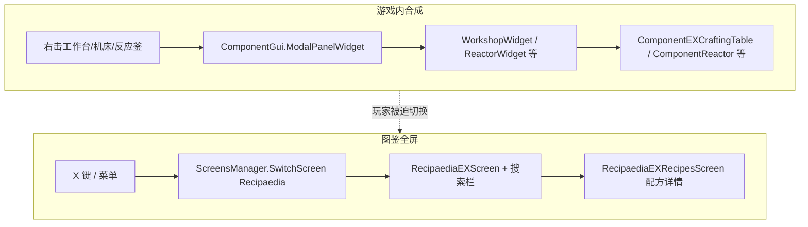
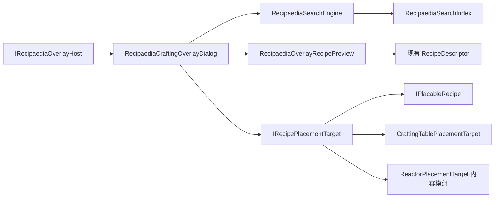

# REX 合成助手（Crafting Overlay）策划

> **版本**：v0.3  
> **状态**：草案（待评审）  
> **范围**：RecipaediaEX（REX）核心 + 依赖 REX 的内容模组接入层  
> **前置**：[`图鉴搜索功能策划.md`](图鉴搜索功能策划.md) Phase 1/2 已交付（搜索引擎、索引、筛选 Dialog 可用）  
> **对标参考**：[`合成助手-JEI对标与基元语句.md`](合成助手-JEI对标与基元语句.md)（Minecraft JEI 解构、基元语句、工业机器扩展依据）

---

## 1. 玩家反馈摘要

社区玩家「工业镐手」在合成工作流中提出以下诉求（2026-06 社群讨论）：

| # | 原话要点 | 诉求归类 |
|---|----------|----------|
| F1 | 「应该直接在游戏内搞个**悬浮界面**」 | 不要全屏跳转，要在当前游戏画面内叠加 UI |
| F2 | 「在用工作台 / 机床里摆配方，忘记怎么摆了，这时候就应该**直接打开 rex 的搜索框**」 | 合成上下文内即时查配方，零层菜单 |
| F3 | 「而不是点两三层进合成表界面，看完了再点两三下返回，忘了又要重复一遍」 | 降低 **上下文切换成本**（Context Switch） |
| F4 | 「有个版本有快捷键好像」（十一） | 快捷键存在但体验未对齐合成场景 |
| F5 | 「方便后续**直接点加号自动摆放**」 | JEI 式 **一键从背包填充合成格** |

**核心矛盾**：REX 图鉴搜索能力已具备，但入口仍是 **全屏 `RecipaediaEXScreen`**；玩家在 **`ModalPanelWidget`（工作台 / 机床 / 反应釜等面板）** 打开时，查配方 = 关闭或遮挡合成界面 → 多层 Screen 往返 → 记忆配方布局困难。

**产品定位**：本模组（工业时代 2 及依赖 REX 的内容模组）对标 **Minecraft JEI** 的 **悬浮窗 + 自动摆放（+）** 体验；REX 提供协议与 UI 壳，工业专有机器逻辑由内容模组接入。

---

## 2. 现状与差距分析

### 2.1 当前架构（相关部分）



| 能力 | 现状 | 与玩家诉求 / JEI 的差距 |
|------|------|-------------------------|
| 文本搜索 | `RecipaediaSearchEngine` + 索引 + 高级筛选 | ✅ 已有；❌ 仅全屏图鉴可用 |
| 配方展示 | `RecipaediaEXRecipesScreen` + `RecipeDescriptor` | ✅ 已有；❌ 需进全屏且与合成格分离 |
| 合成失败提示 | `CrafterHints` + `DisplaySmallMessage` | ✅ 已有；❌ 仅文字提示，非查配方/摆放 |
| 快捷键 | 内容模组 `Recipaedia` → `Key.X`，`SwitchScreen` | ⚠️ 有键位；❌ **不区分**是否正在合成 |
| 自动摆放 | 无 | ❌ 完全缺失 |
| 工作站上下文 | `ICrafter` + `RecipesCrafterManager` 仅用于图鉴展示 | ❌ 未用于合成 UI 侧过滤 |
| 工业机器（反应釜等） | `ReactionEquationRecipe` + 固液槽 | ❌ 无同屏助手与 + 转移 |

### 2.2 宿主 UI 层次（决策依据）

依据仓库 **widget-screen-ui.mdc** 心智模型：

| 层次 | 类型 | 合成场景 |
|------|------|----------|
| `ScreensManager` Screen | 全屏、有返回栈 | 当前图鉴入口；**不适合**作为合成中查配方的唯一方式 |
| `ModalPanelWidget` | 游戏内模态面板 | 工作台 / 机床 / 反应釜正在使用 |
| `DialogsManager` Dialog | 叠在 Screen / GUI 上的弹层 | **适合**合成助手载体；不替换 Modal |

**结论**：合成助手应作为 **Dialog 或可挂于 `ComponentGui` 的浮动 Widget**，在 **保持 `ModalPanelWidget` 打开** 的前提下提供搜索 + 配方预览 + 自动摆放（+）。

### 2.3 与图鉴搜索策划的关系

| 图鉴搜索策划（已完成） | 本策划（合成助手） |
|------------------------|------------------|
| `RecipaediaEXScreen` 内搜索过滤条目 | 复用同一 `SearchEngine` / `Index` / `Parser` |
| 仅当前 **图鉴分类** 为候选集 | 叠加 **当前工作站 / 网格尺寸 / ProcessType** 上下文过滤 |
| 选中条目 → 进配方 Screen | 选中条目 → **内嵌迷你配方视图**，不 `SwitchScreen` |
| 无自动摆放 | **+ 按钮** 调用 `IRecipePlacementTarget` |

两者 **共享搜索内核**，**分离 UI 壳层**；避免在 `RecipaediaEXScreen` 内硬塞合成逻辑。

### 2.4 与已实现 REX 能力的区分

| 功能 | 组件 | 玩家感知 | 是否合成助手 |
|------|------|----------|--------------|
| 合成失败提示 | `CrafterHints` → `DisplaySmallMessage` | 「需要更高温度」「等级不足」等闪烁文字 | ❌ |
| 全屏图鉴 | `RecipaediaEXScreen` | 分类浏览、搜索、进配方页 | ❌（互补） |
| **合成助手** | `RecipaediaCraftingOverlayDialog`（待实现） | 同屏搜配方、看布局、点 + 摆放 | ✅ |

IE2 设置项 **「合成提示」**（`IESettingsManager.CraftingMessageKey`）控制的是 `CrafterHints`，与合成助手 **独立开关**（合成助手开/关为会话态，见 §6.8）。

---

## 3. 设计目标

1. **零跳转查配方**（基元 V1）：在工作容器面板打开时，一键呼出合成助手，搜索并查看配方布局，关闭后合成格/罐体状态不变。
2. **上下文感知**（基元 V4）：默认只显示 **当前工作站可用** 且 **容器形态匹配** 的配方（网格宽、ProcessType、热等级等；可手动放宽）。
3. **双向导航**（基元 V2）：条目支持 **如何制作（R）** 与 **用途（U）**；悬浮内与全屏图鉴共享索引。
4. **快捷键一致**（基元 E3）：沿用 `Recipaedia` 键——**合成 Modal 打开时 toggle 合成助手**，否则进全屏图鉴。
5. **可扩展自动摆放**（基元 E1/E2）：REX 定义 **Placement 协议**；有形合成、One2One、反应釜等由内容模组注册 `IRecipePlacementTarget`；**不在 REX 核心写工业专有逻辑**。
6. **JEI 式 + 转移**（基元 P1–P7）：预检 → 部分填充 → 缺失提示 → 刷新配方匹配；支持 Shift 多组（Phase 3）。

---

## 4. 用户场景

### 4.1 场景 A：工作台摆形状配方

1. 玩家打开工作台，`ModalPanelWidget` 显示 3×3 合成格 + 背包。
2. 按 **`X`**（或点合成助手入口按钮）→ 屏幕一侧出现 **半透明悬浮面板**，带搜索框。
3. 输入「铁砧」→ 列表显示匹配条目 → 点击 → 面板内展示 **3×3 原料布局 + 产物**（复用 Descriptor，只读）。
4. 玩家对照布局手工摆放；或点 **+** 自动从背包移动物品到合成格（Phase 2a）。
5. 按 `Esc` 或再次 `X` 关闭悬浮层，**不关闭工作台**。

### 4.2 场景 B：机床 4×4 配方

1. 打开 4×4 机床面板。
2. 呼出合成助手；搜索默认带 `@crafter:` / 网格尺寸 implicit filter，避免列出仅 3×3 工作台可用的配方。
3. 选中配方后迷你视图显示 **4×4** 网格（与 Descriptor 网格一致）。

### 4.3 场景 C：非合成场景

1. 玩家在世界中未打开任何合成 Modal。
2. 按 `X` → 行为与 **现网一致**：`SwitchScreen("Recipaedia")` 进入全屏图鉴（含已有搜索）。

### 4.4 场景 D：材料不足时自动摆放

1. 玩家点 **+**。
2. 系统 **dry-run** 扫描 Widget 绑定的背包 + 容器可写槽，按配方需求计算方案（含 `TransformRecipe` 平移/镜像）。
3. 能放多少放多少；不足项列出；`DisplaySmallMessage`「缺少：铜锭 ×2」。

### 4.5 场景 E：化学反应釜（工业机器）

1. 打开反应釜面板（3 物品输入槽 + 3 流体罐等，见 `ComponentReactor`）。
2. 呼出合成助手；上下文 filter 隐式 `@crafter:反应釜` + `ProcessType` / 热等级。
3. 选中条目 → 预览区展示 **反应方程式 Descriptor**（固液原料 + 产物，只读）。
4. 点 **+**（Phase 2b）：
   - **物品槽**：从背包尽可能填入 0–2 号输入槽；
   - **流体**：若面板内罐体可写且背包有对应流体容器 → 注液；否则 **仅提示缺口**（不自动拉管道）；
   - 成功后调用 `FindEquation()` 刷新匹配。

---

## 5. 产品形态

### 5.1 命名与定位

| 项 | 建议 |
|----|------|
| 功能名（中文） | **合成助手**（主名）/ **悬浮图鉴**（副名） |
| 代码前缀 | `RecipaediaCraftingOverlay` |
| 与全屏图鉴关系 | 互补；全屏保留浏览 / 分类 / 详情 / 科技树跳转 |
| 对标 | Minecraft JEI（同屏 + R/U + + 转移） |

### 5.2 入口

| 入口 | 优先级 | 说明 |
|------|--------|------|
| 快捷键 `Recipaedia` | P0 | 合成 Modal 打开时 **toggle 合成助手** |
| 工作台 / 机床 / 反应釜面板角标按钮 | P0 | 可发现性；图标复用 `MenuSearchLine.png` 或专用放大镜 |
| 全屏图鉴 | 保留 | 非合成场景不变 |
| R / U（Phase 3） | P2 | 悬停槽位或列表项：Recipes / Uses |

### 5.3 悬浮面板布局（草案）

```text
┌─ 合成助手 ─────────────────────────────── [×] ─┐
│ ┌────────────────────────────┐ [搜] [历] [筛] │
│ │ 搜索…                      │                │
│ └────────────────────────────┘                │
├───────────────────────────────────────────────┤
│  条目列表（ListPanelWidget，过滤后）            │
│  ┌────┬──────────────────────────────┐       │
│  │图标│ 铁砧                          │       │
│  └────┴──────────────────────────────┘       │
├───────────────────────────────────────────────┤
│  配方预览区（选中条目后显示）                    │
│  ┌─────────────────────────┐                  │
│  │  3×3 / 4×4 / 方程式布局   │  [ + 填充 ]      │
│  └─────────────────────────┘                  │
│  工作站：工作台 · 需等级 1                      │
└───────────────────────────────────────────────┘
  ↑ 锚定屏幕右侧或左侧，宽 ~420px，高 ~520px
  ↑ 背景半透明；不拦截 Modal 以外区域点击（可选 pin 固定）
```

**交互规则**：

| 事件 | 行为 |
|------|------|
| `Esc` | 先关合成助手；若已关且焦点在 Modal，交给宿主 |
| 点击列表条目 | 下方预览区切换配方（第一条与当前工作站匹配的配方；多条时 ◀▶） |
| **+ 填充** | `IRecipePlacementTarget.TryPlaceRecipe(..., execute: true)` |
| 搜索 / 筛选 | 与全屏图鉴相同语义；候选集 **All Blocks** + 上下文 Token |
| 关闭 × | 仅隐藏 Dialog，不 `SwitchScreen` |
| 预览区原料格点击 | 跳转相关配方（同 `RecipeSlotWidget`，只读不改动容器） |

---

## 6. 技术架构

### 6.1 分层



建议目录（REX 核心）：

```text
RecipaediaEX/
  Overlay/
    IRecipaediaOverlayHost.cs
    IRecipePlacementTarget.cs
    IPlacableRecipe.cs
    PlacementRequirement.cs          # 通用地址 + Quantity（无流体专有字段）
    PlacementResult.cs               # 预检结果、缺失列表
    PlacementOptions.cs              # FillEmptyOnly, MaxSets, AllowPartial
    PlacementSources.cs              # 背包 + 容器侧栏
    RecipaediaCraftingContext.cs
    RecipaediaCraftingOverlayDialog.cs
    RecipaediaOverlayRecipePreview.cs
    RecipaediaOverlaySearchScope.cs
    CraftingTablePlacementTarget.cs  # 默认有形合成
  Assets/RecipaediaEX/
    Dialogs/RecipaediaCraftingOverlayDialog.xml
```

内容模组（SCIENEW 等）：

```text
SCIENEW/Modules/RecipaediaEX/Overlay/
  ReactorPlacementTarget.cs          # ReactionEquationRecipe
  One2OnePlacementTarget.cs          # 压板机、磁化机等
  FillerPlacementTarget.cs           # 灌装机（Phase 2b+）
```

### 6.2 `IRecipaediaOverlayHost`

合成类 Widget 实现（REX 基类或内容模组 Widget 均可）：

```csharp
public interface IRecipaediaOverlayHost {
    /// <summary>当前合成上下文；无法提供时返回 null（不显示助手入口）。</summary>
    RecipaediaCraftingContext? GetCraftingContext();

    /// <summary>用于 Dialog 挂载的 GUI 根（通常为 ComponentGui 的 ContainerWidget）。</summary>
    Widget OverlayParent { get; }

    /// <summary>自动摆放目标；无则预览区隐藏 + 按钮。</summary>
    IRecipePlacementTarget? GetPlacementTarget();
}
```

**接入示例**：

| Widget / 机器 | Host | PlacementTarget |
|---------------|------|-----------------|
| 工作台 / 机床 | ✅ | `CraftingTablePlacementTarget` |
| 反应釜 | ✅ | `ReactorPlacementTarget`（SCIENEW） |
| 纯箱子 Modal | ❌ | — → 快捷键走全屏图鉴 |

### 6.3 `RecipaediaCraftingContext`

| 字段 | 用途 |
|------|------|
| `CrafterBlockValue` | 隐式 `@crafter:` 过滤 |
| `GridWidth` | 3 / 4 / 5；有形合成宽度过滤 |
| `ProcessType` | One2One / 反应方程等（内容模组扩展） |
| `PlayerLevel` | 预览提示 RequiredPlayerLevel |
| `RequiredHeatLevel` | 预览提示（反应釜、熔炉） |
| `Project` / `Inventory` | 动态配方 Extra、自动摆放来源 |

**默认 query 合成**（内部）：

```text
@crafter:<当前工作站> @grid:<N>x<N>  <用户输入>
```

`@grid:` Phase 1 可在 Engine 层硬编码；Phase 1b 再 parser 化。

### 6.4 配方预览复用

- 从 `RecipaediaEXManager.Recipes` 取 `IRecipaediaRecipeItem.Match` 列表。
- 用现有 `RecipeDescriptor` 工厂渲染到 **只读** 容器（`RecipaediaOverlayRecipePreview`）。
- **+ 按钮**：配方实现 `IPlacableRecipe` 且 Host 提供 `IRecipePlacementTarget` 时启用；否则禁用并 Tooltip 说明原因（基元 E2）。

### 6.5 `IPlacableRecipe` 与 `PlacementRequirement`

配方侧：产出 **需求列表**，而非仅 36 格字符串。

**设计约束（v0.3）**：REX 核心 **不得** 出现 `FluidVolume`、`FluidTank`、`ITank` 等流体/工业专有字段或枚举值——与 [`recipaedia-rex-anti-patterns.mdc`](../../../.cursor/rules/recipaedia-rex-anti-patterns.mdc) §1 一致。流体、罐体、化工方程的 **Quantity 语义与槽位物理含义** 由 **内容模组** 的 `IPlacableRecipe` 适配器 + `IRecipePlacementTarget` 实现解释；REX 只提供 **与领域无关的寻址 + 数量** 载体。

#### 6.5.1 为何不用「字段级 union」（ItemCount + FluidVolume）

| 方案 | 问题 |
|------|------|
| `ItemCount` + `FluidVolume` 并列字段 | 在 REX API 层 **命名** 了流体领域；且同一需求仅其一有效，另一恒为 0，易误用 |
| C# `Explicit`/`Union` 布局 | 仍要在核心区分 item/fluid 分支；与 mdc「REX 无其它产物语义」冲突 |
| **单一 `Quantity` + `PlacementAddressKind`** ✅ | 数量 **opaque**；Target 与配方适配器约定含义（堆叠数 / 体积 / …），REX 不感知 |

这与 JEI 一致：核心 API 是 **slot + ingredient + amount**，`FluidStack` 由 **插件/Handler** 注册与解释，而非在通用 struct 上写 `fluidAmount` 字段。

#### 6.5.2 REX 核心类型（定稿）

```csharp
public interface IPlacableRecipe {
    IReadOnlyList<PlacementRequirement> GetPlacementRequirements();
}

/// <summary>
/// 寻址方式：仅两类 REX 原生语义；不含 Fluid / Tank / 化工。
/// </summary>
public enum PlacementAddressKind {
    /// <summary>有形合成格，AddressIndex 为 0–35（6×6 语义）。</summary>
    GridCell,
    /// <summary>当前容器内逻辑槽位；AddressIndex 含义由 IRecipePlacementTarget 定义。</summary>
    ContainerSlot,
}

/// <summary>
/// 单条摆放需求。Quantity / MatchKey 的物理含义由 Target + 配方适配器解释。
/// </summary>
public readonly struct PlacementRequirement {
    public PlacementAddressKind AddressKind;
    public int AddressIndex;
    public string MatchKey;
    public float Quantity;
    public int[] AcceptedBlockValues;   // 可选；仅 item-like 需求使用方块 value 等价物
}
```

**解读约定**（文档约定，**不**写进 REX 枚举）：

| 场景 | AddressKind | AddressIndex | Quantity 谁解释 |
|------|-------------|--------------|-----------------|
| 工作台 3×3 | `GridCell` | 0–35 | REX `CraftingTablePlacementTarget` → 堆叠 **个数** |
| 反应釜物品输入 | `ContainerSlot` | 0–2（示例） | 内容模组 `ReactorPlacementTarget` → **个数** |
| 反应釜罐体输入 | `ContainerSlot` | 3–5（示例） | 内容模组 `ReactorPlacementTarget` → **体积**；`MatchKey` 为模组内匹配 id |
| One2One 单槽 | `ContainerSlot` | 0 | 内容模组 Target → **个数** |

内容模组在 **SCIENEW** 维护「AddressIndex → 物品槽 / 罐体 / …」映射表；REX 不定义该表。

#### 6.5.3 内容模组扩展（可选，不进 REX）

若 `MatchKey` + `Quantity` 不足，可在 **配方 Extra** 或 **Target 构造参数** 携带模组私有元数据（类比 `IEConstants.Recipaedia.*`），**禁止**回流为 REX 核心字段：

```csharp
// ✅ 内容模组 SCIENEW — 示例
recipe.SetExtraValue(IEConstants.Placement.RequirementHints, ...);
// ❌ 禁止在 Dependencies/RecipaediaEX/ 增加 MatchedFluid* / FluidVolume 等
```

| 配方类型 | `IPlacableRecipe` 实现位置 | 说明 |
|----------|------------------------------|------|
| `OriginalCraftingRecipe` | REX 内置适配 | `GridCell` + Transform |
| `ReactionEquationRecipe` | 内容模组 | `ContainerSlot` 列表；Target 解释罐体 |
| `One2OneRecipe` | 内容模组 | 单 `ContainerSlot` |
| 熔炉单格 | 可选仅预览 | Phase 2c 或不做 + |

### 6.6 `IRecipePlacementTarget`（修订 v0.2）

对齐 JEI `doTransfer` / `maxTransfer`：**预检与执行分离**。

```csharp
public interface IRecipePlacementTarget {
    /// <summary>当前容器是否接受该配方的自动摆放。</summary>
    bool CanAccept(IRecipe recipe);

    /// <summary>
    /// 预检（execute=false）或执行（execute=true）放置。
    /// </summary>
    PlacementResult TryPlaceRecipe(
        IRecipe recipe,
        PlacementSources sources,
        PlacementOptions options,
        bool execute);
}

public readonly struct PlacementResult {
    public bool Success;                   // 全部满足
    public bool PartialSuccess;            // 部分填充
    public IReadOnlyList<string> Missing;  // 可行动缺失列表（基元 E4）
}

public readonly struct PlacementOptions {
    public bool FillEmptyOnly;             // 默认 true（基元 P5）
    public bool MaxSets;                   // Shift+ 多组（Phase 3）
    public bool AllowPartial;              // 默认 true（基元 P4）
}

public readonly struct PlacementSources {
    public IInventory PlayerInventory;
    public IInventory? ContainerInventory;
}
```

`PlacementSources` **刻意仅含 `IInventory`**：罐体、流体接口等由 **Target 实现类** 在构造时绑定机器 `Component`（内容模组），不通过 REX 公共 struct 暴露 `ITank`。

**REX 默认实现 `CraftingTablePlacementTarget`**（`ComponentEXCraftingTable`）：

1. `recipe` 为 `IPlacableRecipe` → 读取 `GridCell` 需求，或回退 36 格 `Ingredients`。
2. 收集 `PlacementSources` 中可用物品（按 CraftingId 聚合）。
3. `TransformRecipe` 尝试 shift / flip（基元 P9）。
4. `execute=true` 时通过 `IInventory` API 移动；遵守堆叠上限（基元 P6）。
5. 调用 `UpdateCraftingResult(true)`（基元 P7）。

**内容模组 `ReactorPlacementTarget`**（`ComponentReactor`，SCIENEW）：

1. 构造时持有 `ComponentReactor`（或 `IReactorComponent`），自行访问 `ITank` / 槽位 API。
2. 解析 `ReactionEquationRecipe` → `GetPlacementRequirements()` 产出若干 `ContainerSlot`（物品与罐体共用 struct，**索引区间由本 Target 定义**）。
3. 物品槽：`Quantity` 作堆叠数，从 `PlacementSources` 移动。
4. 罐体槽：`Quantity` 作体积；罐体可写则注液，否则记入 `Missing`（不 silent fail）。
5. `execute=true` 后调用 `FindEquation()`。

**禁止**：在 REX 核心写反应釜/灌装机等工业逻辑，或在 REX 类型上出现流体专有成员 → 内容模组实现 Target 并在 Widget 的 `GetPlacementTarget()` 返回。

### 6.7 快捷键路由

| 条件 | `Recipaedia` 键行为 |
|------|---------------------|
| `ModalPanelWidget` 实现 `IRecipaediaOverlayHost` 且 `GetCraftingContext() != null` | toggle `RecipaediaCraftingOverlayDialog` |
| 否则 | `SwitchScreen("Recipaedia")`（现网） |

**归属**：接口与 Dialog → REX；键位检测 → REX `RecipaediaEXLoader` Hook；内容模组 `SubsystemTechTree` 内重复 `SwitchScreen` **迁移或委托** 到 REX。

### 6.8 持久化与设置

| 数据 | 存储 |
|------|------|
| 合成助手开/关 | 不持久化（会话态） |
| 搜索历史 | `RecipaediaSearchHistory.txt`（与全屏共享） |
| 面板锚点左/右、宽度 | 可选 UI 偏好 → 外部 Storage |
| `CrafterHints`（合成提示） | IE2 `IESettings.xml`，与合成助手 **无关** |

---

## 7. 自动摆放（+ 按钮）详细规则

### 7.1 适用范围（Phase 分档，v0.2 修订）

| 阶段 | 配方 / 机器 | + 行为 |
|------|-------------|--------|
| Phase 2a | `OriginalCraftingRecipe` + 工作台/机床 | 3×3 / 4×4 / 5×5 有形合成 |
| Phase 2b | `ReactionEquationRecipe` + 反应釜 | 物品槽自动填 + 流体缺口提示 |
| Phase 2b | `One2OneRecipe` + 压板机等 | 单输入槽 |
| Phase 2c | 熔炉单格、`OriginalSmeltingRecipe` | 仅预览或单槽 +（可选） |
| Phase 3 | Ghost 拖拽、Shift 多组、书签 | 见 §9 |

原 v0.1「Phase 3 化工不做 +」**已废止**；化工/流体通过内容模组 `IPlacableRecipe` 适配 + `*PlacementTarget` 接入，REX 只提供 **与领域无关** 的 `PlacementRequirement` / 预检框架。

### 7.2 算法要点（对应基元 P1–P7）

1. **dry-run 优先**：`execute=false` 返回 `PlacementResult.Missing`；UI 可预览缺失再确认。
2. **默认只填空位**（P5）；「覆盖已有」Phase 3 可选。
3. **等价物**（P3）：已在目标槽 > 背包数量最多 > 字典序。
4. **部分成功**（P4）：仍移动可满足的项 + 明确缺失提示。
5. **转移后刷新**（P7）：`UpdateCraftingResult` / `FindEquation` / `FindRecipe`。
6. **联机**（P8）：与手工拖放同一套库存 API；罐体操作在内容模组 Target 内完成。

---

## 8. 用户故事与验收

| ID | 故事 | 验收 |
|----|------|------|
| US-C01 | 打开工作台后按 X | 出现合成助手；工作台仍打开 |
| US-C02 | 助手内搜「铁」 | 与全屏 All Blocks 下搜「铁」一致（±上下文过滤） |
| US-C03 | 在 4×4 机床打开助手 | 默认不展示仅 3×3 可用配方（或排后 + 标记） |
| US-C04 | 选中条目 | 预览与全屏配方页一致 |
| US-C05 | Esc 关闭助手 | Modal 未关闭；合成格不变 |
| US-C06 | 非合成场景按 X | 进入全屏 `RecipaediaEXScreen` |
| US-C07 | 点 + 且背包足够（工作台） | 合成格与配方一致；产物槽更新 |
| US-C08 | 点 + 材料不足 | 部分填充 + 「缺少：…」 |
| US-C09 | 助手内使用筛选 Dialog | 与全屏筛选一致 |
| US-C10 | 关闭游戏重进 | 搜索历史仍可用 |
| US-C11 | 打开反应釜呼出助手 | 预览显示固液方程式布局 |
| US-C12 | 反应釜点 + 物品够、流体不够 | 物品槽填入；提示缺流体及体积 |
| US-C13 | 反应釜点 + 后 | `FindEquation` 匹配正确 |
| US-C14 | 未实现 `IPlacableRecipe` 的配方 | 可预览；+ 禁用 + 原因说明 |

---

## 9. 分阶段交付

### Phase 1 — 合成助手 MVP（P0）

- [ ] `IRecipaediaOverlayHost` + `RecipaediaCraftingContext`
- [ ] `RecipaediaCraftingOverlayDialog` + XML
- [ ] 复用 `RecipaediaSearchEngine`；条目列表 + 只读配方预览
- [ ] 上下文 `@crafter` + 网格宽度过滤
- [ ] 快捷键 / 角标 toggle；与全屏图鉴路由分叉
- [ ] 工作台 + 机床 Widget 接入 Host（3×3 + 4×4 验证）
- [ ] i18n：`ContentWidgets.RecipaediaCraftingOverlay.*`

### Phase 2a — 有形合成自动摆放（P1）

- [ ] `IPlacableRecipe` + `PlacementRequirement` 基础类型
- [ ] `IRecipePlacementTarget` + `PlacementResult`（dry-run / execute）
- [ ] `CraftingTablePlacementTarget` + 预览区 **+**
- [ ] `TransformRecipe`；部分填充与缺失提示

### Phase 2b — 工业机器自动摆放（P1）

- [ ] SCIENEW `ReactorPlacementTarget`（反应釜）
- [ ] SCIENEW `One2OnePlacementTarget`（压板机、磁化机等）
- [ ] 反应釜 Widget 接入 Host + PlacementTarget
- [ ] 流体：罐体可写则注液；否则仅提示

### Phase 2c — 单格 / 熔炼（P2，可选）

- [ ] 熔炉类单输入 + 或仅预览

### Phase 3 — 扩展与 polish（P2）

- [ ] Ghost 拖拽（过滤器、样板；基元 P10）
- [ ] Shift 多组、`MaxSets`
- [ ] R / U 快捷键；书签
- [ ] 面板锚点 / 透明度 / Exclusion 避让
- [ ] `RecipeSlotWidget` 联动 → 打开助手并预填 `@in:` / `@out:`
- [ ] 「在全屏图鉴中打开」链接

### 明确不做（本策划范围）

- 替代全屏图鉴
- 服务端远程替他人容器摆放
- **在 REX 核心实现** 反应釜/灌装机等 **具体** 放置算法（仅协议 + 默认有形合成）
- 自动从管道/外部储罐拉流体（Phase 2b 仅面板内罐体 + 提示）

---

## 10. 非功能需求

| 项 | 指标 |
|----|------|
| 打开延迟 | toggle 后首帧可见；索引已预热则 < 50ms |
| 查询 | 与全屏相同（< 100ms / 5000 候选） |
| 内存 | 不重复构建索引；Dialog 关闭释放预览 Descriptor |
| 兼容 | 未实现 Host 的 Modal 行为不变 |
| 反模式 | 遵守 `recipaedia-rex-anti-patterns.mdc`：工业语义不进 REX 核心 API |

---

## 11. 风险与对策

| 风险 | 对策 |
|------|------|
| Dialog 与 Modal 争焦点 | 输入路由：合成格仍可拖放；Dialog 仅捕获自身区域 |
| 多种机床网格不统一 | `GridWidth` / `PlacementRequirement` 由 Host 上报 |
| 自动摆放冲突 | 默认 FillEmptyOnly；冲突格跳过 |
| 快捷键双监听 | REX 统一路由；内容模组移除重复逻辑 |
| 反应釜流体无法 + | Phase 2b 允许「物品 + + 流体提示」分档交付 |
| 动态配方 | + 时带 `Project` / `Inventory` Extra 再匹配 |
| 小屏遮挡 | Phase 3 拖曳 / 左右锚点 |

---

## 12. 开放问题（评审待定）

| # | 问题 | 建议默认 |
|---|------|----------|
| Q1 | 候选集 All Blocks 还是当前分类？ | **All Blocks** |
| Q2 | 「在全屏图鉴中打开」？ | Phase 1 小链接；不自动关 Modal |
| Q3 | `@grid` 是否暴露给用户？ | Phase 1 内部；Phase 3 可手输 |
| Q4 | 角标按钮注入范围？ | 仅 `IRecipaediaOverlayHost` 声明的 Widget |
| Q5 | 反应釜流体 + 是否必须注满？ | 能写多少写多少；不足列 Missing |

---

## 13. 变更记录

| 版本 | 日期 | 说明 |
|------|------|------|
| v0.1 | 2026-06-08 | 初稿：社群反馈与 REX 现网架构 |
| v0.2 | 2026-06-16 | 整合 JEI 对标、基元语句、接口修订（Placement dry-run/execute、`IPlacableRecipe`）、工业反应釜场景与 Phase 2b、区分 `CrafterHints`；废止「化工 Phase 3 不做 +」 |
| v0.3 | 2026-06-16 | 移除 `FluidVolume`/`FluidTank`/`ITank`；`PlacementRequirement` 改为 `PlacementAddressKind` + 单一 `Quantity`；补充 anti-patterns 分工 §6.5.1–6.5.3 |

---

## 14. 相关文档

- [合成助手-JEI对标与基元语句.md](合成助手-JEI对标与基元语句.md) — JEI 解构、基元语句全文、概念对照
- [图鉴搜索功能策划.md](图鉴搜索功能策划.md)
- [API 使用文档.md](API使用文档.md)
- 仓库规则：`.cursor/rules/widget-screen-ui.mdc`、`recipaedia-rex-anti-patterns.mdc`
- 外部：[JEI Recipe Transfer Handlers](https://github.com/mezz/JustEnoughItems/wiki/Recipe-Transfer-Handlers)
