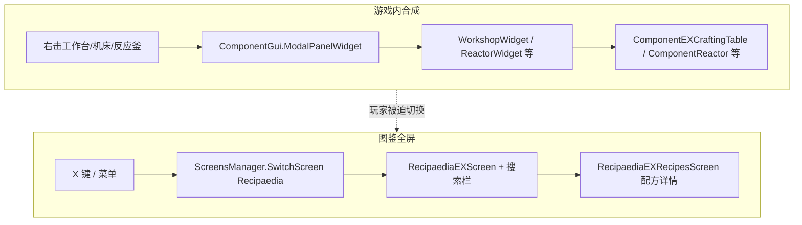
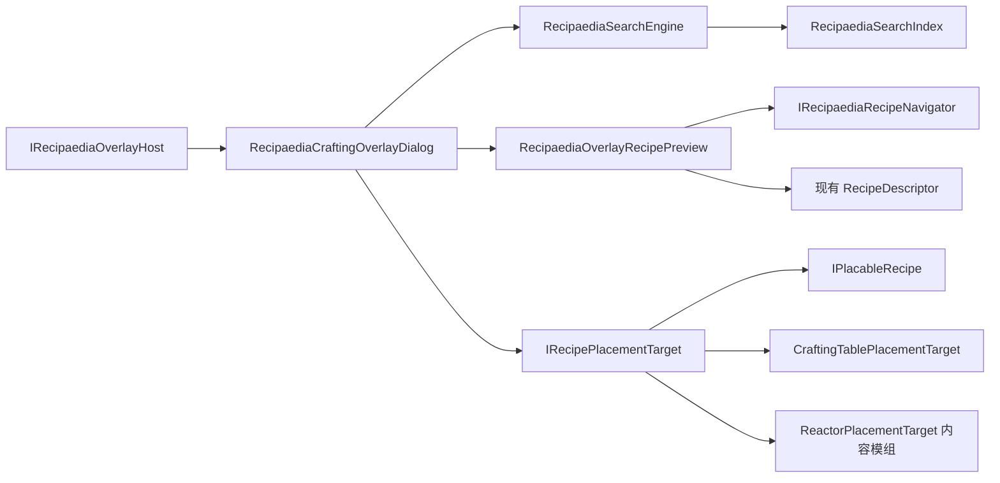
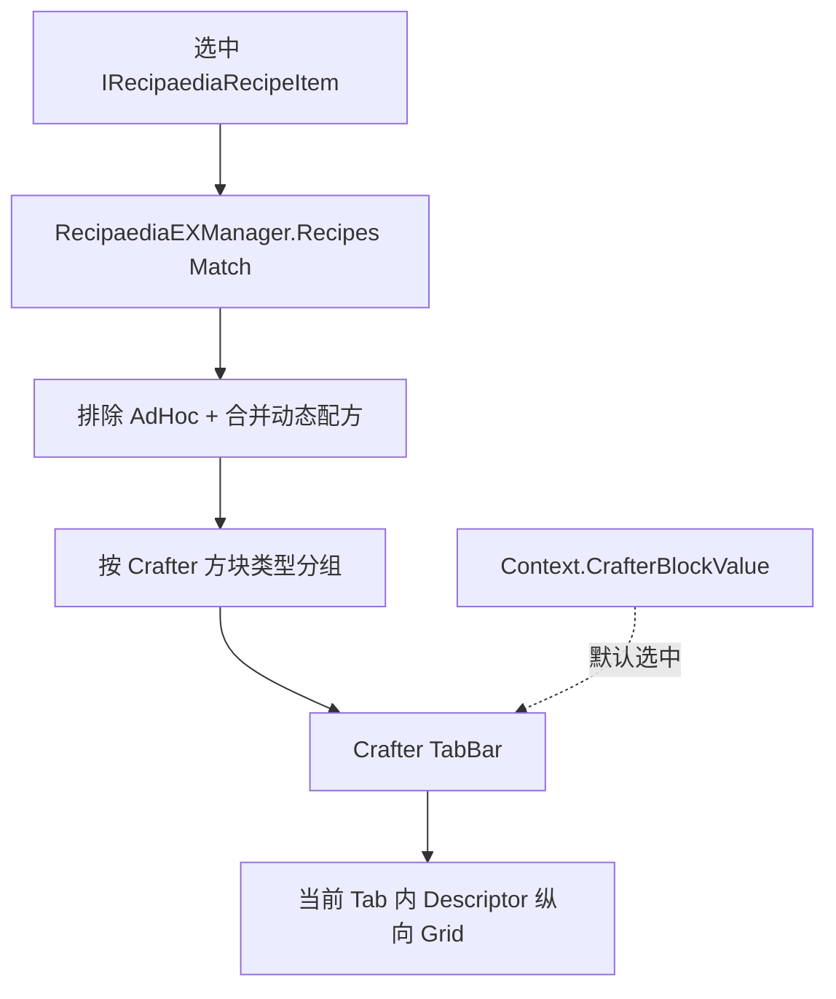
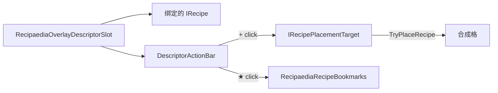

# REX 合成助手（Crafting Overlay）策划

> **版本**：v0.9  
> **状态**：**Phase 1 已收尾**（2026-06-16）；**Phase 1.5 / 1.6 已收尾**；**Phase 2a 已收尾**（有形合成 `+` 协议与底部条）；**Phase 2a.1**（每 Descriptor 操作按钮）待实现；Phase 2b+ 待实现  
> **范围**：RecipaediaEX（REX）核心 + 依赖 REX 的内容模组接入层  
> **前置**：[`图鉴搜索功能策划.md`](图鉴搜索功能策划.md) Phase 1/2 已交付（搜索引擎、索引、筛选 Dialog 可用）  
> **对标参考**：[`合成助手-JEI对标与基元语句.md`](合成助手-JEI对标与基元语句.md)（Minecraft JEI 解构、基元语句、工业机器扩展依据）

---

## 1. 玩家反馈摘要

社区玩家「工业镐手」在合成工作流中提出以下诉求（2026-06 社群讨论）：

| # | 原话要点 | 诉求归类 |
|---|----------|----------|
| F1 | 「应该直接在游戏内搞个**悬浮界面**」 | 不要全屏跳转，要在当前游戏画面内叠加 UI |
| F2 | 「在用工作台 / 机床里摆配方，忘记怎么摆了，这时候就应该**直接打开 rex 的搜索框**」 | 合成上下文内即时查配方，零层菜单 |
| F3 | 「而不是点两三层进合成表界面，看完了再点两三下返回，忘了又要重复一遍」 | 降低 **上下文切换成本**（Context Switch） |
| F4 | 「有个版本有快捷键好像」（十一） | 快捷键存在但体验未对齐合成场景 |
| F5 | 「方便后续**直接点加号自动摆放**」 | JEI 式 **一键从背包填充合成格** |

**核心矛盾**：REX 图鉴搜索能力已具备，但入口仍是 **全屏 `RecipaediaEXScreen`**；玩家在 **`ModalPanelWidget`（工作台 / 机床 / 反应釜等面板）** 打开时，查配方 = 关闭或遮挡合成界面 → 多层 Screen 往返 → 记忆配方布局困难。

**产品定位**：本模组（工业时代 2 及依赖 REX 的内容模组）对标 **Minecraft JEI** 的 **悬浮窗 + 自动摆放（+）** 体验；REX 提供协议与 UI 壳，工业专有机器逻辑由内容模组接入。

---

## 2. 现状与差距分析

### 2.1 当前架构（相关部分）



| 能力 | 现状 | 与玩家诉求 / JEI 的差距 |
|------|------|-------------------------|
| 文本搜索 | `RecipaediaSearchEngine` + 索引 + 高级筛选 | ✅ 已有；❌ 仅全屏图鉴可用 |
| 配方展示 | `RecipaediaEXRecipesScreen` + `RecipeDescriptor` | ✅ 已有；❌ 需进全屏且与合成格分离 |
| 合成失败提示 | `CrafterHints` + `DisplaySmallMessage` | ✅ 已有；❌ 仅文字提示，非查配方/摆放 |
| 快捷键 | 内容模组 `Recipaedia` → `Key.X`，`SwitchScreen` | ⚠️ 有键位；❌ **不区分**是否正在合成 |
| 自动摆放 | 无 | ❌ 完全缺失 |
| 工作站上下文 | `ICrafter` + Crafter Tab 分页预览 | ✅ Overlay 已用；默认 Tab = 当前 Host |
| 工业机器（反应釜等） | `ReactionEquationRecipe` + 固液槽 | ❌ 无同屏助手与 + 转移 |

### 2.2 宿主 UI 层次（决策依据）

依据仓库 **widget-screen-ui.mdc** 心智模型：

| 层次 | 类型 | 合成场景 |
|------|------|----------|
| `ScreensManager` Screen | 全屏、有返回栈 | 当前图鉴入口；**不适合**作为合成中查配方的唯一方式 |
| `ModalPanelWidget` | 游戏内模态面板 | 工作台 / 机床 / 反应釜正在使用 |
| `DialogsManager` Dialog | 叠在 Screen / GUI 上的弹层 | **适合**合成助手载体；不替换 Modal |

**结论**：合成助手应作为 **Dialog 或可挂于 `ComponentGui` 的浮动 Widget**，在 **保持 `ModalPanelWidget` 打开** 的前提下提供搜索 + 配方预览 + 自动摆放（+）。

### 2.3 与图鉴搜索策划的关系

| 图鉴搜索策划（已完成） | 本策划（合成助手） |
|------------------------|------------------|
| `RecipaediaEXScreen` 内搜索过滤条目 | 复用同一 `SearchEngine` / `Index` / `Parser` |
| 仅当前 **图鉴分类** 为候选集 | **按 Category 分页浏览**（与全屏 `BlocksCategoryProvider` 同源）；搜索/筛选在 **当前分类** 内执行 |
| 选中条目 → 进配方 Screen | 选中条目 → **二级弹窗 Crafter Tab + Descriptor 网格滚动**，不 `SwitchScreen` |
| 无自动摆放 | **+ 按钮** 调用 `IRecipePlacementTarget` |

两者 **共享搜索内核**，**分离 UI 壳层**；避免在 `RecipaediaEXScreen` 内硬塞合成逻辑。

### 2.5 评审决议（v0.4 已定）

| # | 议题 | 决议 |
|---|------|------|
| D1 | Descriptor 与 Screen 耦合 | **方案 A（轻量化 YAGNI）**：`IRecipaediaRecipeNavigator` + `RecipeDescriptorRegistry`；不拆 Descriptor 布局层 |
| D2 | 搜索候选集 | **Phase 1.6 修订**：条目列表按 **当前 Category** 展示；搜索/筛选在 **该分类内** 执行（与全屏图鉴一致）。`All Blocks` 仍可通过 ◀▶ 切回，**默认落在首个非 All 分类** |
| D3 | `@grid` Token | **舍弃**；**废止 `GridWidth`**（Phase 1.5）；预览改 Crafter Tab 分页，不进 Parser |
| D4 | `ProcessType` | **不进入** `RecipaediaCraftingContext`；与 `@crafter` 语义重叠，区分优先级低 |
| D5 | `Recipaedia` 键 | **REX `RecipaediaEXLoader` Hook** 统一路由；打开全屏图鉴 / 科技树等 **模组间通信用 `RecipaediaEventBus`**，内容模组不再硬编码 `SwitchScreen` |
| D6 | Phase 1 Host 接入 | **原版工作台（3×3，若有）+ 机床 4×4 + 车间 5×5**；反应釜 **仅预览** 可跟 Phase 1，**+** 放 Phase 2b |
| D7 | 预览区交互 | **Grid + 纵向滚动** 放置多个 `RecipeDescriptor`；**不用 ◀▶**；单 Descriptor 用 **变换矩阵整体缩放** 固定布局 |
| D8 | 动态配方 | **展示**（`IDynamicRecipeLoader` 路径）；**AdHoc 配方不展示** |
| D9 | Phase 2a 绑定 | `CraftingTablePlacementTarget` 绑 **`ComponentEXCraftingTable`**（IE 侧 `ComponentIECraftingTable` 继承之） |
| D10 | 反应釜流体 + | Phase 2b **低优先级**：先物品；再尝试背包 **流体罐/桶 → 面板罐体** 并 **返还空容器** |
| D11 | Overlay 布局与输入 | **右侧条带、垂直拉满屏高**（对齐 JEI 右栏）；左侧 Modal **不捕获**鼠标；条带内列表+预览 **可滚动**（§5.3） |
| D12 | 工业 Descriptor | **一并改** Navigator 构造签名（REX + 内容模组全部 `[RecipeDescriptor]`） |
| D13 | `GridWidth` 预览过滤 | **废止**（Phase 1.5）：有形合成（工作台 / 机床 / 车间）为 **同一 Recipe Category**，不按 3/4/5 拆预览 |
| D14 | 预览 Crafter 过滤 | **废止「仅当前工作站」硬过滤**（Phase 1.5）：二级预览改 **Crafter Tab 分页**；默认落当前 Host 对应 Tab，可切换查看其它 Crafter |
| D15 | Context 辅助类 | **YAGNI**：`RecipaediaCraftingTableContextHelper` 等单行组装逻辑 **内联到 Host Widget**，不单独文件 |
| D16 | Crafter Tab 视觉 | 复用全屏 `CrafterButtonWidget` / `BlockItem` 图标；Tab 条置于 **二级配方弹窗** 标题下、Descriptor 滚动区上 |
| D17 | 全屏图鉴隔离 | Phase 1.5 **仅改 Overlay**；`RecipaediaEXScreen` / `RecipaediaEXRecipesScreen` 等全屏图鉴 **环境隔离，一分一毫不改** |
| D18 | Phase 2a `+` 与 Tab | **暂定**：仅当当前选中 Tab 的 Crafter 与 Host 一致时启用 `+`；**Phase 2a** 以底部全局 `PlacementBar` 落地；**Phase 2a.1** 迁至每 Descriptor 操作条（D19） |
| D19 | `+` / 收藏 落点 | **对齐 JEI**：每条配方预览卡片旁独立 **+** 与 **收藏**；废止「Tab 内取第一条可摆配方」的隐式语义；底部全局 `+` 在 2a.1 完成后 **移除** |
| D20 | `+` 后 UI 与重复点击 | **不关闭** Overlay / 二级配方弹窗；合成格 **已符合该配方** 时 **不转移**、**不破坏** pattern；`+` **禁用或灰显** + Tooltip（key `9`「合成格已符合该配方」）；**不**支持在同一 pattern 上反复叠加（Shift 多组属 Phase 3） |

### 2.4 与已实现 REX 能力的区分

| 功能 | 组件 | 玩家感知 | 是否合成助手 |
|------|------|----------|--------------|
| 合成失败提示 | `CrafterHints` → `DisplaySmallMessage` | 「需要更高温度」「等级不足」等闪烁文字 | ❌ |
| 全屏图鉴 | `RecipaediaEXScreen` | 分类浏览、搜索、进配方页 | ❌（互补） |
| **合成助手** | `RecipaediaCraftingOverlayDialog` | 同屏搜配方、看布局、Descriptor 链式导航；**+** Phase 2a 已接（底部条，2a.1 迁至每卡操作条） | ✅ |

IE2 设置项 **「合成提示」**（`IESettingsManager.CraftingMessageKey`）控制的是 `CrafterHints`，与合成助手 **独立开关**（合成助手开/关为会话态，见 §6.8）。

---

## 3. 设计目标

1. **零跳转查配方**（基元 V1）：在工作容器面板打开时，一键呼出合成助手，搜索并查看配方布局，关闭后合成格/罐体状态不变。
2. **上下文感知**（基元 V4）：条目搜索在 **当前 Category** 候选集内（与全屏图鉴一致）；选中条目后，二级预览按 **Crafter Tab 分页**（默认 Tab = 当前 Host）。
3. **双向导航**（基元 V2）：条目支持 **如何制作（R）** 与 **用途（U）**（Phase 3）；悬浮内与全屏图鉴共享索引。
4. **快捷键一致**（基元 E3）：`Recipaedia` 键由 **REX Hook** 路由——合成 Modal 打开时 **toggle** 合成助手；否则经 **事件总线** 打开全屏图鉴（内容模组订阅，不硬编码 `SwitchScreen`）。
5. **可扩展自动摆放**（基元 E1/E2）：REX 定义 **Placement 协议**；有形合成、One2One、反应釜等由内容模组注册 `IRecipePlacementTarget`；**不在 REX 核心写工业专有逻辑**。
6. **JEI 式 + 转移**（基元 P1–P7）：预检 → 部分填充 → 缺失提示 → 刷新配方匹配；支持 Shift 多组（Phase 3）。

---

## 4. 用户场景

### 4.1 场景 A：工作台摆形状配方

1. 玩家打开工作台，`ModalPanelWidget` 显示 3×3 合成格 + 背包。
2. 按 **`X`**（或点合成助手入口按钮）→ 屏幕一侧出现 **半透明悬浮面板**，带搜索框。
3. 输入「铁砧」→ 列表显示匹配条目（**All Blocks**，与全屏一致）→ 点击 → 二级弹窗 **Crafter Tab** + Descriptor **网格纵向滚动**（槽位缩放，只读）。
4. 玩家对照布局手工摆放；或点 **+** 自动从背包移动物品到合成格（Phase 2a）。
5. 按 `Esc` 或再次 `X` 关闭悬浮层，**不关闭工作台**。

### 4.2 场景 B：机床 4×4 / 车间 5×5

1. 打开 4×4 机床或 5×5 车间面板。
2. 呼出合成助手；搜索仍为 **All Blocks**；选中条目后，二级弹窗 **按 Crafter Tab 分页**（默认当前机床 Tab）；**同一 3×3 有形配方可在机床 Tab 可见**（废止格宽过滤）。
3. 各 Descriptor 在槽位内 **RenderTransform 整体缩放**（`RecipaediaOverlayDescriptorSlot`），**不改**内部 Slot 布局。

### 4.3 场景 C：非合成场景

1. 玩家在世界中未打开任何合成 Modal。
2. 按 `X` → REX Hook 经 **`RecipaediaEventBus`** 发布「打开全屏图鉴」类事件；内容模组（如 IE2 科技树）**订阅** 后 `SwitchScreen("Recipaedia")` 或等价逻辑，**不在 REX 外重复监听键位**。

### 4.4 场景 D：材料不足时自动摆放

1. 玩家点 **+**。
2. 系统 **dry-run** 扫描 Widget 绑定的背包 + 容器可写槽，按配方需求计算方案（含 `TransformRecipe` 平移/镜像）。
3. 能放多少放多少；不足项列出；`DisplaySmallMessage`「缺少：铜锭 ×2」。

### 4.5 场景 E：化学反应釜（工业机器）

1. 打开反应釜面板（3 物品输入槽 + 3 流体罐等，见 `ComponentReactor`）。
2. 呼出合成助手；选中条目后，二级弹窗 **Crafter Tab** 展示反应釜等路径（**非**搜索栏 Token）。
3. 选中条目 → 预览 Grid 展示 **反应方程式 Descriptor**（固液原料 + 产物，只读）；**AdHoc 配方不出现**。
4. 点 **+**（Phase 2b，**物品优先**）：
   - **物品槽**：从背包尽可能填入输入槽；
   - **流体**（低优先级）：背包 **流体罐/桶** 可匹配时尝试 **倒入面板罐体并返还空容器**；否则 **仅提示缺口**；
   - 成功后调用 `FindEquation()` 刷新匹配。

---

## 5. 产品形态

### 5.1 命名与定位

| 项 | 建议 |
|----|------|
| 功能名（中文） | **合成助手**（主名）/ **悬浮图鉴**（副名） |
| 代码前缀 | `RecipaediaCraftingOverlay` |
| 与全屏图鉴关系 | 互补；全屏保留浏览 / 分类 / 详情 / 科技树跳转 |
| 对标 | Minecraft JEI（同屏 + R/U + + 转移） |

### 5.2 入口

| 入口 | 优先级 | 说明 |
|------|--------|------|
| 快捷键 `Recipaedia` | P0 | 合成 Modal 打开时 **toggle 合成助手** |
| 工作台 / 机床 / 反应釜面板角标按钮 | P0 | 可发现性；图标复用 `MenuSearchLine.png` 或专用放大镜 |
| 全屏图鉴 | 保留 | 非合成场景不变 |
| R / U（Phase 3） | P2 | 悬停槽位或列表项：Recipes / Uses |

### 5.3 悬浮面板布局（v0.4）

**与 JEI 对齐**：JEI 在合成 GUI 打开时占 **屏幕右侧整条、自顶至底**（非居中浮窗）。本策划采用 **右侧条带 + 垂直拉满（Stretch 屏高）**，**不**采用全屏半透明遮罩盖住左侧 Modal——否则合成格拖放与焦点会失效。

```text
┌ Modal（工作台/机床，左侧可交互） ────────┬─ 合成助手（右侧条带，屏高） ─┐
│  合成格 + 背包                            │ [×]  合成助手                  │
│  （鼠标、拖放归 Modal）                    │ ┌ 搜索… ──────── [搜][历][筛]┐ │
│                                          │ └────────────────────────────┘ │
│                                          │ ┌ 条目列表（Scroll）─────────┐ │
│                                          │ │ 图标 │ 铁砧                 │ │
│                                          │ └────────────────────────────┘ │
│                                          │ ┌ 配方预览 Grid（Scroll）────┐ │
│                                          │ │ ┌Descriptor┐ ┌Descriptor┐ │ │
│                                          │ │ │ (矩阵缩放) │ │ (矩阵缩放) │ │ │
│                                          │ │ └──────────┘ └──────────┘ │ │
│                                          │ │        … 纵向滚动 …         │ │
│                                          │ │              [ + 填充 ]     │ │
│                                          │ └────────────────────────────┘ │
└──────────────────────────────────────────┴────────────────────────────────┘
  宽 ~420px（可 Phase 3 配置）；条带外左侧区域 **不拦截** 点击/拖放
```

**鼠标与焦点**：

| 区域 | 行为 |
|------|------|
| 左侧 Modal | 与现网一致：合成格拖放、背包操作 **不受 Overlay 阻挡** |
| 右侧条带内 | Dialog 捕获输入；搜索框、列表、预览 Grid 可滚动 |
| 条带与 Modal 交界 | 不抢 Modal 焦点；`Esc` 先关助手 |

**交互规则**：

| 事件 | 行为 |
|------|------|
| `Esc` | 先关合成助手；若已关且焦点在 Modal，交给宿主 |
| 点击列表条目 | 预览 Grid 刷新：该条目下 **经 `@crafter` + `GridWidth` 过滤** 的配方 Descriptor 列表（**无 ◀▶**） |
| **+ 填充** | `IRecipePlacementTarget.TryPlaceRecipe(..., execute: true)` |
| 搜索 / 筛选 | 与全屏图鉴相同语义；候选集 **永远 All Blocks** |
| 关闭 × | 仅隐藏 Dialog，不 `SwitchScreen` |
| 预览 Grid 内原料格点击 | `IRecipaediaRecipeNavigator` 跳转相关配方（同 `RecipeSlotWidget` 语义，只读不改动容器） |
| Descriptor 尺寸 | 每个单元格内对 Descriptor 根 Widget 设 **变换矩阵统一缩放**（如 0.85），**禁止**改内部子控件布局尺寸 |

---

## 6. 技术架构

### 6.1 分层



建议目录（REX 核心）：

```text
RecipaediaEX/
  Overlay/
    IRecipaediaOverlayHost.cs
    IRecipaediaRecipeNavigator.cs       # 轻量导航，解耦 Screen
    RecipeDescriptorRegistry.cs         # 工厂：Navigator 替代 Screen ctor
    IRecipePlacementTarget.cs
    IPlacableRecipe.cs
    PlacementRequirement.cs
    PlacementResult.cs
    PlacementOptions.cs
    PlacementSources.cs
    RecipaediaCraftingContext.cs
    RecipaediaCraftingOverlayDialog.cs
    RecipaediaOverlayRecipePreview.cs   # Grid + Scroll 容器
    CraftingTablePlacementTarget.cs
  Events/
    RecipaediaOpenFullScreenEvent.cs    # 或复用既有总线事件类型（YAGNI 一种即可）
  Assets/RecipaediaEX/
    Dialogs/RecipaediaCraftingOverlayDialog.xml
```

内容模组（SCIENEW 等）：

```text
SCIENEW/Modules/RecipaediaEX/Overlay/
  ReactorPlacementTarget.cs          # ReactionEquationRecipe
  One2OnePlacementTarget.cs          # 压板机、磁化机等
  FillerPlacementTarget.cs           # 灌装机（Phase 2b+）
```

### 6.2 `IRecipaediaOverlayHost`

合成类 Widget 实现（REX 基类或内容模组 Widget 均可）：

```csharp
public interface IRecipaediaOverlayHost {
    /// <summary>当前合成上下文；无法提供时返回 null（不显示助手入口）。</summary>
    RecipaediaCraftingContext? GetCraftingContext();

    /// <summary>用于 Dialog 挂载的 GUI 根（通常为 ComponentGui 的 ContainerWidget）。</summary>
    Widget OverlayParent { get; }

    /// <summary>自动摆放目标；无则预览区隐藏 + 按钮。</summary>
    IRecipePlacementTarget? GetPlacementTarget();
}
```

**接入示例**：

| Widget / 机器 | Host | PlacementTarget |
|---------------|------|-----------------|
| 工作台 / 机床 / 车间 | ✅ | `CraftingTablePlacementTarget`（`ComponentEXCraftingTable`） |
| 反应釜 | ✅ | `ReactorPlacementTarget`（SCIENEW） |
| 纯箱子 Modal | ❌ | — → 快捷键走全屏图鉴 |

### 6.3 `RecipaediaCraftingContext`

| 字段 | 用途 |
|------|------|
| `CrafterBlockValue` | **默认 Crafter Tab** 与 Phase 2a **`+` 是否可用**（**不拼进搜索 query**；**不**裁剪可见 Tab 列表） |
| ~~`GridWidth`~~ | **已废止**（Phase 1.5）；有形合成不按 3/4/5 拆预览 |
| `PlayerLevel` | 预览提示 RequiredPlayerLevel |
| `RequiredHeatLevel` | 预览提示（反应釜、熔炉等，可选） |
| `Project` / `Inventory` | 动态配方 Extra、自动摆放来源 |

**刻意不含**：`ProcessType`（与 Crafter 语义重叠，v0.4 否决）、`GridWidth`（v0.5 废止）。

**搜索 query**：**仅用户输入 + 全屏同款筛选 Token**；候选集 **永远 `All Blocks`**。工作站约束 **只在选中条目 → 构建二级预览 Crafter Tab 时** 体现（默认 Tab + Tab 内配方分组）。

### 6.3.1 `IRecipaediaRecipeNavigator`（方案 A，YAGNI）

**问题**：`RecipeDescriptor` / `RecipeSlotWidget` / `CrafterButtonWidget` 硬依赖 `RecipaediaEXRecipesScreen` 构造与 `SwitchToNewRecipe`，Overlay 无法直接复用。

**最小解耦**（不做 Descriptor 大拆）：

```csharp
/// <summary>配方页内导航：全屏 Screen 与 Overlay Dialog 各自实现。</summary>
public interface IRecipaediaRecipeNavigator {
    /// <summary>跳转到条目的配方视图（原料格点击、Crafter 按钮等）。</summary>
    void ShowRecipes(IRecipaediaRecipeItem item, IReadOnlyList<IRecipe> recipes, int startIndex = 0);
}
```

| 实现 | 职责 |
|------|------|
| `RecipaediaEXRecipesScreen` | `ShowRecipes` → 现有 `SwitchToNewRecipe` |
| `RecipaediaCraftingOverlayDialog` | `ShowRecipes` → **压栈** + **全量刷新**二级弹窗（标题、Crafter Tab、Descriptor）；标题栏 **返回（↑）** 出栈 |
| `RecipaediaOverlayRecipePreview` | `DisplayRecipes` → 槽位网格渲染（**不**实现 Navigator） |
| `[RecipeDescriptor]` 子类 | 构造 `(IRecipaediaRecipeNavigator navigator)`；navigator 指向 **Dialog** |

**YAGNI 边界**：不新增 `IRecipePreviewHost`、不把 Descriptor XML 再拆一层；仅替换 Screen 类型为 Navigator 接口。

### 6.4 配方预览复用

- 条目列表：对 **All Blocks** 跑 `RecipaediaSearchEngine`（与全屏一致）。
- 选中条目：`ResolveAllRecipes` → `BuildCrafterGroups`（key = **`ICrafter.GetCraftingId`**，非 BlockIndex）→ **Crafter TabBar** → 当前 Tab 内 `DisplayRecipes` → **`RecipaediaOverlayDescriptorSlot`** 网格 + 纵向滚动。
- **动态配方**：经 `IDynamicRecipeLoader` 路径生成的配方 **展示**；**AdHoc 不展示**。
- 单 Descriptor：**槽位内 `RenderTransform` 缩放**（自适应 scale，**不改** Descriptor 内部 XML 布局）。
- **Descriptor 内原料格点击**：`IRecipaediaRecipeNavigator.ShowRecipes(item, …)` → Dialog **全量刷新** + 导航栈；侧边列表 **同步高亮**目标条目。
- **+ / 收藏**（Phase 2a → 2a.1）：
  - **Phase 2a（已落地）**：二级弹窗底部 **`RecipaediaOverlayPlacementBar`** 全局 `+`；对当前 Tab 内 **第一条** 可摆配方执行 `TryPlaceRecipe`（过渡实现，**非终态**）。
  - **Phase 2a.1（目标态，对齐 JEI）**：在 **`RecipaediaOverlayDescriptorSlot`** 每条配方卡片旁增加 **+** 与 **收藏**；`+` 仅作用于 **该卡片绑定的 `IRecipe`**；Host Tab 不一致时该卡 `+` 禁用并 Tooltip（沿用 D18）。
  - 未实现 `IPlacableRecipe` 或 Target 不可用：该卡 `+` 禁用 + 原因（基元 E2）；收藏仍可标记（仅浏览用途）。

### 6.5 `IPlacableRecipe` 与 `PlacementRequirement`

配方侧：产出 **需求列表**，而非仅 36 格字符串。

**设计约束（v0.3）**：REX 核心 **不得** 出现 `FluidVolume`、`FluidTank`、`ITank` 等流体/工业专有字段或枚举值——与 [`recipaedia-rex-anti-patterns.mdc`](../../../.cursor/rules/recipaedia-rex-anti-patterns.mdc) §1 一致。流体、罐体、化工方程的 **Quantity 语义与槽位物理含义** 由 **内容模组** 的 `IPlacableRecipe` 适配器 + `IRecipePlacementTarget` 实现解释；REX 只提供 **与领域无关的寻址 + 数量** 载体。

#### 6.5.1 为何不用「字段级 union」（ItemCount + FluidVolume）

| 方案 | 问题 |
|------|------|
| `ItemCount` + `FluidVolume` 并列字段 | 在 REX API 层 **命名** 了流体领域；且同一需求仅其一有效，另一恒为 0，易误用 |
| C# `Explicit`/`Union` 布局 | 仍要在核心区分 item/fluid 分支；与 mdc「REX 无其它产物语义」冲突 |
| **单一 `Quantity` + `PlacementAddressKind`** ✅ | 数量 **opaque**；Target 与配方适配器约定含义（堆叠数 / 体积 / …），REX 不感知 |

这与 JEI 一致：核心 API 是 **slot + ingredient + amount**，`FluidStack` 由 **插件/Handler** 注册与解释，而非在通用 struct 上写 `fluidAmount` 字段。

#### 6.5.2 REX 核心类型（定稿）

```csharp
public interface IPlacableRecipe {
    IReadOnlyList<PlacementRequirement> GetPlacementRequirements();
}

/// <summary>
/// 寻址方式：仅两类 REX 原生语义；不含 Fluid / Tank / 化工。
/// </summary>
public enum PlacementAddressKind {
    /// <summary>有形合成格，AddressIndex 为 0–35（6×6 语义）。</summary>
    GridCell,
    /// <summary>当前容器内逻辑槽位；AddressIndex 含义由 IRecipePlacementTarget 定义。</summary>
    ContainerSlot,
}

/// <summary>
/// 单条摆放需求。Quantity / MatchKey 的物理含义由 Target + 配方适配器解释。
/// </summary>
public readonly struct PlacementRequirement {
    public PlacementAddressKind AddressKind;
    public int AddressIndex;
    public string MatchKey;
    public float Quantity;
    public int[] AcceptedBlockValues;   // 可选；仅 item-like 需求使用方块 value 等价物
}
```

**解读约定**（文档约定，**不**写进 REX 枚举）：

| 场景 | AddressKind | AddressIndex | Quantity 谁解释 |
|------|-------------|--------------|-----------------|
| 工作台 3×3 | `GridCell` | 0–35 | REX `CraftingTablePlacementTarget` → 堆叠 **个数** |
| 反应釜物品输入 | `ContainerSlot` | 0–2（示例） | 内容模组 `ReactorPlacementTarget` → **个数** |
| 反应釜罐体输入 | `ContainerSlot` | 3–5（示例） | 内容模组 `ReactorPlacementTarget` → **体积**；`MatchKey` 为模组内匹配 id |
| One2One 单槽 | `ContainerSlot` | 0 | 内容模组 Target → **个数** |

内容模组在 **SCIENEW** 维护「AddressIndex → 物品槽 / 罐体 / …」映射表；REX 不定义该表。

#### 6.5.3 内容模组扩展（可选，不进 REX）

若 `MatchKey` + `Quantity` 不足，可在 **配方 Extra** 或 **Target 构造参数** 携带模组私有元数据（类比 `IEConstants.Recipaedia.*`），**禁止**回流为 REX 核心字段：

```csharp
// ✅ 内容模组 SCIENEW — 示例
recipe.SetExtraValue(IEConstants.Placement.RequirementHints, ...);
// ❌ 禁止在 Dependencies/RecipaediaEX/ 增加 MatchedFluid* / FluidVolume 等
```

| 配方类型 | `IPlacableRecipe` 实现位置 | 说明 |
|----------|------------------------------|------|
| `OriginalCraftingRecipe` | REX 内置适配 | `GridCell` + Transform |
| `ReactionEquationRecipe` | 内容模组 | `ContainerSlot` 列表；Target 解释罐体 |
| `One2OneRecipe` | 内容模组 | 单 `ContainerSlot` |
| 熔炉单格 | 可选仅预览 | Phase 2c 或不做 + |

### 6.6 `IRecipePlacementTarget`（修订 v0.2）

对齐 JEI `doTransfer` / `maxTransfer`：**预检与执行分离**。

```csharp
public interface IRecipePlacementTarget {
    /// <summary>当前容器是否接受该配方的自动摆放。</summary>
    bool CanAccept(IRecipe recipe);

    /// <summary>
    /// 预检（execute=false）或执行（execute=true）放置。
    /// </summary>
    PlacementResult TryPlaceRecipe(
        IRecipe recipe,
        PlacementSources sources,
        PlacementOptions options,
        bool execute);
}

public readonly struct PlacementResult {
    public bool Success;                   // 全部满足
    public bool PartialSuccess;            // 部分填充
    public IReadOnlyList<string> Missing;  // 可行动缺失列表（基元 E4）
}

public readonly struct PlacementOptions {
    public bool FillEmptyOnly;             // 默认 true（基元 P5）
    public bool MaxSets;                   // Shift+ 多组（Phase 3）
    public bool AllowPartial;              // 默认 true（基元 P4）
}

public readonly struct PlacementSources {
    public IInventory PlayerInventory;
    public IInventory? ContainerInventory;
}
```

`PlacementSources` **刻意仅含 `IInventory`**：罐体、流体接口等由 **Target 实现类** 在构造时绑定机器 `Component`（内容模组），不通过 REX 公共 struct 暴露 `ITank`。

**REX 默认实现 `CraftingTablePlacementTarget`**（`ComponentEXCraftingTable`）：

1. `recipe` 为 `IPlacableRecipe` → 读取 `GridCell` 需求，或回退 36 格 `Ingredients`。
2. 收集 `PlacementSources` 中可用物品（按 CraftingId 聚合）。
3. `TransformRecipe` 尝试 shift / flip（基元 P9）。
4. `execute=true` 时通过 `IInventory` API 移动；遵守堆叠上限（基元 P6）。
5. 调用 `UpdateCraftingResult(true)`（基元 P7）。

**内容模组 `ReactorPlacementTarget`**（`ComponentReactor`，SCIENEW）：

1. 构造时持有 `ComponentReactor`（或 `IReactorComponent`），自行访问 `ITank` / 槽位 API。
2. 解析 `ReactionEquationRecipe` → `GetPlacementRequirements()` 产出若干 `ContainerSlot`（物品与罐体共用 struct，**索引区间由本 Target 定义**）。
3. 物品槽：`Quantity` 作堆叠数，从 `PlacementSources` 移动（**Phase 2b 优先交付**）。
4. 罐体槽（**低优先级**）：`Quantity` 作体积；尝试从背包 **流体罐/桶** 倒入面板罐体，**返还空容器**；不可写或不足则记入 `Missing`。
5. `execute=true` 后调用 `FindEquation()`。

**禁止**：在 REX 核心写反应釜/灌装机等工业逻辑，或在 REX 类型上出现流体专有成员 → 内容模组实现 Target 并在 Widget 的 `GetPlacementTarget()` 返回。

### 6.7 快捷键路由（v0.4）

**归属**：键位检测与分叉逻辑 **仅在 REX `RecipaediaEXLoader` Hook**（或 REX 注册的等价入口）；内容模组 **不再** 在 `SubsystemTechTree.Update` 等处重复监听 `Key.X`。

| 条件 | `Recipaedia` 键行为 |
|------|---------------------|
| 顶层存在实现 `IRecipaediaOverlayHost` 的 Modal，且 `GetCraftingContext() != null` | toggle `RecipaediaCraftingOverlayDialog` |
| 否则 | REX 经 **`RecipaediaEventBus`** 发布「请求打开全屏图鉴」事件 |

**模组间通信**（打开科技树、工业配合等）：

```text
REX Hook（非 Overlay 场景按 X）
  → RecipaediaEventBus.Publish(OpenFullRecipaediaRequested)
  → 内容模组订阅者（如 IE2 SubsystemTechTree）执行 SwitchScreen / 自定义逻辑
```

REX **不** 硬编码 `SwitchScreen("Recipaedia")` 到具体 Screen 名；默认订阅者可由 REX 或 IE2 注册，**YAGNI 一种事件类型即可**。

### 6.8 持久化与设置

| 数据 | 存储 |
|------|------|
| 合成助手开/关 | 不持久化（会话态） |
| 搜索历史 | `RecipaediaSearchHistory.txt`（与全屏共享） |
| 面板锚点左/右、宽度 | 可选 UI 偏好 → 外部 Storage |
| `CrafterHints`（合成提示） | IE2 `IESettings.xml`，与合成助手 **无关** |

---

## 7. 自动摆放（+ 按钮）详细规则

### 7.1 适用范围（Phase 分档，v0.2 修订）

| 阶段 | 配方 / 机器 | + 行为 |
|------|-------------|--------|
| Phase 2a | `OriginalCraftingRecipe` + 工作台/机床 | 3×3 / 4×4 / 5×5 有形合成 |
| Phase 2b | `ReactionEquationRecipe` + 反应釜 | **物品槽 + 优先**；流体：罐/桶倒入罐体并返还容器（次之） |
| Phase 2b | `One2OneRecipe` + 压板机等 | 单输入槽 |
| Phase 2c | 熔炉单格、`OriginalSmeltingRecipe` | 仅预览或单槽 +（可选） |
| Phase 3 | Ghost 拖拽、Shift 多组、书签 | 见 §9 |

原 v0.1「Phase 3 化工不做 +」**已废止**；化工/流体通过内容模组 `IPlacableRecipe` 适配 + `*PlacementTarget` 接入，REX 只提供 **与领域无关** 的 `PlacementRequirement` / 预检框架。

### 7.2 算法要点（对应基元 P1–P7）

1. **dry-run 优先**：`execute=false` 返回 `PlacementResult.Missing`；UI 可预览缺失再确认。
2. **默认只填空位**（P5）；「覆盖已有」Phase 3 可选。
3. **等价物**（P3）：已在目标槽 > 背包数量最多 > 字典序。
4. **部分成功**（P4）：仍移动可满足的项 + 明确缺失提示。
5. **转移后刷新**（P7）：`UpdateCraftingResult` / `FindEquation` / `FindRecipe`。
6. **联机**（P8）：与手工拖放同一套库存 API；罐体操作在内容模组 Target 内完成。

---

## 8. 用户故事与验收

| ID | 故事 | 验收 |
|----|------|------|
| US-C01 | 打开工作台后按 X | 出现合成助手；工作台仍打开 |
| US-C02 | 助手内搜「铁」 | 与全屏 **同一 Category** 下搜「铁」**一致**（切换分类后候选集随之变化） |
| US-C03 | 在 4×4 机床 / 5×5 车间打开助手 | ~~`recipeWidth <= GridWidth`~~ → **已由 US-C1.5-01/03 替代**：机床 Host 下铁块等 **有形配方在机床 Tab 可见** |
| US-C04 | 选中条目 | 预览 Grid 内 Descriptor 与全屏配方页一致（矩阵缩放后） |
| US-C05 | Esc 关闭助手 | Modal 未关闭；合成格不变 |
| US-C06 | 非合成场景按 X | 经 **EventBus** 打开全屏图鉴（IE2 等订阅者行为与现网一致） |
| US-C07 | 点 + 且背包足够（工作台） | 合成格与配方一致；产物槽更新 |
| US-C08 | 点 + 材料不足 | 部分填充 + 「缺少：…」 |
| US-C09 | 助手内使用筛选 Dialog | 与全屏筛选一致 |
| US-C10 | 关闭游戏重进 | 搜索历史仍可用 |
| US-C11 | 打开反应釜呼出助手 | 预览显示固液方程式布局 |
| US-C12 | 反应釜点 + 物品够、流体不够 | 物品槽填入；提示缺流体；**不阻塞** 物品 + 交付 |
| US-C13 | 反应釜点 + 后 | `FindEquation` 匹配正确 |
| US-C14 | 未实现 `IPlacableRecipe` 的配方 | 可预览；+ 禁用 + 原因说明 |
| US-C15 | 助手预览含动态配方条目 | 动态配方出现在 Grid；**AdHoc 不出现** |
| US-C16 | 多条配方条目 | 当前 Tab 内 **Descriptor 网格 + 滚动**；**无 ◀▶** |
| US-C17 | Descriptor 内点原料（如铁锭→铁块） | 二级弹窗 **标题 + Tab + Descriptor 全量刷新**；**返回（↑）** 可回到上一条目 |
| US-C18 | 当前 Tab 含 ≥2 条有形配方 Descriptor | 每张卡片旁有 **+**；点 **卡 A 的 +** 只摆放 **卡 A 对应配方**，不取列表第一条 |
| US-C19 | 点 Descriptor 旁 **收藏（★）** | 该配方加入助手收藏列表（持久化策略见 2a.1）；再次点击取消收藏；收藏态视觉区分 |

---

## 9. 分阶段交付

### Phase 1 — 合成助手 MVP（P0）

- [x] `IRecipaediaRecipeNavigator` + `RecipeDescriptorRegistry`；**全库 Descriptor 构造迁移**（REX + SCIENEW）
- [x] `IRecipaediaOverlayHost` + `RecipaediaCraftingContext`（**无 ProcessType**）
- [x] `RecipaediaCraftingOverlayDialog` + XML（**右侧条带、屏高**；条目列表 Scroll；**JEI 式二级配方弹窗** Grid + Scroll）
- [x] 复用 `RecipaediaSearchEngine`；候选 **All Blocks**；预览 Grid + Descriptor 全尺寸展示
- [x] 预览过滤：`@crafter` + `GridWidth`（`recipeWidth <= GridWidth`）；**排除 AdHoc**；**含动态配方**
- [x] REX Loader Hook：`Recipaedia` 键 toggle + **EventBus** 全屏图鉴请求
- [x] Host 接入：**机床 4×4** + **车间 5×5** + **反应釜预览**；IE2 `CraftingOverlayHostHelper`
- [x] i18n：`ContentWidgets.RecipaediaCraftingOverlay.*`

**验收记录**：2026-06-16 手工冒烟通过（机床 / 车间 / 反应釜；条目点击 → 左侧配方弹窗；搜索与筛选与全屏一致）。

> **注**：Phase 1 中 `@crafter` + `GridWidth` 硬过滤已在 **Phase 1.5** 废止；§3–§6 已按 Crafter Tab 语义回写（v0.6）。

---

### Phase 1.5 — 预览松绑与 Crafter 分页（已收尾）

**优先级**：P0.5（建议在 Phase 2a 自动摆放之前完成，避免 `+` 与错误过滤语义绑死）  
**动机**：Phase 1 把「当前 Host 的 Crafter + 网格宽度」写死为预览前置条件，导致：

1. **铁块等 3×3 有形配方**在机床 Host 下被误伤或需额外解释（`GridWidth` 与 `IsCrafter` 叠床架屋）；
2. 玩家 **无法在同屏内** 看到「同一物品在熔炉 / 反应釜 / 其它机器」的替代路径，必须退回全屏图鉴——**违背 JEI 基元 V3（分类展示）在同屏场景的延伸**；
3. 代码侧 `GridWidth`、`GetCraftingGridWidth`、`RecipaediaCraftingTableContextHelper` 等 **为已否决的产品假设服务**，维护成本高。

**产品原则（本阶段）**：

| 原则 | 说明 |
|------|------|
| **搜索仍全局** | 不变：条目列表永远 `All Blocks`（D2、US-C02） |
| **有形合并不按格宽分家** | 原版工作台、机床 4×4、车间 5×5 均属 **同一 Recipe Category**（`OriginalCraftingRecipe` + `CraftingRecipeDescriptor`）；**删除 `GridWidth` 及一切 `recipeWidth` 预览判断** |
| **预览按 Crafter Tab 分页，而非单页硬筛** | 选中条目后，二级弹窗内 **横向 Crafter Tab**（图标 = 方块/机器 `BlockItem`）；每 Tab 内纵向滚动该 Crafter 下的 Descriptor 列表 |
| **默认 Tab = 当前 Host** | 打开预览时 **优先选中** 与 `RecipaediaCraftingContext.CrafterBlockValue` 同 **方块类型**（`Terrain.ExtractContents`）的 Tab；若无配方则选 **第一个有内容的 Tab** |
| **自动摆放与 Tab 对齐**（为 2a 预埋，D18） | `+` **暂定**仅当当前选中 Tab 的 Crafter 与 Host 一致且 `IRecipePlacementTarget` 可用时启用；其它 Tab **只读预览**（Tooltip：「需在对应机器旁使用 +」）；Phase 2a 实施时 **视情况可调整** |
| **全屏图鉴隔离**（D17） | 本阶段 **只改 Overlay**；全屏图鉴代码与交互 **不改动** |

#### 9.1.1 废止项（实现时删除）

| 废止 | 范围 |
|------|------|
| `RecipaediaCraftingContext.GridWidth` 字段 | Context、Host、`CraftingOverlayHostHelper.BuildCraftingTableContext(..., gridWidth)` |
| `RecipaediaOverlayRecipeResolver.GetCraftingGridWidth` | 及 `PassesContextFilter` 内全部网格分支 |
| 预览阶段 **按当前 Crafter 硬过滤** | `ResolvePreviewRecipes` 不再 `PassesContextFilter(crafter==host)`；改为 **全量 Match 后按 Tab 分组** |
| `RecipaediaCraftingTableContextHelper.cs` | 逻辑 **内联** 至 `RecipaediaCraftingTableWidget.GetCraftingContext()`（SCIENEW 侧 `CraftingOverlayHostHelper` 同理去掉 `gridWidth` 参数） |
| US-C03（v0.4 `recipeWidth <= GridWidth`） | 由 **US-C1.5-03** 替代（见下） |

**保留**：

- 排除 **AdHoc**；包含 **动态配方**（D8）
- `CrafterBlockValue` **仍保留在 Context**：用于 **默认 Tab** 与 Phase 2a **`+` 是否可用**，**不再**用于裁剪可见 Tab 列表

#### 9.1.2 UI：二级配方弹窗 + Crafter Tab

在现有 `RecipeDetailPopup`（JEI 式左侧/叠层二级页）上增量：

```text
┌─ 配方详情（RecipeDetailPopup）────────────────────────┐
│ [←]  铁块                                        [×]  │
│ ┌ Tab ─────────────────────────────────────────────┐  │
│ │ [工作台icon] [机床icon] [熔炉icon] [反应釜icon] … │  │
│ └──────────────────────────────────────────────────┘  │
│ ┌ Descriptor 网格 + 纵向 Scroll ───────────────────┐  │
│ │  ┌──────────────────┐  ┌──────────────────┐    │  │
│ │  │ Descriptor 预览   │  │ Descriptor 预览   │    │  │
│ │  │         [★] [+]  │  │         [★] [+]  │    │  │  ← Phase 2a.1：每卡操作条（JEI）
│ │  └──────────────────┘  └──────────────────┘    │  │
│ └──────────────────────────────────────────────────┘  │
│  （Phase 2a 过渡：底部全局 [ + ]；2a.1 验收后移除）     │
└────────────────────────────────────────────────────────┘
```

| 项 | 建议 |
|----|------|
| Tab 控件 | 新建 `RecipaediaOverlayCrafterTabBar`（**仅 Overlay 使用**，不抽全屏共用，D17） |
| Tab 图标 | `BlockItem` + 机器方块 `GetCreativeValues()[0]` 或 `RecipesCrafterManager` 反查；尺寸 40–48px；选中态描边/底色 **视觉参考** 全屏 `CrafterButtonWidget`，**不修改** 全屏控件 |
| Tab 过多 | **横向 `ScrollPanel`**（Q1.5-2 已定）；Phase 3 再考虑折叠「其它」 |
| Tab 排序 | **当前 Host Crafter 置顶** → 有形合成类（工作台 / 机床 / 车间 **分 Tab，不合并品牌**，Q1.5-1）→ 熔炼类 → 工业专用 |
| Tab 与 Descriptor 类型 | 一 Tab 对应一个 **Crafter 方块类型**；同一 `OriginalCraftingRecipe` 可在 **工作台 Tab 与机床 Tab 各出现一次**（若两者 `IsCrafter` 均为真）；**不同 Descriptor 类型** 靠 Crafter 自然分到不同 Tab |
| 与全屏关系 | **语义对齐** JEI「按工作站查看」，Overlay 用 **显式 Tab**；全屏 `RecipaediaEXRecipesScreen` **不改**（D17） |

#### 9.1.3 数据流（修订后）



伪代码：

```csharp
// 1. 解析：不再 PassesContextFilter(crafter)
IReadOnlyList<IRecipe> all = ResolveAllRecipes(item, context); // AdHoc 排除 + 动态

// 2. 分组：key = ICrafter.GetCraftingId（工业设备同 BlockIndex 不合并）
IReadOnlyList<RecipaediaCrafterRecipeGroup> groups = BuildCrafterGroups(all, context);

// 3. UI：Tab 切换 → m_recipePreview.DisplayRecipes(groups[selectedTab].Recipes);
```

`BuildCrafterGroups`：对每条配方扫描 `ICrafter`（及 `RecipesCrafterManager`），按 **`GetCraftingId`** 归入 Tab；同一配方可出现在工作台 Tab 与机床 Tab（若两者均为 Crafter）。

#### 9.1.4 用户场景（修订）

**场景 A'（工作台看铁块）**

1. 原版 3×3 工作台打开助手 → 搜「铁块」→ 点条目。  
2. 二级弹窗打开，**默认 Tab = 工作台**；可见 9×铁锭 → 铁块 `CraftingRecipeDescriptor`。  
3. 玩家 **切换到熔炉 Tab** → 看到冶炼路径（若有）；**无需关工作台、无需全屏图鉴**。  
4. 在熔炉 Tab 时 `+` 禁用；切回工作台 Tab 后 Phase 2a 可启用 `+`。

**场景 B'（机床看铁块）**

1. 机床 Host 打开助手 → 点「铁块」。  
2. **默认 Tab = 机床**；因废止 `GridWidth`，**同一 3×3 有形配方出现在机床 Tab**（与 JEI 一致：大格子能摆小图案）。  
3. 可切到 **工作台 Tab** 对照（布局相同 Descriptor）；或切 **反应釜 / 熔炉** 看其它路径。

#### 9.1.5 验收标准

| ID | 故事 | 验收 |
|----|------|------|
| US-C1.5-01 | 废止 GridWidth 后点「铁块」 | 工作台 / 机床 / 车间 Host 下，**有形铁块配方在对应有形 Tab 均可见**；**无**「仅因格宽被隐藏」 |
| US-C1.5-02 | 二级弹窗 Crafter Tab | 至少 2 种 Crafter 能造同一物品时，**显示多个 Tab**；图标为对应机器方块 |
| US-C1.5-03 | 默认 Tab | 从机床打开 → 默认选中 **机床 Tab**；从工作台打开 → 默认 **工作台 Tab** |
| US-C1.5-04 | 跨 Crafter 浏览 | 工作台 Host 下可 **切 Tab 看熔炉配方**，Descriptor 只读；**不** `SwitchScreen` |
| US-C1.5-05 | 搜索不变 | 助手搜「铁」仍与全屏 All Blocks **完全一致**（US-C02 回归） |
| US-C1.5-06 | 代码 YAGNI | 无 `GridWidth` 字段；无 `RecipaediaCraftingTableContextHelper` 文件 |
| US-C1.5-07 | AdHoc / 动态 | AdHoc 仍不出现；动态配方仍出现且在正确 Crafter Tab |

#### 9.1.6 实现清单

- [x] `RecipaediaCraftingContext`：删除 `GridWidth`；Host 签名同步  
- [x] `RecipaediaOverlayRecipeResolver`：`ResolveAllRecipes` + `BuildCrafterGroups`（`GetCraftingId`）；删除 `GetCraftingGridWidth`  
- [x] `RecipaediaOverlayCrafterTabBar` + `RecipaediaOverlayDescriptorSlot` + 二级弹窗 XML（含 **返回 ↑**）  
- [x] `RecipaediaCraftingOverlayDialog`：实现 `IRecipaediaRecipeNavigator`；条目/原料点击 → Tab → `DisplayRecipes`；**导航栈**  
- [x] SCIENEW `CraftingOverlayHostHelper` / 各 Host：去掉 `gridWidth` 实参  
- [x] 内联 `RecipaediaCraftingTableContextHelper` → 删除文件  
- [x] 回写 §3 设计目标 V4、§4.2、§6.3–6.4、§8 US-C03（v0.6）；**未改**全屏图鉴与 [`合成助手-JEI对标与基元语句.md`](合成助手-JEI对标与基元语句.md)（V4 仍含 `GridWidth` 表述，Phase 2a 前可单开修订）

**验收记录**（2026-06-16）：铁块多 Crafter Tab、机床 Host 默认 Tab、Descriptor 槽位紧凑布局、铁锭→铁块原料跳转（标题/Tab/Descriptor 全刷）、返回栈与侧边列表同步；进档后 `RecipesCrafterManager` 重初始化已修。

#### 9.1.7 明确不做（本阶段）

- **不**将有形合成类合并为单个「超级 Tab」（工作台 / 机床 / 车间 **分 Tab**；熔炉 / 反应釜等仍各为独立 Tab；仅 **废止按格宽拆预览**）  
- **不**改动全屏图鉴任何代码或布局（D17 环境隔离）  
- 不实现 `+` 自动摆放（仍属 Phase 2a；启用规则见 D18）  
- 不改变搜索 / 筛选 Dialog 语义  

#### 9.1.8 评审决议（2026-06-16）

| # | 问题 | 决议 |
|---|------|------|
| Q1.5-1 | 有形配方在工作台 / 机床 Tab 如何展示？ | ✅ **分 Tab**，只废止格宽，**不合并机器品牌** |
| Q1.5-2 | Tab 过多时 | ✅ **横向 `ScrollPanel`** |
| Q1.5-3 | 全屏图鉴是否 Tab 化？ | ✅ **只改 Overlay**；全屏图鉴 **环境隔离，一分一毫不改** |
| Q1.5-4 | Phase 2a `+` 与 Tab 关系 | ✅ **暂定**仅 Host 匹配 Tab 可点；Phase 2a 实施时 **视情况再调**（D18） |

---

### Phase 1.6 — 条目 Category 浏览（已收尾）

**动机**：Phase 1/1.5 条目列表默认 `All Blocks`，条目过多难以翻阅；玩家反馈需引入与全屏图鉴一致的 **Category**，同时保持 Overlay **扁平** 布局（不增加二级 Screen）。

**产品原则**：

| 原则 | 说明 |
|------|------|
| **与全屏分类同源** | `RecipaediaCategoryCatalog`（`RecipaediaEX.UI`）扫描 `IRecipaediaCategoryProvider` |
| **紧凑切换条** | `RecipaediaOverlayCategoryBar`：高 **28px**，Atlas `ArrowLeft`/`ArrowRight` + 分类名 (数量)，置于搜索栏与条目列表之间 |
| **默认非 All** | 打开助手时默认 **首个非 `All Blocks` 分类**，降低首屏条目量 |
| **搜索范围** | 搜索/高级筛选在 **当前 Category** 内执行（对齐全屏 `RecipaediaEXScreen`） |
| **Descriptor 跳转** | 点击原料跳转到其它方块时，若不在当前分类，**自动切换 Category** 并高亮列表项 |

#### 9.1.9 实现清单

- [x] `RecipaediaCategoryCatalog`：加载 Provider、默认 Overlay 分类、`TryFindCategoryForRecipeItem`（全屏图鉴与 Overlay 共用）
- [x] `RecipaediaOverlayCategoryBar` + `RecipaediaCraftingOverlayDialog.xml` 布局
- [x] `PopulateBlocksList` 按 `m_selectedCategory` 填充；切换分类时清空搜索（与全屏一致）
- [x] `SyncBlocksListSelection` 跨分类定位条目

**验收记录**（2026-06-16）：Atlas 箭头切换分类、默认非 All Blocks、分类内搜索与全屏一致；`RecipaediaCategoryCatalog` 全屏/Overlay 共用；Descriptor 链式跳转可自动切分类。

#### 9.1.10 明确不做（本阶段）

- 不新增 Category 类型（复用全屏 Provider）
- 不改变二级预览 Crafter Tab / Descriptor 布局
- 不实现 Phase 2a `+`

---

### Phase 2a — 有形合成自动摆放（P1，已收尾）

- [x] `IPlacableRecipe` + `PlacementRequirement` 基础类型
- [x] `IRecipePlacementTarget` + `PlacementResult`（dry-run / execute）
- [x] `CraftingTablePlacementTarget` + 预览区 **+**（`RecipaediaOverlayPlacementBar`，**过渡**）
- [x] `TransformRecipe`；部分填充与缺失提示
- [x] Host：`RecipaediaCraftingTableWidget` / 机床 / 车间 `GetPlacementTarget()`

**验收记录**（2026-06-16）：9 格有形配方可从背包填充；材料不足部分填充 + 缺失提示；非 Host Tab 禁用 `+`；已摆满 pattern 后重复 `+` 不破坏布局（评分 + `AlreadySatisfied`）；创造/生存已满足时提示「合成格已符合该配方」（D20）；背包扫描 `SlotsCount`（含机床 slot 10+）；dry-run 选 Tab 内最优可摆配方。

**遗留（移交 Phase 2a.1）**：底部全局 `+` 对 Tab 内 **第一条** 可摆配方取料，多 Descriptor 时语义不明确 → 迁至每卡操作条（D19）；`+` 已满足态 **灰显/tooltip** 在 2a.1 每卡操作条落地（D20）。

---

### Phase 2a.1 — 每 Descriptor 操作条（P1，对齐 JEI）

**优先级**：P1（紧接 Phase 2a；建议在 Phase 2b 工业摆放前完成，避免反应釜等沿用「全局 + / 取第一条」的过渡语义）

**动机**：

1. **JEI 对照**：JEI 在 **每条配方预览旁** 提供 **Move Items（+）** 与 **Bookmark（★）**，而非「整个分类一个 +」。
2. **现网缺口**：Phase 2a 底部 `PlacementBar` 对 `group.Recipes` **隐式取第一条**，同一 Tab 多张 `CraftingRecipeDescriptor` 时玩家无法指定摆放哪条变体（playtest 反馈）。
3. **收藏前置**：Phase 3 全局面书签与 R/U 快捷键依赖「单条配方」身份；Overlay 侧先落地 **每卡收藏** 更自然。

**产品原则**：

| 原则 | 说明 |
|------|------|
| **一卡一配方** | 每个 `RecipaediaOverlayDescriptorSlot` 构造时绑定 **唯一 `IRecipe`**；操作条只读写该实例 |
| **+ 复用 2a 协议** | 点击卡上 `+` → `IRecipePlacementTarget.TryPlaceRecipe(该卡.recipe, …)`；不新增 Placement API |
| **Tab / Host 门控** | 与 D18 一致：仅当 **当前 Tab 的 Crafter = Host** 时该卡 `+` 可点；否则禁用 + Tooltip「需在对应机器旁使用 +」 |
| **`+` 后 UI（D20）** | 转移成功 **不关闭** Overlay / 二级弹窗；已满足配方时 `+` 灰显 + Tooltip，**不**重复填充 |
| **收藏独立** | `★` **不依赖** `IPlacableRecipe`；不可摆的配方也可收藏（纯浏览/备忘） |
| **移除底部条** | 2a.1 验收通过后 **删除** `RecipaediaOverlayPlacementBar` 与 Dialog 底部占位，避免双入口 |
| **全屏图鉴隔离** | 仍 **不改** `RecipaediaEXRecipesScreen` 布局；Overlay 专用 `RecipaediaOverlayDescriptorActionBar`（D17） |

#### 2a.1.1 UI：Descriptor 卡片操作条

在 `RecipaediaOverlayDescriptorSlot` 内，Descriptor 预览区 **右上或右侧**（与 JEI recipe widget 一致）增加紧凑操作条：

```text
┌─ RecipaediaOverlayDescriptorSlot ─────────────────┐
│  ┌──────────────────────────────────────┐ [★][+] │
│  │     CraftingRecipeDescriptor         │  20px  │
│  │     （RenderTransform 缩放，布局不变）   │  图标  │
│  └──────────────────────────────────────┘         │
└───────────────────────────────────────────────────┘
```

| 项 | 建议 |
|----|------|
| 控件 | 新建 `RecipaediaOverlayDescriptorActionBar`（仅 Overlay）；扁平 `RectangleWidget` + `Subtexture` / 文本 `+`、`★`，风格对齐条带内 History/Search |
| `+` 尺寸 | 28×28 点击热区；`★` 同尺寸；两钮间距 2px |
| 禁用态 | `ColorTransform` 降透明度；`IsHitTestVisible = false`；Tooltip / 状态行可选显示 `PlacementResult.Missing` 摘要 |
| 布局 | 操作条 `HorizontalAlignment = Far`、`VerticalAlignment = Near`，**不挤压** Descriptor `Measure` 自然尺寸（操作条叠在卡片 padding 区） |

#### 2a.1.2 数据流



- `RecipaediaOverlayRecipePreview.DisplayRecipes`：创建 Slot 时传入 `recipe` 引用；**不再**由 Dialog 底部条遍历 `group.Recipes[0]`。
- Dialog 仅保留 **Host / Tab 门控** 辅助方法（如 `CanPlaceRecipe(IRecipe)`），供 ActionBar 查询。

#### 2a.1.3 收藏（★）持久化

| 项 | 决议 |
|----|------|
| 存储 | 与搜索历史同级：**用户级外部 Storage**（非世界存档）；键：`配方稳定 id` 或 `ResultValue + 配方类型 + DisplayOrder` 组合（实现时取 REX 现有配方唯一键） |
| 范围 | **仅合成助手** 快速入口；全屏图鉴是否同步展示收藏列表 → **Phase 3 可选** |
| UI | 已收藏：`★` 填充色高亮（如 `255, 220, 80`）；未收藏：线框 |

#### 2a.1.4 验收标准

| ID | 故事 | 验收 |
|----|------|------|
| US-C2a.1-01 | 同一 Tab 下 2+ 张 Descriptor | 各卡 `+` 只摆放 **各自绑定配方**；与「取列表第一条」行为 **不一致** 且可验证 |
| US-C2a.1-02 | 机床 Host + 机床 Tab | 卡 `+` 可用；切熔炉 Tab 后同条目卡 `+` 禁用 |
| US-C2a.1-03 | 不可摆配方（无 `IPlacableRecipe`） | 卡 `+` 禁用；`★` 仍可用 |
| US-C2a.1-04 | 点 `★` | 收藏态切换；重进游戏仍保留（Storage 路径正确） |
| US-C2a.1-05 | 2a.1 完成后 | **无** 底部全局 `PlacementBar`；二级弹窗布局无多余底栏 |

#### 2a.1.5 实现清单

- [ ] `RecipaediaOverlayDescriptorSlot`：构造参数增加 `IRecipe`；子控件 `RecipaediaOverlayDescriptorActionBar`
- [ ] `RecipaediaOverlayDescriptorActionBar`：`+` / `★` 点击；向 Dialog 或 Target 委托 `TryPlaceRecipe` / 收藏切换
- [ ] `RecipaediaOverlayRecipePreview`：创建 Slot 时传入 recipe；移除对 Dialog 底部条的状态依赖
- [ ] `RecipaediaRecipeBookmarks`（或等价名）：Load/Save 外部 Storage；API：`IsBookmarked` / `Toggle`
- [ ] 移除 `RecipaediaOverlayPlacementBar`、Dialog XML 底栏、`TryGetPlacementRecipe` 第一条语义
- [ ] i18n：`RecipaediaCraftingOverlay` 增加收藏 Tooltip / 禁用原因；`zh-CN.json`
- [ ] 回写 §6.4、§9.1.2 示意图（本文已预写）

#### 2a.1.6 明确不做（本阶段）

- **不**改全屏 `RecipaediaEXRecipesScreen` 的 Crafter 按钮 / 配方页布局（D17）
- **不**实现 Shift 多组 `+`（仍属 Phase 3）
- **不**在 REX 核心新增工业摆放逻辑（仍走既有 `IRecipePlacementTarget`）

#### 2a.1.7 评审决议（2026-06-16）

| # | 问题 | 决议 |
|---|------|------|
| Q2a.1-1 | 底部全局 `+` 何时删？ | ✅ **2a.1 验收通过后立即移除**，不长期双入口 |
| Q2a.1-2 | 多 Descriptor 时 `+` 选哪条？ | ✅ **仅操作条所在卡片绑定的 `IRecipe`**（对齐 JEI） |
| Q2a.1-3 | 收藏是否必须可摆？ | ✅ **否**；`★` 与 `+` 能力解耦 |
| Q2a.1-4 | 点 `+` 后关不关弹窗？ | ✅ **不关**（D20，对齐 JEI 同屏查配方） |
| Q2a.1-5 | 已摆满再点 `+`？ | ✅ **不转移**；灰显 + Tooltip，不 toast 堆叠（D20） |

---

### Phase 2b — 工业机器自动摆放（P1）

- [ ] SCIENEW `ReactorPlacementTarget`（反应釜）：**物品 + 先于流体**；流体罐/桶倒入 + 返还空容器
- [ ] SCIENEW `One2OnePlacementTarget`（压板机、磁化机等）
- [ ] 反应釜 Widget 接入 Host + PlacementTarget
- [ ] 流体：罐体可写则注液；否则仅提示

### Phase 2c — 单格 / 熔炼（P2，可选）

- [ ] 熔炉类单输入 + 或仅预览

### Phase 3 — 扩展与 polish（P2）

- [ ] Ghost 拖拽（过滤器、样板；基元 P10）
- [ ] Shift 多组、`MaxSets`（含每卡 `+` 长按/Shift，可与 2a.1 操作条联动）
- [ ] R / U 快捷键；**全屏图鉴侧**书签浏览（Overlay 每卡收藏已在 2a.1）
- [ ] 面板锚点 / 透明度 / Exclusion 避让
- [ ] `RecipeSlotWidget` 联动 → 打开助手并预填 `@in:` / `@out:`
- [ ] 「在全屏图鉴中打开」链接

### 明确不做（本策划范围）

- 替代全屏图鉴
- 服务端远程替他人容器摆放
- **在 REX 核心实现** 反应釜/灌装机等 **具体** 放置算法（仅协议 + 默认有形合成）
- 自动从管道/外部储罐拉流体（Phase 2b 仅面板内罐体 + 提示）

---

## 10. 非功能需求

| 项 | 指标 |
|----|------|
| 打开延迟 | toggle 后首帧可见；索引已预热则 < 50ms |
| 查询 | 与全屏相同（< 100ms / 5000 候选） |
| 内存 | 不重复构建索引；Dialog 关闭释放预览 Descriptor |
| 兼容 | 未实现 Host 的 Modal 行为不变 |
| 反模式 | 遵守 `recipaedia-rex-anti-patterns.mdc`：工业语义不进 REX 核心 API |

---

## 11. 风险与对策

| 风险 | 对策 |
|------|------|
| Dialog 与 Modal 争焦点 | **右侧条带**不遮左侧 Modal；条带外 click-through；`Esc` 分层关闭 |
| 自动摆放冲突 | 默认 FillEmptyOnly；冲突格跳过 |
| Descriptor 与 Screen 耦合 | Phase 1 **Navigator 迁移**（方案 A） |
| 多种机床网格不统一 | `GridWidth` 由 Host 上报；预览过滤，非搜索 Token |
| 快捷键双监听 | **仅 REX Hook**；IE2 改 **EventBus 订阅** |
| 反应釜流体无法 + | 物品先交付；流体罐/桶 + 返还容器为 **低优先级** 增强 |
| 动态配方 / AdHoc | 动态 **展示**；AdHoc **过滤** |
| 预览多条配方 | **Grid + 纵向滚动**；禁止 ◀▶ 单页切换 |
| 小屏遮挡 | Phase 3 条带宽度 / 左右锚点 |

---

## 12. 开放问题（v0.4 已决议）

| # | 原问题 | 决议 |
|---|--------|------|
| Q1 | 候选集 All Blocks 还是当前分类？ | ✅ **永远 All Blocks**（D2） |
| Q2 | 「在全屏图鉴中打开」？ | Phase 3 小链接；Phase 1 不自动关 Modal |
| Q3 | `@grid` 是否暴露？ | ✅ **舍弃**，不做 Token（D3） |
| Q4 | 角标按钮注入范围？ | 仅 `IRecipaediaOverlayHost` 声明的 Widget |
| Q5 | 反应釜流体 + 是否必须注满？ | 能写多少写多少；不足列 Missing；**物品优先于流体**（D10） |
| Q6 | Overlay 全屏 stretch 还是右侧条带？ | ✅ **右侧条带 + 屏高**；左侧 Modal 可交互（D11） |
| Q7 | 预览单条还是多条？ | ✅ **Grid 多 Descriptor + 滚动**；无 ◀▶（D7） |
| Q8 | `ProcessType` 进 Context？ | ✅ **否决**（D4） |
| Q9 | 多 Descriptor 时 `+` 放哪条？ | ✅ **Phase 2a.1**：每卡操作条绑定该卡 `IRecipe`（D19）；废止底部条「取第一条」 |

---

## 13. 变更记录

| 版本 | 日期 | 说明 |
|------|------|------|
| v0.1 | 2026-06-08 | 初稿：社群反馈与 REX 现网架构 |
| v0.2 | 2026-06-16 | 整合 JEI 对标、基元语句、接口修订（Placement dry-run/execute、`IPlacableRecipe`）、工业反应釜场景与 Phase 2b、区分 `CrafterHints`；废止「化工 Phase 3 不做 +」 |
| v0.3 | 2026-06-16 | 移除 `FluidVolume`/`FluidTank`/`ITank`；`PlacementRequirement` 改为 `PlacementAddressKind` + 单一 `Quantity`；补充 anti-patterns 分工 §6.5.1–6.5.3 |
| v0.4 | 2026-06-16 | 评审决议：Navigator 轻量解耦、All Blocks、弃 `@grid`/ProcessType、EventBus+X Hook、JEI 式右栏+Grid 预览、AdHoc 排除、ComponentEXCraftingTable、流体罐低优先级、工业 Descriptor 迁移 |
| v0.5 | 2026-06-16 | Phase 1.5 定稿：废止 `GridWidth`；Crafter Tab 分页（分 Tab、横向滚动）；全屏图鉴隔离（D17）；`+` 规则暂定（D18）；Q1.5-1~4 决议 |
| v0.6 | 2026-06-16 | Phase 1.5 **已收尾**：实现 Crafter Tab、Descriptor 槽位、Navigator 全量刷新与返回栈；§3–§6 回写；新增 US-C17 |
| v0.7 | 2026-06-16 | Phase 1.6 **已收尾**：合成助手条目 Category 浏览（Atlas ◀▶ 条、默认非 All Blocks、分类内搜索）；`RecipaediaCategoryCatalog` 与全屏共用；修订 D2 / US-C02 |
| v0.8 | 2026-06-16 | Phase 2a **已收尾**（有形合成 Placement 协议 + 底部过渡 `+`）；新增 **Phase 2a.1**（每 Descriptor **+ / ★** 操作条，对齐 JEI）；D19、US-C18/19、Q9 |

---

## 14. 相关文档

- [合成助手-JEI对标与基元语句.md](合成助手-JEI对标与基元语句.md) — JEI 解构、基元语句全文、概念对照
- [图鉴搜索功能策划.md](图鉴搜索功能策划.md)
- [API 使用文档.md](API使用文档.md)
- 仓库规则：`.cursor/rules/widget-screen-ui.mdc`、`recipaedia-rex-anti-patterns.mdc`
- 外部：[JEI Recipe Transfer Handlers](https://github.com/mezz/JustEnoughItems/wiki/Recipe-Transfer-Handlers)
