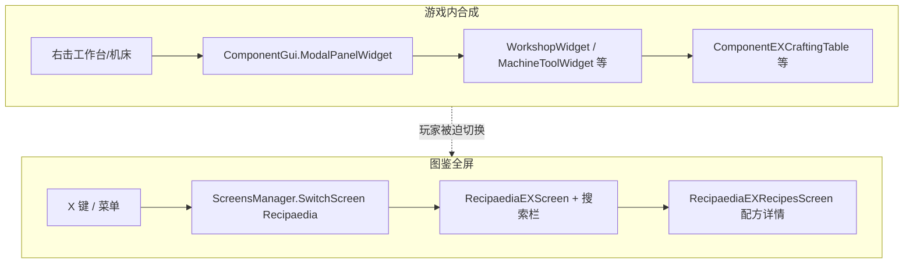
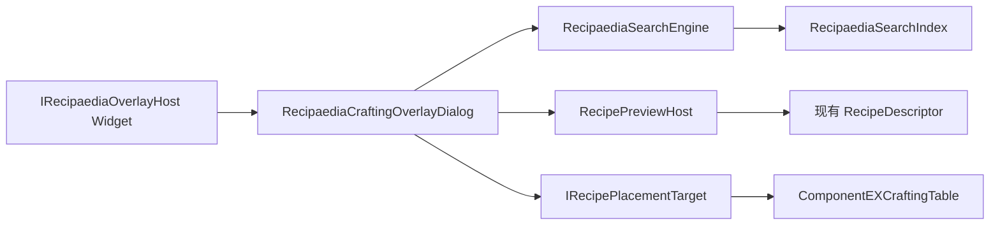

# REX 工作台悬浮助手（Crafting Overlay）策划

> **版本**：v0.1  
> **状态**：草案（待评审）  
> **范围**：RecipaediaEX（REX）核心 + 依赖 REX 的内容模组接入层  
> **前置**：[`图鉴搜索功能策划.md`](图鉴搜索功能策划.md) Phase 1/2 已交付（搜索引擎、索引、筛选 Dialog 可用）

---

## 1. 玩家反馈摘要

社区玩家「工业镐手」在合成工作流中提出以下诉求（2026-06 社群讨论）：

| # | 原话要点 | 诉求归类 |
|---|----------|----------|
| F1 | 「应该直接在游戏内搞个**悬浮界面**」 | 不要全屏跳转，要在当前游戏画面内叠加 UI |
| F2 | 「在用工作台 / 机床里摆配方，忘记怎么摆了，这时候就应该**直接打开 rex 的搜索框**」 | 合成上下文内即时查配方，零层菜单 |
| F3 | 「而不是点两三层进合成表界面，看完了再点两三下返回，忘了又要重复一遍」 | 降低 **上下文切换成本**（Context Switch） |
| F4 | 「有个版本有快捷键好像」（十一） | 快捷键存在但体验未对齐合成场景 |
| F5 | 「方便后续**直接点加号自动摆放**」 | JEI 式 **一键从背包填充合成格** |

**核心矛盾**：REX 图鉴搜索能力已具备，但入口仍是 **全屏 `RecipaediaEXScreen`**；玩家在 **`ModalPanelWidget`（工作台 / 机床面板）** 打开时，查配方 = 关闭或遮挡合成界面 → 多层 Screen 往返 → 记忆配方布局困难。

---

## 2. 现状与差距分析

### 2.1 当前架构（相关部分）



| 能力 | 现状 | 与玩家诉求的差距 |
|------|------|------------------|
| 文本搜索 | `RecipaediaSearchEngine` + 索引 + 高级筛选 | ✅ 已有；❌ 仅全屏图鉴可用 |
| 配方展示 | `RecipaediaEXRecipesScreen` + `RecipeDescriptor` | ✅ 已有；❌ 需进全屏且与合成格分离 |
| 快捷键 | 内容模组注册 `Recipaedia` → `Key.X`，`SubsystemTechTree` 内 `SwitchScreen` | ⚠️ 有键位；❌ **不区分**是否正在合成；打开全屏打断 Modal |
| 自动摆放 | 无 | ❌ 完全缺失 |
| 工作站上下文 | `ICrafter` + `RecipesCrafterManager` 仅用于图鉴展示 | ❌ 未用于合成 UI 侧过滤 |

### 2.2 宿主 UI 层次（决策依据）

依据仓库 **widget-screen-ui.mdc** 心智模型：

| 层次 | 类型 | 合成场景 |
|------|------|----------|
| `ScreensManager` Screen | 全屏、有返回栈 | 当前图鉴入口；**不适合**作为合成中查配方的唯一方式 |
| `ModalPanelWidget` | 游戏内模态面板 | 工作台 / 机床正在使用 |
| `DialogsManager` Dialog | 叠在 Screen / GUI 上的弹层 | **适合**悬浮助手载体；不替换 Modal |

**结论**：悬浮助手应作为 **Dialog 或可挂于 `ComponentGui` 的浮动 Widget**，在 **保持 `ModalPanelWidget` 打开** 的前提下提供搜索 + 配方预览 +（后续）自动摆放。

### 2.3 与图鉴搜索策划的关系

| 图鉴搜索策划（已完成） | 本策划（新增） |
|------------------------|----------------|
| `RecipaediaEXScreen` 内搜索过滤条目 | 复用同一 `SearchEngine` / `Index` / `Parser` |
| 仅当前 **图鉴分类** 为候选集 | 叠加 **当前工作站 / 网格尺寸** 上下文过滤 |
| 选中条目 → 进配方 Screen | 选中条目 → **内嵌迷你配方视图**，不 `SwitchScreen` |
| 无自动摆放 | **+ 按钮** 调用 `IRecipePlacementTarget` |

两者 **共享搜索内核**，**分离 UI 壳层**；避免在 `RecipaediaEXScreen` 内硬塞合成逻辑。

---

## 3. 设计目标

1. **零跳转查配方**：在工作台 / 机床面板打开时，一键呼出悬浮助手，搜索并查看配方布局，关闭后合成格状态不变。
2. **上下文感知**：默认只显示 **当前工作站可用** 且 **网格尺寸匹配** 的配方（可手动放宽）。
3. **快捷键一致**：沿用或扩展 `Recipaedia` 键位——**合成中 toggle 悬浮助手**，非合成中仍可进全屏图鉴（行为可配置）。
4. **可扩展自动摆放**：REX 定义放置协议；各 `ComponentEXCraftingTable` / 内容模组自定义配方类型通过接口接入；**不**在 REX 核心写工业专有逻辑。
5. **JEI 式体验对齐**：搜索 → 点结果看 3×3 / 4×4 / 5×5 布局 → 点 **+** 从相邻背包格尝试填充（材料不足时部分填充 + 提示）。

---

## 4. 用户场景

### 4.1 场景 A：工作台摆形状配方

1. 玩家打开工作台，`ModalPanelWidget` 显示 3×3 合成格 + 背包。
2. 按 **`X`**（或点悬浮助手入口按钮）→ 屏幕一侧出现 **半透明悬浮面板**，带搜索框。
3. 输入「铁砧」→ 列表显示匹配条目 → 点击 → 面板内展示 **3×3 原料布局 + 产物**（复用 Descriptor 渲染逻辑，只读）。
4. 玩家对照布局手工摆放；或点 **+** 自动从背包移动物品到合成格（Phase 2）。
5. 按 `Esc` 或再次 `X` 关闭悬浮层，**不关闭工作台**。

### 4.2 场景 B：机床 4×4 配方

1. 打开 4×4 机床面板。
2. 呼出悬浮助手；搜索默认带 `@crafter:` / 网格尺寸 implicit filter，避免列出仅 3×3 工作台可用的配方。
3. 选中配方后迷你视图显示 **4×4** 网格（与 `ScalingIngredients` / Descriptor 网格一致）。

### 4.3 场景 C：非合成场景

1. 玩家在世界中未打开任何合成 Modal。
2. 按 `X` → 行为与 **现网一致**：`SwitchScreen("Recipaedia")` 进入全屏图鉴（含已有搜索）。

### 4.4 场景 D：材料不足时自动摆放

1. 玩家点 **+**。
2. 系统扫描 **Widget 绑定的背包库存** + **合成格库存**，按配方需求计算可放置方案（含 `TransformRecipe` 平移/镜像）。
3. 能放多少放多少；不足项高亮缺失；可选 Toast「缺少：铜锭 ×2」。

---

## 5. 产品形态

### 5.1 命名与定位

| 项 | 建议 |
|----|------|
| 功能名（中文） | **合成助手** / **悬浮图鉴** |
| 代码前缀 | `RecipaediaCraftingOverlay` |
| 与全屏图鉴关系 | 互补；全屏保留浏览 / 分类 / 详情 / 科技树跳转 |

### 5.2 入口

| 入口 | 优先级 | 说明 |
|------|--------|------|
| 快捷键 `Recipaedia` | P0 | 合成 Modal 打开时 **toggle 悬浮助手** |
| 工作台 / 机床面板角标按钮 | P0 | 可发现性；图标复用 `MenuSearchLine.png` 或专用放大镜 |
| 全屏图鉴 | 保留 | 非合成场景不变 |

### 5.3 悬浮面板布局（草案）

```text
┌─ 合成助手 ─────────────────────────────── [×] ─┐
│ ┌────────────────────────────┐ [搜] [历] [筛] │
│ │ 搜索…                      │                │
│ └────────────────────────────┘                │
├───────────────────────────────────────────────┤
│  条目列表（ListPanelWidget，过滤后）            │
│  ┌────┬──────────────────────────────┐       │
│  │图标│ 铁砧                          │       │
│  └────┴──────────────────────────────┘       │
├───────────────────────────────────────────────┤
│  配方预览区（选中条目后显示）                    │
│  ┌─────────────────────────┐                  │
│  │  3×3 / 4×4 原料格 + 产物 │  [ + 填充 ]      │
│  └─────────────────────────┘                  │
│  工作站：工作台 · 需等级 1                      │
└───────────────────────────────────────────────┘
  ↑ 锚定屏幕右侧或左侧，宽 ~420px，高 ~520px
  ↑ 背景半透明；不拦截 Modal 以外区域点击（可选「.pin」固定）
```

**交互规则**：

| 事件 | 行为 |
|------|------|
| `Esc` | 先关悬浮助手；若已关且焦点在 Modal，交给宿主 |
| 点击列表条目 | 下方预览区切换配方（该条目 **第一条** 与当前工作站匹配的配方；多条时 ◀▶） |
| **+ 填充** | 调用 `IRecipePlacementTarget.TryPlaceRecipe` |
| 搜索 / 筛选 | 与全屏图鉴相同语义；候选集为 **全库条目** 或 **当前分类等价物（All Blocks）** + 上下文 Token |
| 关闭 × | 仅隐藏 Dialog，不 `SwitchScreen` |

---

## 6. 技术架构

### 6.1 分层



建议目录（REX 核心）：

```text
RecipaediaEX/
  Overlay/
    IRecipaediaOverlayHost.cs       # 合成 Widget 声明上下文
    IRecipePlacementTarget.cs       # 自动摆放协议
    RecipaediaCraftingContext.cs    # 工作站 blockValue、网格宽、关联 Component
    RecipaediaCraftingOverlayDialog.cs
    RecipaediaOverlayRecipePreview.cs
    RecipaediaOverlaySearchScope.cs # 上下文 query 前缀合成
  Assets/RecipaediaEX/
    Dialogs/RecipaediaCraftingOverlayDialog.xml
```

### 6.2 `IRecipaediaOverlayHost`

合成类 Widget 实现（REX 基类或内容模组 Widget 均可）：

```csharp
public interface IRecipaediaOverlayHost {
    /// <summary>当前合成上下文；无法提供时返回 null（不显示助手入口）。</summary>
    RecipaediaCraftingContext? GetCraftingContext();

    /// <summary>用于 Dialog 挂载的 GUI 根（通常为 ComponentGui 的 ContainerWidget）。</summary>
    Widget OverlayParent { get; }
}
```

**接入示例（概念）**：

- `ComponentEXCraftingTable` 所在 Widget（工作台 / 机床）实现 `IRecipaediaOverlayHost` + `IRecipePlacementTarget`。
- 非合成 Modal（箱子、熔炉无合成格）不实现 → 快捷键走全屏图鉴。

### 6.3 上下文过滤

`RecipaediaCraftingContext` 字段：

| 字段 | 用途 |
|------|------|
| `CrafterBlockValue` | 隐式 `@crafter:` 过滤 |
| `GridWidth` | 3 / 4 / 5；过滤 `OriginalCraftingRecipe` 有效宽度 |
| `PlayerLevel` | 与 `RequiredPlayerLevel` 对齐（仅预览提示，不隐藏可选） |
| `Project` / `Inventory` | 自动摆放与动态配方 Extra |

**默认 query 合成**（内部，不一定展示给用户）：

```text
@crafter:<当前工作站> @grid:<N>x<N>  <用户输入>
```

`@grid:` 为 **本策划拟新增 Token**（Phase 1 可在 Engine 层硬编码宽度过滤，Phase 1b 再 parser 化）。

### 6.4 配方预览复用

- 从 `RecipaediaEXManager.Recipes` 取 `IRecipaediaRecipeItem.Match` 列表。
- 用现有 `RecipeDescriptor` 工厂渲染到 **只读** 容器（`RecipaediaOverlayRecipePreview`），避免实例化完整 `RecipaediaEXRecipesScreen`。
- **+ 按钮** 仅在预览区存在 **可解析为 `OriginalCraftingRecipe`（或实现 `IPlacableRecipe`）** 的配方时启用；化工方程等 Phase 3 由内容模组扩展。

### 6.5 `IRecipePlacementTarget`

```csharp
public interface IRecipePlacementTarget {
    /// <summary>将指定配方尽可能填入合成格；返回是否全部满足。</summary>
    bool TryPlaceRecipe(IRecipe recipe, IInventory playerInventory, out string? missingMessage);
}
```

**REX 可提供默认实现** `CraftingTablePlacementTarget`（针对 `ComponentEXCraftingTable`）：

1. 读取配方 `Ingredients`（36 格语义）与 `GridWidth`。
2. 收集背包 + 合成格可用物品（按 `CraftingId` 聚合）。
3. 调用已有 `TransformRecipe` 尝试 shift / flip 匹配空位。
4. 通过 `IInventory` API 移动物品（需 **主线程**、遵守堆叠上限）。
5. 触发 `UpdateCraftingResult(true)`。

**禁止**：在 REX 核心为流体灌装机、化工方程等写死放置逻辑 → 由内容模组实现 `IRecipePlacementTarget` 并注册。

### 6.6 快捷键路由

| 条件 | `Recipaedia` 键行为 |
|------|---------------------|
| `ModalPanelWidget` 实现 `IRecipaediaOverlayHost` 且 `GetCraftingContext() != null` | toggle `RecipaediaCraftingOverlayDialog` |
| 否则 | `SwitchScreen("Recipaedia")`（现网） |

**归属**：

- **接口与 Dialog** → REX。
- **键位检测钩子** → 建议在 REX `RecipaediaEXLoader` 注册 `Update` 或 `OnPlayerInput` 类 Hook；内容模组现有 `SubsystemTechTree` 中的 `IsOpenRecipaedia` 分支 **迁移或委托** 到 REX，避免双处监听冲突。

### 6.7 持久化

| 数据 | 存储 |
|------|------|
| 悬浮助手开/关 | 不持久化（会话态） |
| 搜索历史 | 继续用 `RecipaediaSearchHistory.txt`（与全屏共享） |
| 面板锚点左/右、宽度 | 可选 UI 偏好 → 外部 Storage（同搜索历史） |

---

## 7. 自动摆放（+ 按钮）详细规则

### 7.1 适用范围（Phase 分档）

| 阶段 | 配方类型 | 网格 |
|------|----------|------|
| Phase 2a | `OriginalCraftingRecipe` | 3×3 / 4×4 / 5×5 有形合成 |
| Phase 2b | 内容模组 `FormattedRecipe` 子类 | 需实现 `IPlacableRecipe` 暴露 36 格原料 |
| Phase 3 | 无序多格（熔炉单格等） | 不做 +，仅预览 |

### 7.2 算法要点

1. **不清空**已有合成格，除非用户勾选「覆盖」（Phase 2 可选；默认 **仅填空位**）。
2. 同一 `CraftingId` 多物品（橡木 / 白桦）→ 优先 **已存在于合成格** 的变种，其次 **背包内数量最多** 的变种。
3. 部分满足时仍执行移动，并 `DisplaySmallMessage` 列出缺口。
4. **联机**：仅本地玩家库存；服务端权威以宿主 `IInventory` 行为为准（与手工拖放一致）。

### 7.3 与玩家 F5 的对齐

> 「方便后续直接点加号自动摆放」

UI 上 **+** 置于配方预览区右下角；列表项可显示小 **+** 快捷填充（Phase 2b，可选）。

---

## 8. 用户故事与验收

| ID | 故事 | 验收 |
|----|------|------|
| US-C01 | 打开工作台后按 X | 出现悬浮助手；工作台仍打开 |
| US-C02 | 悬浮助手内搜「铁」 | 结果与全屏 All Blocks 下搜「铁」一致（±上下文过滤） |
| US-C03 | 在 4×4 机床打开助手 | 默认不展示仅 3×3 可用的配方（或排后 + 标记） |
| US-C04 | 选中条目 | 预览区显示正确形状布局，与全屏配方页一致 |
| US-C05 | Esc 关闭助手 | Modal 未关闭；合成格物品不变 |
| US-C06 | 非合成场景按 X | 进入全屏 `RecipaediaEXScreen`（回归） |
| US-C07 | 点 + 且背包足够 | 合成格布局与配方一致；产物槽更新 |
| US-C08 | 点 + 材料不足 | 部分填充 + 明确缺失提示 |
| US-C09 | 助手内使用筛选 Dialog | 与全屏筛选行为一致 |
| US-C10 | 关闭游戏重进 | 搜索历史仍可用（共享） |

---

## 9. 分阶段交付

### Phase 1 — 悬浮助手 MVP（P0）

- [ ] `IRecipaediaOverlayHost` + `RecipaediaCraftingContext`
- [ ] `RecipaediaCraftingOverlayDialog` + XML（搜索行复用现有图标按钮样式）
- [ ] 复用 `RecipaediaSearchEngine`；条目列表 + 配方预览（只读）
- [ ] 上下文 `@crafter` + 网格宽度过滤
- [ ] 快捷键 / 角标按钮 toggle；与全屏图鉴路由分叉
- [ ] 工作台 / 机床 Widget 接入 Host（至少一种 3×3 + 一种 4×4 验证）
- [ ] i18n：`ContentWidgets.RecipaediaCraftingOverlay.*`

### Phase 2 — 自动摆放（P1）

- [ ] `IRecipePlacementTarget` + `CraftingTablePlacementTarget`
- [ ] 预览区 **+ 填充** 按钮
- [ ] `TransformRecipe` 集成；部分填充与提示
- [ ] 可选：列表项快捷 +

### Phase 3 — 扩展与 polish（P2）

- [ ] `IPlacableRecipe` + 内容模组自定义配方放置
- [ ] 面板锚点 / 透明度 UI 偏好
- [ ] 与 `RecipeSlotWidget`「在图鉴中搜索」联动 → 打开悬浮助手并预填 `@in:` / `@out:`
- [ ] 键盘上下选条目（与全屏搜索可选特性对齐）

### 明确不做（本策划范围）

- 替代全屏图鉴（仅增强合成场景）
- 服务端远程替他人合成格摆放
- 在 REX 核心实现化工 / 流体等非网格合成自动填充

---

## 10. 非功能需求

| 项 | 指标 |
|----|------|
| 打开延迟 | toggle 后首帧可见；索引已预热则 < 50ms |
| 查询 | 与全屏相同（< 100ms / 5000 候选） |
| 内存 | 不重复构建索引；Dialog 关闭释放预览 Descriptor 实例 |
| 兼容 | 未实现 `IRecipaediaOverlayHost` 的 Modal 行为不变 |
| 反模式 | 遵守 [`recipaedia-rex-anti-patterns.mdc`](../../../.cursor/rules/recipaedia-rex-anti-patterns.mdc)：流体/工业语义不进 REX 核心 |

---

## 11. 风险与对策

| 风险 | 对策 |
|------|------|
| Dialog 与 Modal 争焦点 | 明确输入路由；合成格仍接收拖放；Dialog 仅捕获自身区域 |
| 多种机床网格不统一 | `GridWidth` 由 Host 上报；Descriptor 动态列行 |
| 自动摆放与现有物品冲突 | 默认只填空位；冲突时跳过该格 |
| 快捷键双监听 | REX 统一 `Recipaedia` 路由；内容模组移除重复 `SwitchScreen` |
| 动态配方 `FindMatchingRecipe` | 预览只读静态表；+ 填充时带 `Project` / `Inventory` Extra 再匹配 |
| 小屏遮挡合成格 | 面板可拖曳或左右锚点配置（Phase 3） |

---

## 12. 开放问题（评审待定）

| # | 问题 | 建议默认 |
|---|------|----------|
| Q1 | 悬浮助手候选集用 **All Blocks** 还是 **当前分类**？ | **All Blocks**（合成场景更偏「全局找产物」） |
| Q2 | 是否显示「在全屏图鉴中打开」链接？ | Phase 1 提供小链接，跳转前 **不** 自动关 Modal |
| Q3 | `@grid` 是否暴露给用户？ | Phase 1 仅内部；高级用户 Phase 2 可手输 |
| Q4 | 角标按钮是否所有 `ICrafter` 方块统一注入？ | 由 Host 接口声明；不全局注入 |

---

## 13. 变更记录

| 版本 | 日期 | 说明 |
|------|------|------|
| v0.1 | 2026-06-08 | 初稿：基于社群玩家反馈与 REX 现网架构 |

---

## 14. 相关文档

- [图鉴搜索功能策划.md](图鉴搜索功能策划.md)
- [API 使用文档.md](API使用文档.md)
- 仓库规则：`.cursor/rules/widget-screen-ui.mdc`、`recipaedia-rex-anti-patterns.mdc`
