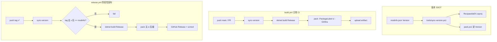

# RecipaediaEX 打包 → 发布 CI 策划

> **版本**：v0.2  
> **状态**：**P0–P3 已实施**（见 `tools/sync-version.ps1`、`build.yml`、`release.yml`）  
> **范围**：RecipaediaEX 独立仓库（`CS-LX/RecipaediaEX`）的本地打包、`build.yml` 日常 CI、`release.yml` 阶段性发布。  
> **参考**：EBoyTerminal `tools/pack.ps1` + `.github/workflows/build.yml`（无 内容模组 依赖的简化版）。

---

## 1. 背景与目标

### 1.1 现状

| 项 | 现状 | 问题 |
|---|---|---|
| 本机打包 | `tools/pack.ps1` + `pack.config.json` → `ModsFolder/RecipaediaEX.scmod` | 可用 |
| GitHub CI | `build.yml` 产出固定名 `RecipaediaEX.scmod` artifact | 无法从文件名区分版本/提交 |
| 版本字段 | `modinfo.json` 为 `2.0.0.0-preview5`，csproj `<Version>` 为 `2.0.0.0` | **不同步** |
| 发布 | 无 GitHub Releases | 阶段性版本无官方分发入口 |

### 1.2 目标

1. **CI / Release 产物带元信息**：日常 CI 用 `RecipaediaEX-ci.{sha}`；Release 用 `RecipaediaEX-{Version}`。
2. **标签驱动阶段性发布**：对某个 commit 打 git tag，CI 自动打 Release 包并挂到 GitHub Releases。
3. **版本单一真相源（SSOT）**：以 `modinfo.json` 的 `Version` 为准，构建前同步到 csproj 与打包脚本；Release 时与 tag 校验一致。
4. **本机体验不变**：Mods 目录仍部署短名 `RecipaediaEX.scmod`，便于覆盖调试。

### 1.3 非目标（本阶段不做）

- 自动修改依赖模组的 `modinfo.json` 依赖版本或子模块指针。
- AMPK 资源加密（RecipaediaEX 保持明文 Assets）。
- release-please / conventional commits 全自动发版（可作为 P4 扩展）。

---

## 2. 版本号规范与 csproj 能力

### 2.1 各字段分工

| 字段 | 示例 | 谁维护 | 说明 |
|---|---|---|---|
| `modinfo.json` → `Version` | `2.0.0.0-preview5` | **人工（SSOT）** | 游戏与下游模组依赖读此字段 |
| csproj `<Version>` | `2.0.0.0-preview5` | `sync-version.ps1` 写入 | NuGet SemVer；**支持 `-previewN` 后缀** |
| csproj `<AssemblyVersion>` | `2.0.0.0` | `sync-version.ps1` 写入 | **仅四段整数**，不能含文字 |
| csproj `<InformationalVersion>` | `2.0.0.0-preview5` | 默认同 `<Version>` 或显式设置 | 程序集完整展示串 |
| git tag | `v2.0.0.0-preview5` | 发版时人工打 | **带 `v` 前缀**；CI 校验时剥掉 `v` 再与 modinfo 比 |

### 2.2 csproj 是否支持「带文字」的版本号？

**结论（已在 net10.0 SDK 上验证）：**

| 写入 csproj 的值 | 是否合法 | 说明 |
|---|---|---|
| `2.0.0.0-preview5` | ✅ | `<Version>` / SemVer 预发布标签 |
| `v2.0.0.0-preview5` | ❌ | NuGet 报错：「不是有效的版本字符串」 |
| `2.0.0.0-preview5` 写入 `<AssemblyVersion>` | ❌ | 须 `major.minor.build.revision` 纯数字 |

**策划约定：**

- `modinfo.json` 与 csproj `<Version>` **不要写 `v` 前缀**。
- git tag **保留 `v` 前缀**（GitHub 惯例）；CI 用 `tag.TrimStart('v')` 与 modinfo 比对。
- `sync-version.ps1` 从 modinfo 解析时：
  - 完整串 → `<Version>`、`<InformationalVersion>`
  - 去掉 `-preview…` 等 SemVer 预发布后取四段数字 → `<AssemblyVersion>`（不足补 `.0`）

### 2.3 Preview / 正式版命名（已锁定）

| 类型 | `modinfo.json` → `Version` 格式 | 示例 |
|---|---|---|
| Preview | `X.X.X.X-previewN`（N 递增） | `2.0.0.0-preview5` |
| 正式版 | `X.X.X.X`（四段数字，无后缀） | `2.0.0.0` |

- git tag：`v` + 与 modinfo **完全一致**（如 `v2.0.0.0-preview5`、`v2.0.0.0`）。
- GitHub Release：**Preview 标 `prerelease: true`**（`Version` 含 `-preview` 时）；正式版 `prerelease: false`。

---

## 3. 产物命名规范（已锁定）

| 场景 | 文件名示例 | 部署位置 |
|---|---|---|
| 本机开发 | `RecipaediaEX.scmod` | 游戏 `ModsFolder`（覆盖安装） |
| PR / main CI | `RecipaediaEX-ci.abc1234.scmod` | workflow artifact（SHA 取前 7 位） |
| GitHub Release | `RecipaediaEX-2.0.0.0-preview5.scmod` | Release 附件（含完整 Version） |
| 可选 | `RecipaediaEX-2.0.0.0-preview5.scmod.sha256` | 同 Release 附校验文件 |

命名逻辑（`pack.ps1`）：

```
# 本机（pack.config.json，短名）
→ RecipaediaEX.scmod

# 日常 CI（-PackageLabel ci -GitSha abc1234）
→ RecipaediaEX-ci.abc1234.scmod

# Release（-Version 从 modinfo 读取，无 ci/sha）
→ RecipaediaEX-{Version}.scmod
```

本机 `pack.config.json` 默认 `ModFileName = RecipaediaEX`（短名），**不**走 CI / Release 的长名规则。

---

## 4. 工作流架构



### 4.1 `build.yml`（增强现有）

**触发：** `push`（main/master）、`pull_request`、`workflow_dispatch`

**步骤：**

1. `actions/checkout@v4`
2. `actions/setup-dotnet@v4`（10.0.x）
3. `tools/sync-version.ps1`
4. `dotnet restore` / `dotnet build -c Release -p:RecipaediaEXSkipPack=true`
5. `pack.ps1 -ArtifactDir ... -PackageLabel ci -GitSha ${{ github.sha }}`
6. `upload-artifact`：名称 `RecipaediaEX-ci-{sha}`（与包内文件名一致，sha 7 位）

### 4.2 `release.yml`（新建）

**触发：**

```yaml
on:
  push:
    tags:
      - 'v*'
```

**权限：** `contents: write`（创建 Release）

**步骤：**

1. checkout（`fetch-depth: 0`，便于生成 changelog）
2. `sync-version.ps1`
3. **门禁**：`$tagVersion = $env:GITHUB_REF_NAME.TrimStart('v')` 必须等于 `modinfo.Version`
4. build + pack（`-Version` 来自 modinfo；无 `PackageLabel` / `GitSha`）
5. 生成 Release body：**第一版**用 `git log`（上一 tag..HEAD）；流程稳定后改为读 `docs/CHANGELOG.md` 对应版本段落
6. `softprops/action-gh-release` 或 `ncipollo/release-action` 上传 `.scmod`（及可选 `.sha256`）
7. **Preview**（`Version` 含 `-preview`）→ `prerelease: true`；**正式版**（`X.X.X.X`）→ `prerelease: false`

**为何用 tag 而非仅 workflow_dispatch：** tag 不可变、与 GitHub Releases 原生绑定，是「阶段性提交」的业界默认标记。

---

## 5. 工具链改动清单

| 文件 | 改动 |
|---|---|
| `tools/sync-version.ps1` | **新建**。读 `modinfo.json` → 更新 csproj `<Version>` / `<AssemblyVersion>` |
| `tools/pack.ps1` | 增加 `-Version`、`-PackageLabel`、`-GitSha`；CI → `RecipaediaEX-ci.{sha}`，Release → `RecipaediaEX-{Version}` |
| `tools/pack.config.example.json` | 注明本机短名策略 |
| `RecipaediaEX.csproj` | PreBuild 或文档约定先跑 sync-version；保留 `RecipaediaEXSkipPack` |
| `.github/workflows/build.yml` | 接入 sync-version + 版本化 artifact |
| `.github/workflows/release.yml` | **新建**，tag 驱动 Release |
| `docs/RELEASE.md` | **新建**，发版 SOP（简短） |
| `docs/CHANGELOG.md` | 发版时人工维护；Release body 可引用 |
| `README.md` | 链接本策划与 RELEASE.md |

---

## 6. 开发者发版 SOP

```text
1. 修改 modinfo.json 的 Version（如 2.0.0.0-preview6）
2. 更新 docs/CHANGELOG.md（推荐）
3. commit: release: RecipaediaEX 2.0.0.0-preview6
4. git tag v2.0.0.0-preview6
5. git push origin main
6. git push origin v2.0.0.0-preview6
7. 等待 release.yml → GitHub Releases 出现 RecipaediaEX-2.0.0.0-preview6.scmod
8. （手动）通知依赖模组：在其 `modinfo.json` 中将 `com.recipaediaex` 对齐为新版本
```

---

## 7. 与依赖模组的衔接

RecipaediaEX 发版后，**依赖模组**侧检查项（**不纳入 REX CI 自动化**）：

1. 其 `modinfo.json` → `Dependencies.com.recipaediaex` 版本字符串与 REX 一致。
2. 使用 Git 子模块引用 REX 时，更新子模块指针（由各宿主仓库自行维护）。

---

## 8. 实施阶段

| 阶段 | 内容 | 预估 |
|---|---|---|
| **P0** | `sync-version.ps1`；修 modinfo / csproj 不一致 | 0.5d |
| **P1** | `pack.ps1` CI/Release 命名 + `build.yml`（`RecipaediaEX-ci.{sha}`） | 0.5d |
| **P2** | `release.yml` + tag 校验 + GitHub Release | 0.5d |
| **P3** | `RELEASE.md`、README/CHANGELOG 衔接 | 0.25d |
| **P4（可选）** | sha256、release-please、EBoyTerminal 同模式复用 | 后续 |
| **P5** | `publish-mod-site.ps1` + `release.yml` 模组站 post 1739 自动发版 | **已实施** |

---

## 9. 已拍板决策

| # | 议题 | 结论 |
|---|---|---|
| 1 | modinfo / tag 版本格式 | Preview：`X.X.X.X-previewN`；正式：`X.X.X.X`。tag 为 `v` + 同串（如 `v2.0.0.0-preview5`） |
| 2 | CI artifact 文件名 | `RecipaediaEX-ci.{sha}.scmod`（**不含** Version） |
| 3 | Preview Release | **标 `prerelease: true`** |
| 4 | Release body | **第一版** `git log`；稳定后改 **CHANGELOG 段落** |

---

## 10. 参考

- 本仓库：`tools/pack.ps1`、`.github/workflows/build.yml`
- EBoyTerminal：`CS-LX/EBoyTerminal`（含 依赖模组 checkout 的复杂 CI，REX 不需要）
- 依赖模组：`内容模组/modinfo.json` 中 `com.recipaediaex` 依赖写法
